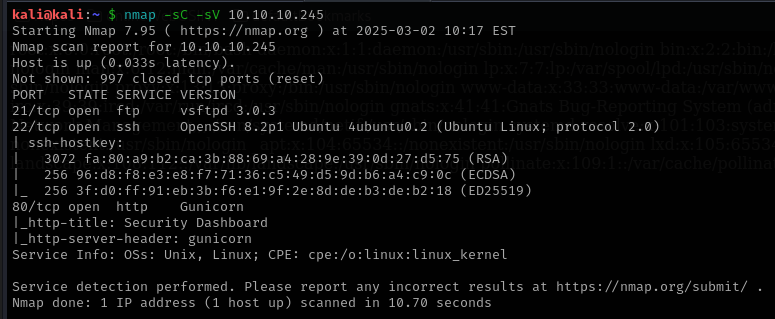
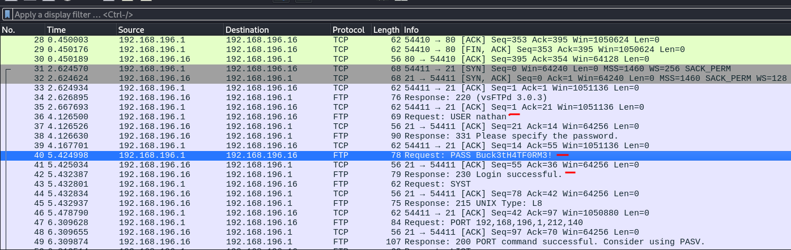
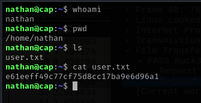
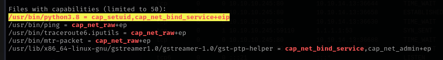
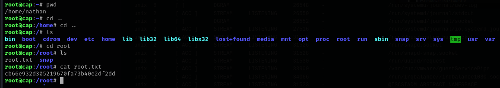

# Cap

This is my write-up for the machine **Cap** on Hack The Box located at: https://app.hackthebox.com/machines/351

first we start with an nmap scan, it shows the following:

- Neither anonymous login or basic passwords did work for ftp
- Navigating through the port 80 we see two interesting dirs, /netstat which shows some networking information, and /data which let's us download a pcap file
- We can change the /data URL to /data/0 to download a pcap with sentive info. Where we can find the password for nathan user

- With that credentials we can open a ssh connection an retrieve the user flag

- After some enumeration without any findings for privilege escalation I went to hack the box for a hint, which was to use linPEAS and search on the 'Files with capabilities' section

- There I found that we could use the python file to get root as the following

- Then get the root flag

