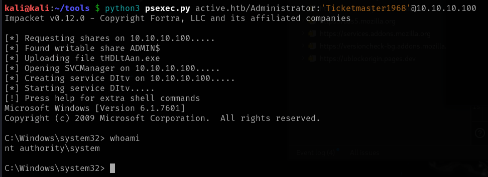

# Active

This is my write-up for the machine **Active** on Hack The Box located at: https://app.hackthebox.com/machines/148

## Enumeration

First I started with an [nmap scan](./res/Active/10_10_10_100_nmapReport.txt), which shows the following

It looks like a typicall windows domain configuration, so first I decided to trigger the enum4linux to gather some general information

After that I tried listing the shares

And then I tried to access them, but I only got access to Replication

After some manual enumeration I found two interesting files, which are GptTmpl.inf that contains some password policies, and Groups.xml which seems to contain a user with some kind of hash

After that I ran some nmap scripts againts smb to enumerate it further, but nothing interesting came through

And I tried pulling some information from ldap, but the files were empty

## Exploitation

So before enumerating the other ports, I decided to dig deeper on the hash obtained, first I tried to identify which type of hash it was with hashid and crackstatation, but it didn't work

So, I tried googling for "smb groups xml encryption" and I found [this page](https://github.com/incredibleindishell/Windows-AD-environment-related/blob/master/Exploiting-GPP-AKA-MS14_025-vulnerability/README.md) where they talk about how to decrypt it and provide [this script](https://github.com/incredibleindishell/Windows-AD-environment-related/blob/master/Exploiting-GPP-AKA-MS14_025-vulnerability/gppdecrypt.rb), so I went ahead and try to decrypt the password, and it actually worked

Then I tried to get into another share with the recently obtained credentials **active.htb\SVC_TGS:GPPstillStandingStrong2k18** but I got an error on all of them

So I triggered crackmapexec to make sure the credentials were right

I also tried getting a shell with psexec, but it seems that we don't have write permissions on any share

So I enumerated the users with crackmapexec, but it seems that there's only the default ones a part from the one that we have credentials

After that I tried to connect to the Replication share, and when I saw that it didn't work either I realized that I was doing something wrong, and after a few tries I was able to connect to the Users share

## Post Exploitation

There I was able to retrieve the user flag

After that I used GetUserSPNs.py to check if kerberoasting was possible, and I got the Administrator hash

Then I went to hashcat to crack it, and it actually did really fast, and the credentials were **Administrator:Ticketmaster1968**

With that I used psexec to get an elevated shell

And then the only thing left to do was retrieving the root flag

