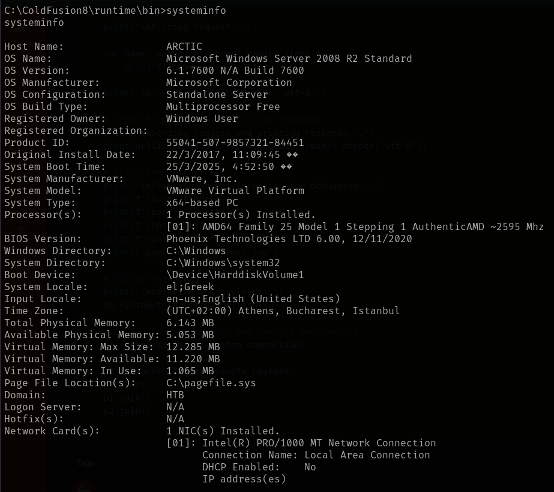
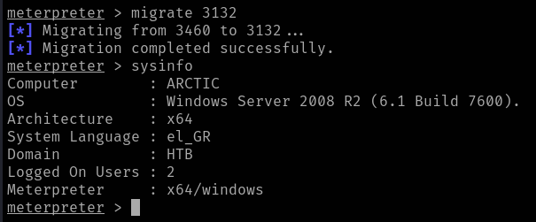

# Artic

This is my write-up for the machine **Artic** on Hack The Box located at: https://app.hackthebox.com/machines/9

## Enumeration

First I started with an nmap scan, which shows the following:

Since I didn't know what it was, I decided to look into the port 8500 first, and after a quick google search it seems to be an HTTP services, so I navigated to it

After navigating a little bit through the folders, I found a login page

## Exploitation

Since trying the default credentials for coldfusion did not work, I searched for exploits for that specific version, the first one that I tried from metasploit doesn't seem to be working

So I tried another one from exploid-db which granted a shell

## Post Exploitation

I gathered the systeminfo

After some tries with winPEAS, the .exe was not running properly and the .bat kept getting stuck

So I decided to try a different exploit to see if it works with a different shell, but none of them were working, so I tried a different approach which was to try and get a meterpreter shell from the current shell and after some struggling I was able to generate the shell.exe

And after uploading it to the target and executing it, it finally gave me the meterpreter shell

After that I migrated processes in order to get a 64 bit shell

Since I wasn't being able to escalate privileges with meterpreter either, after tring with incognito, kiwi, getsystem, etc... I decided to pull the password.properties file, to see if I can crack it and maybe access a user with higher privileges or something.

I cracked tha hash, but it was not working either on the login page

So I decided to give a try to the local_exploit_suggester

After trying a lot of them I found the one that works and it gave me an elevated shell

Now the only thing left to do is retrieve the flags

