# Bashed

This is my write-up for the machine **Bashed** on Hack The Box located at: https://app.hackthebox.com/machines/118

## Enumeration

First I started with an nmap scan, which shows the following:

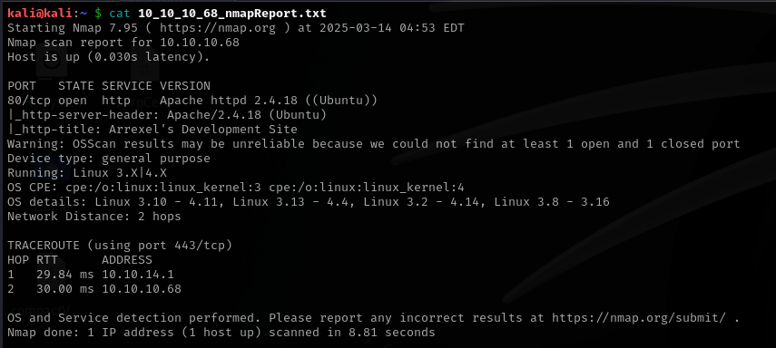

Since only the port 80 is open, I proceed to enumerate it, when we navigate to it we are presented with the following page

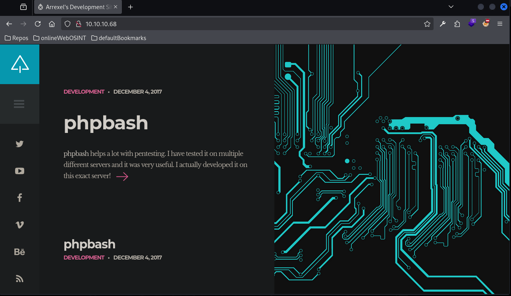

I run gobuster to see if there are any interesting directories, which seems to be the case

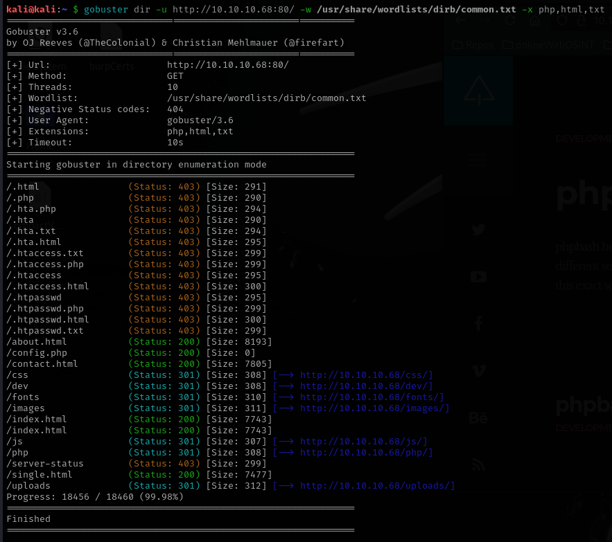

If we click on the phpbash from the main page, we are redirected to the single.html file, which have an explanation of how phpbash works, and a link to github with more information. We could also see that on the example they're accessing the shell under /uploads/phpbash.php unfortunately when I went there there was no shell there

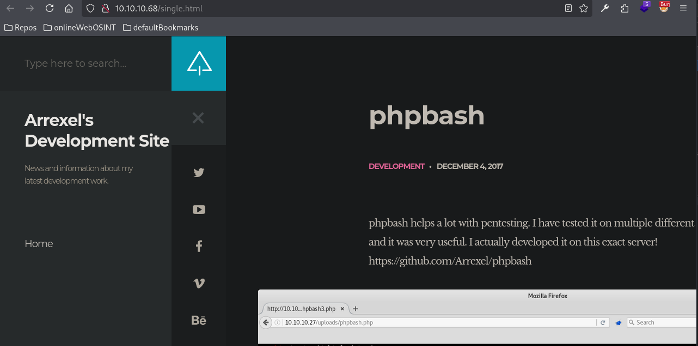

## Exploitation

After navigating through the directories that gobuster facilitated, I found that there's actually a shell on /dev/phpbash.php

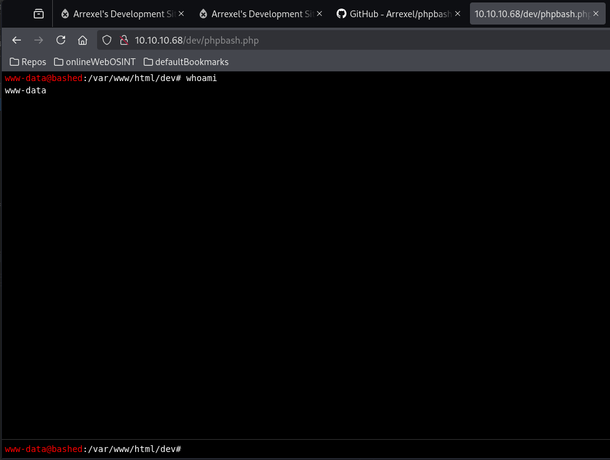

Since we are a low privilege user, I searched for way to escalate privileges, and I found that we should be able to trigger commands as sudo under scriptmanager

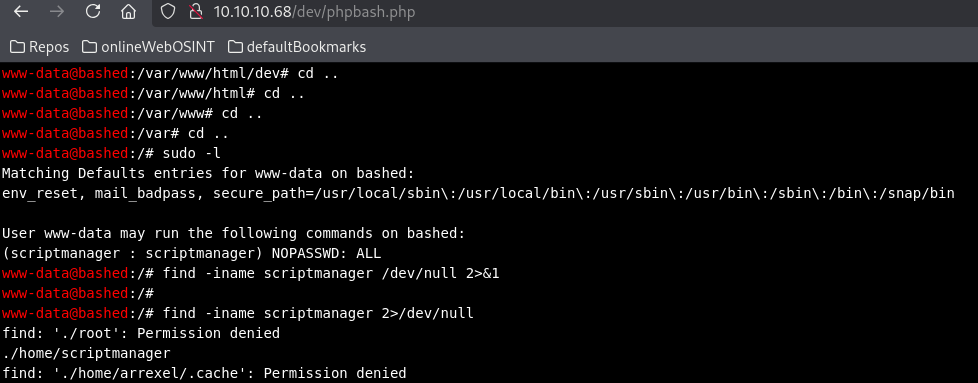

But after some tries, I was not able to get a root shell

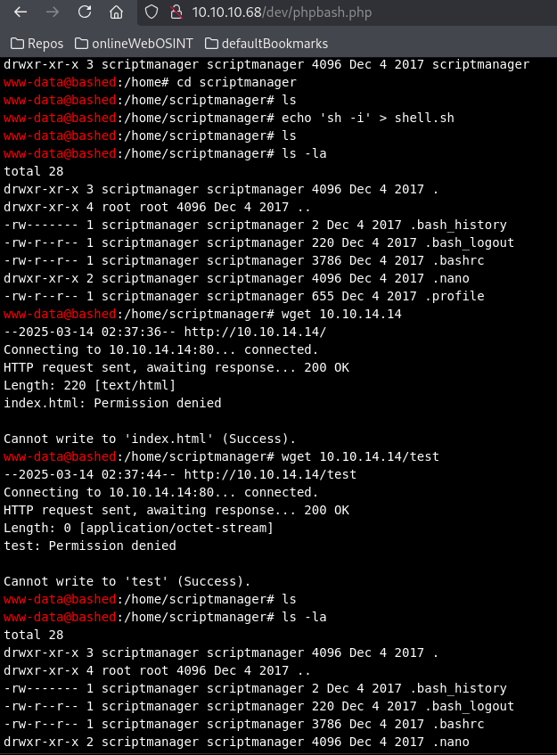

I was able to retrieve the user flag though

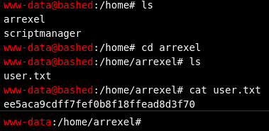

Since I was struggling to exploit the scriptmanager because the shell given wasn't interactive enough, I tried a different approach which was creating a reverse shell, first I tried with netcat directly, but the -e flag wasn't working, so I tried a workaround with python, and this one worked

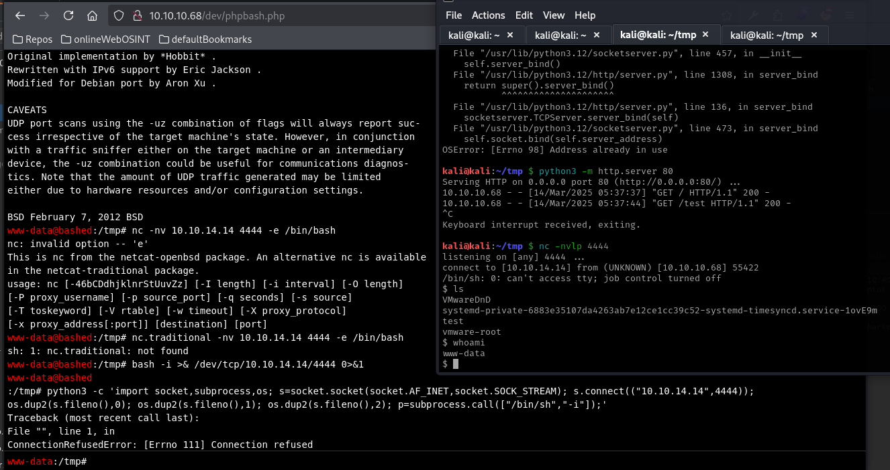

## Post Exploitation

With the reverse shell I was able to get into the scriptmanager, but when I tried to get root I continued to get the error message no tty present

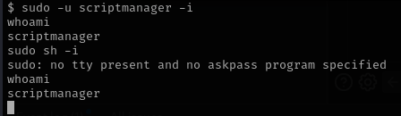

I tried adding scripts and running them as root inside /home/scriptmanager but I was getting errors, I also tried running linpeas to see if there was something interesting, and since I wasn't finding anything and I was stuck I checked the official write-up, which gave me the hint that there was a folder /scripts owned by scriptmanager but outside of the home folder

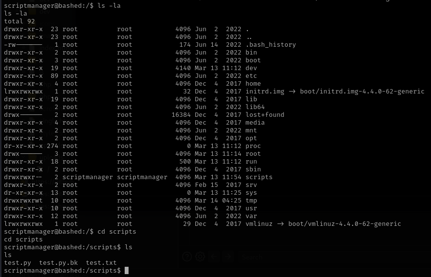

The write-up also suggested to check the timestamps of the files since it a cron job running on the background, and indeed they were changing every minute

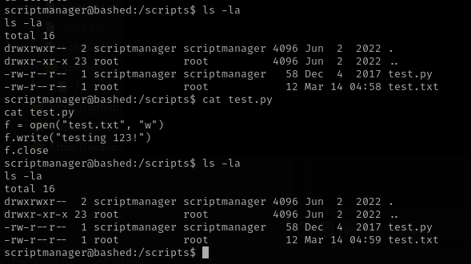

So now all we have to do is replace the test.py with a reverse shell, so we could get root privileges once it is run by it

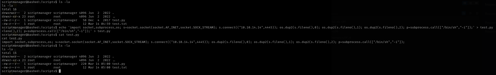

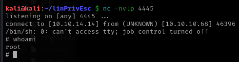

And with that we can retrieve the root flag

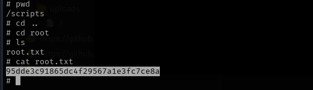

