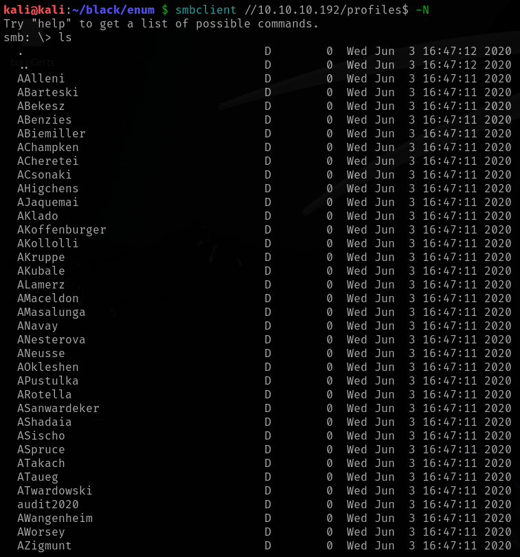
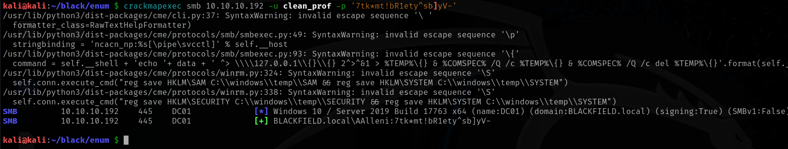
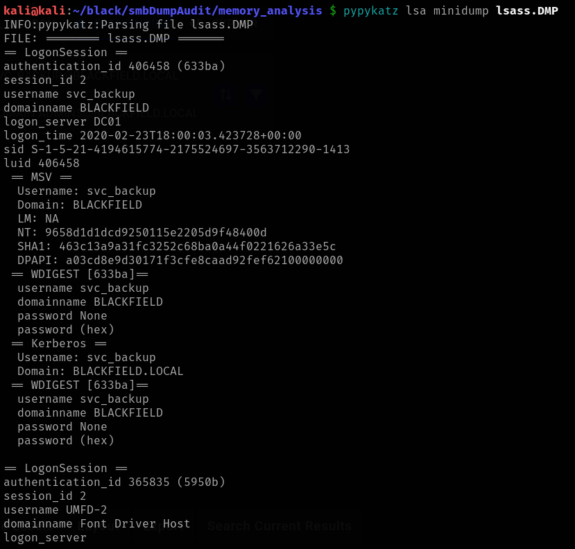
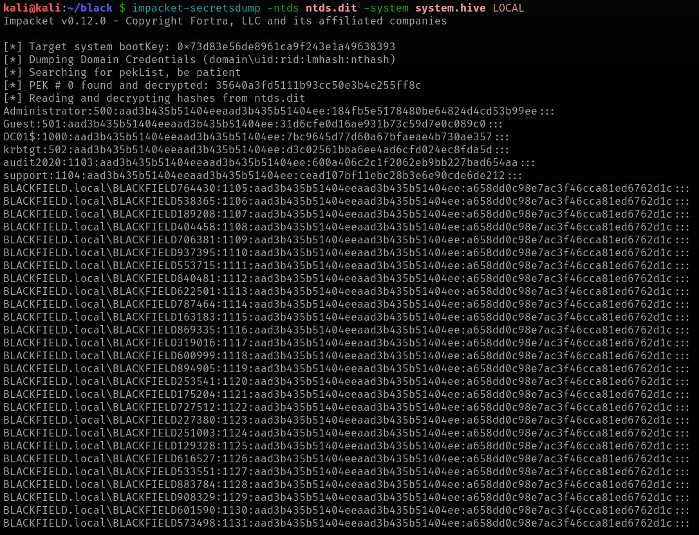

# Blackfield

This is my write-up for the machine **Blackfield** on Hack The Box located at: https://app.hackthebox.com/machines/255

## Enumeration

First I started with an [nmap scan](./res/Blackfield/10_10_10_192_nmapReport.txt), which shows the following

It looks like a normal Active Directory configuration, so first I triggered enum4linux, in order to gather some general information

Then I went to enum smb, starting with the shares, where I was able to get a list of them with smbclient

But the access was denied for all of them, except for profiles, where all the directories were empty, but I was able to get a list of potential usernames

Then I obtained the clean usernames

And with that I ran GetNPUsers script to check if there was some of this users with kerberos preauth, but it wasn't the case

Since it was giving a lot of errors, I used kerbrute to check if there was any valid user, and apparently there were only two

So I tried running a LDAP search to see if I could gather some more information about the target, but I didn't get too much

Then I decided to go and enumerate the other ports to gather as much information as I could, first I did a nbtscan, which didn't get anything

And I also did a dns dig, which also didn't return anything useful, a part from the new domain hostmaster

After that, I tried to get the account lockout threshold with rpcclient, but it wasn't possible, cause I got access denied

Since I didn't have much more options, I tried doing a bruteforce attack anyway to see if I got banned or if I found something, which didn't seem the case either way

So I decided to go and enumerate the ports further, starting by smb, where I ran some nmap scripts first the one that checks for eternal blue, which isn't likely, but just in case

Then I used the ones who checks the security and the protocols, which didn't report anything new

Since I was running out of ideas, I checked the write-up and apparently I should have got a hash back when running the GetNPUsers script, but I didn't, even after trying the command from the write-up itself

So I checked a video of the box, but they ran the same command as the write-up and it worked, so I googled what could happen and it seems to be the mismatch between my kali machine and the target, and after some back and forth with it I was finally able to set the correct time and get the hash

## Exploitation

Then I went to hashcat to crack the hash which gave me the credentials **support:#00^BlackKnight**

And with that I tried to get a shell on the target with those credentials, but it didn't work

So I checked if there was any kerberoastable user, but it wasn't the case

After that I went to smb, and I tried to access the shares that I didn't have access before, and there I was able to access SYSVOL and get all it's contents

There I identified two interesting files, which were GptTmpl.inf, that contained the password policy

And Registry.pol, which seemed to be an encrypted certificate

Since the Administrator user was repeated, along with the same string below, I tried those credentials (`Administrator@BLACKFIELD:7tk*mt!bR1ety^sb]yV-`) against smb, and they seemed to be correct, but when I tried them on winRM they didn't work, neither to enumerate the shares with crackmapexec

Then I tried to check for roastable users with those new creds, and for an ldap dump, but nothing worked, so I decided to try a password spray with the users we've retrieved earlier, and I found one match, which was `AAlleni:7tk*mt!bR1ety^sb]yV-`

Since nothing was working with those credentials either, I tried the same password spray with kerbrute, which confirmed that they weren't right

So I got back to the support user to try and enumerate further, first I tried with rpc, where I was able to pull the valid users

Then I cleaned the rpc users, in order to be able to use them in password spraying and kerberoasting

I ran the impacket script one more time to check if there was some other user without preauth, but only support came through

So I did a ldap dump, which retrieved some interesting information about the domain, like users and groups and so on

That gave me the idea that if ldap dump worked, maybe I could use bloodhound-python to retrieve some information and put it to bloodhound, which was actually the case

After checking the domain with bloodhound, there wasn't any paths to domain admin or other users, but for audit2020 with this ForcheChangePassword

So I tried the command recommended by bloodhound to change audit password for **audit2020:newP@ssword2022**

Which seemed to work, cause I was able to access forensic share with it

Checking the files downloaded, I found an interesting user, which happens to be an administrator, I don't know if it should be there or someone created it while doing the box

But when I tried the user pre auth it didn't found it

So I continued with the enumeration by running bloodhound again, but this time from audit user

But I didn't found any path to escalate from here either, since I was stuck here, I checked there write-up to see if I was on track or completely lost, and I was almost there, since the idea was once we got control over audit2020 user and we dumped the smb data, we could check the lsass zip to hunt for valid hashes, which I did previously, but the lsass.DMP was a binary, so I assumed that we couldn't take anything valuable from there

But according to the write-up it is possible to use a tool called pypykatz to extract NT hashes from there

Then I tried to use the hashes extracted, which were **svc_backup:9658d1d1dcd9250115e2205d9f48400d**, and with that I finally got a shell

## Post Exploitation

After that I went ahead and retrieve the user flag

Then I ran sharphound to retrieve the domain info from this user

And this time BloodHound finally gave a path to domain admin

With that information I tried the path suggested by bloodhound, first by uploading mimikatz via winrm, but the AV was blocking it

So I changed the approach and tried it from my kali machine, but it was also getting blocked

As a last resort of exploiting this path, I tried to open a meterpreter shell and use mimikatz there, but it wasn't possible as well

So I tried running winPEAS, but it was also blocked and didn't retrieve a lot of information

With that out of the way, I decided to do some manual enumeration, first I've checked the PS history, which wasn't available

Then I checked the privileges of the account, and the backup one caught my attention, even more considering that I saw before on bloodhound that this user is member of backup operators

And while I was going to the windows directory, to try an exploit the privileges, I saw the following note

Then I pulled the sam and the system

And after downloading them, I ran secretsdump and got the hash

But when I tried to use it I got login errors

So I continued the enumeration by pulling the groups, and the backup operators kept showing up

Before going that rabbit hole, I did a hash spray over the users that we had from previously, and apparently it worked for the Ipwn3dYourCompany user

But again when I tried to get a shell I got errors

So I tried to crack the hashes retrieved, but it didn't work either

Then I decided to finish the manual enumeration before trying something else, so I continued by pulling the ip config

After that I ran netstat, which confirmed the ports that we already knew that were open

And lastly I used sc query to check for AV and services, which apparently didn't work

With all that information, I went back to trying and get the sam file exploiting the group privileges, but this time, with a different tool, but unfortunately with the same result

After some googling, I saw that maybe there's the security file also needed, and since it was getting errors with reg I tried another tool , the on recommended to get that, but it didn't work either

So I checked the write-up to see what was going on, and apparently, we have to use WBAdmin to dump NTDS.dit and extract the correct hashes, but they were also creating a share on the kali machine and sharing it with the target, since I didn't understand that step, I tried to copy the file directly, then I got the error and I understood why they were doing it

With that said, I proceed to create the share on my kali machine, first by configuring the smb.conf

Then I added the smb user and restarted the smb service

After that I went to the evilwinRM, mounted the smb share and proceed with the backup

Then I pulled the versions to check the specific date of our backup, and proceed with the recovery

After that all I had to do was download the ntds.dit file

And run the secretdump to get the hashes which were **Administrator:aad3b435b51404eeaad3b435b51404ee:184fb5e5178480be64824d4cd53b99ee**

With that I was finally able to get and elevated shell and retrieve the root flag

