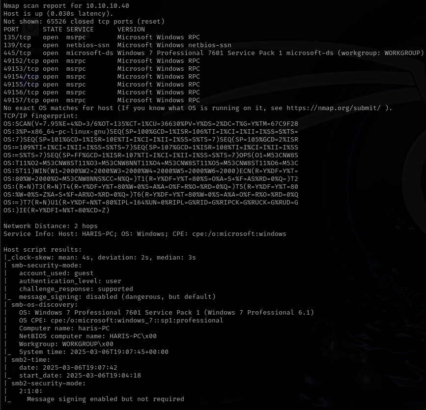
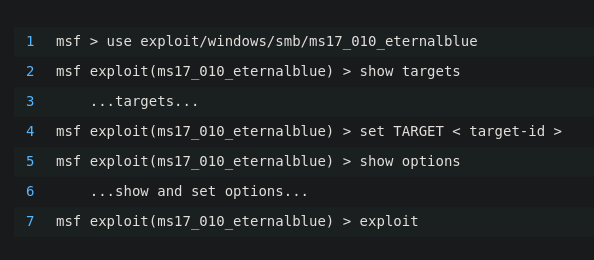
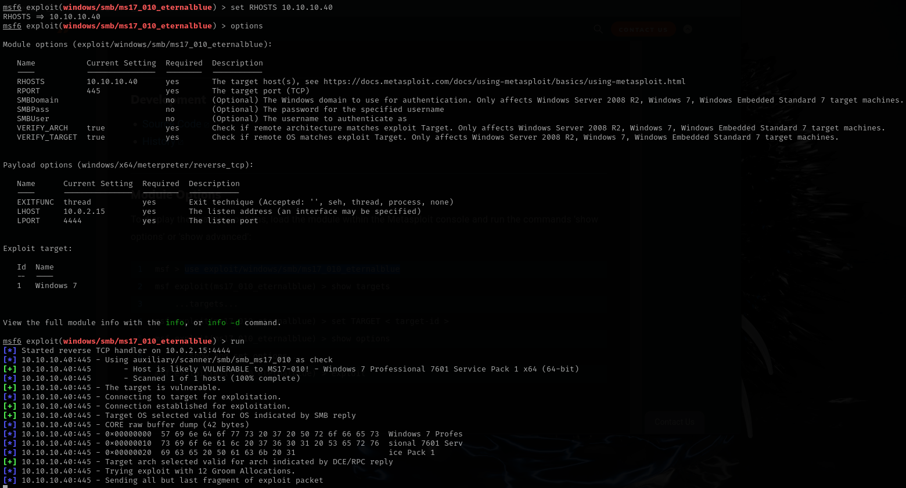
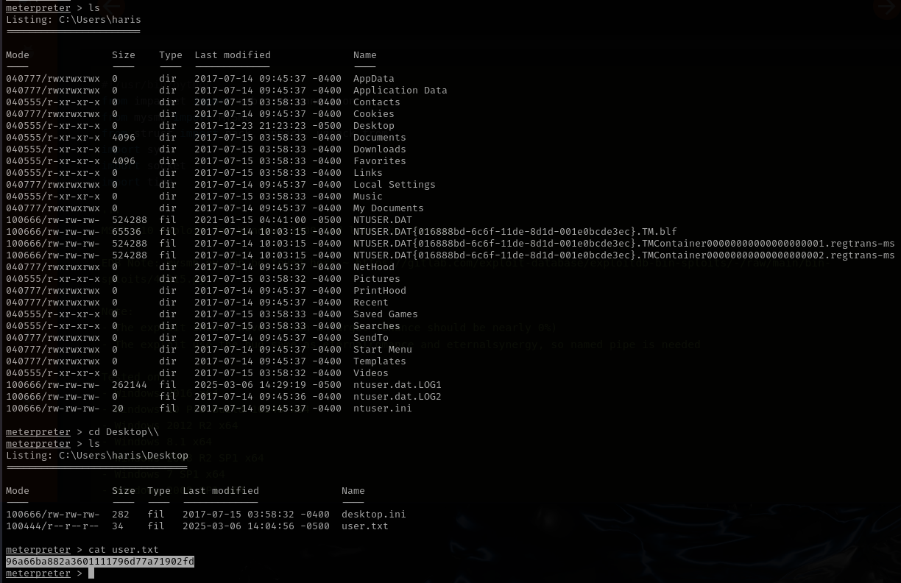
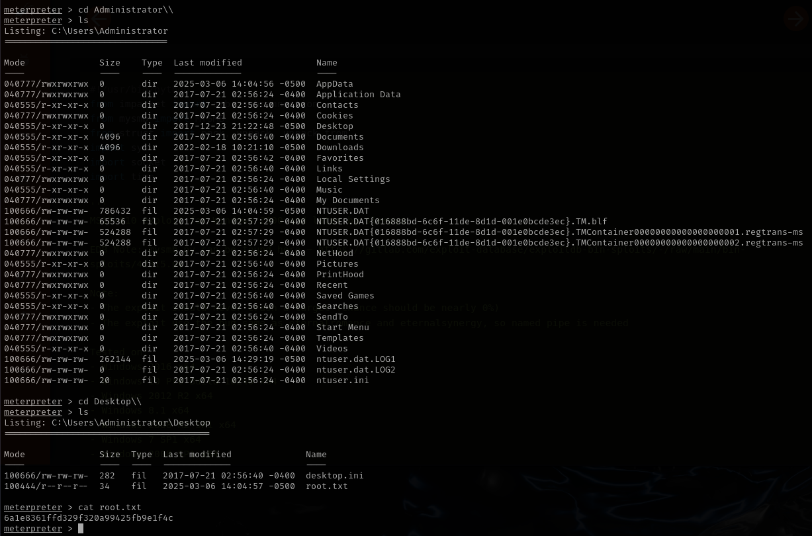

# Blue

This is my write-up for the machine **Blue** on Hack The Box located at: https://app.hackthebox.com/machines/51

First I started with an nmap scan, which shows the following:

Since the port for SMB is open, and we know that hack the box usually give us hint on the machine name, I've decided to give a try to the eternal blue exploit. A quick google search which the specific windows version lead us to this minitutorial on how to exploit it with metasploit

After setting up the options for the exploit we get a shell

We can find the user flag here:

And the root flag here:

