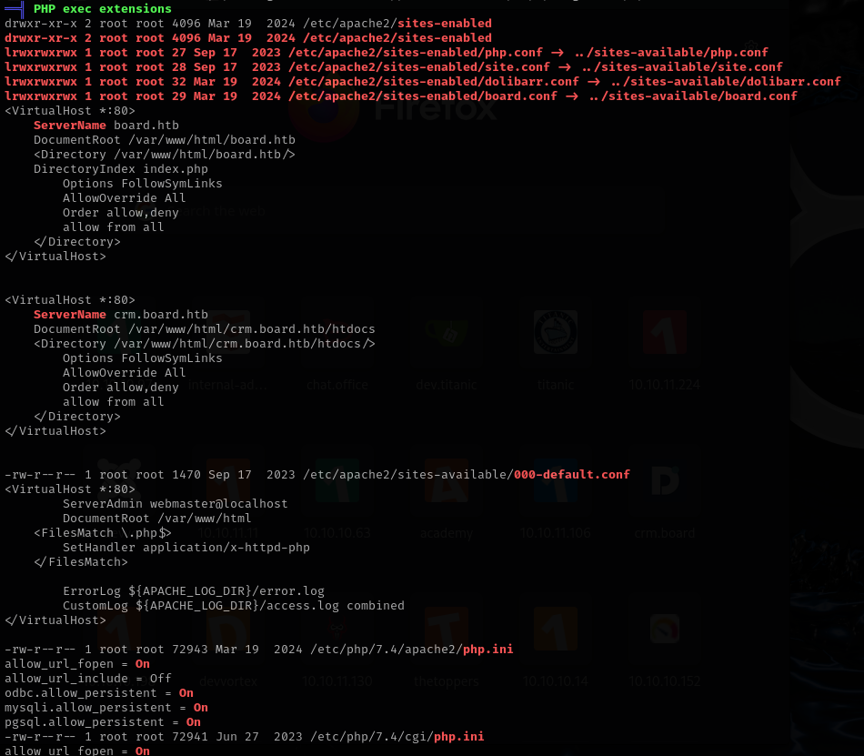

# BoardLight

This is my write-up for the machine **BoardLight** on Hack The Box located at: https://app.hackthebox.com/machines/603

## Enumeration

First I started with an nmap scan, which shows the following

Since only port 80 is open, apart from port 22, I navigated there to see what are we up against, and it shows the following

I also checked wappalyzer to check the tech stack

And I ran gobuster to enumerate subdirectories, but it only seemed to find the same as me with manual enumeration

I ran nikto to scan for vulnerabilities, but nothing came through either

So I ran feroxbuster to see if it finds something different, but it wasn't the case

After some time, checking the source code, the requests and general behavior of the website, and searching for exploits for the known versions and not finding anything I went to the guided mode of HTB for a hint, which was to look through the page for a domain, which made me realize that I saw this email, which could be it

Then I added this domain to /etc/hosts and run gobuster against it, where I found the following subdomain

Which displays the following login page

Then I checked the teck stack for this new page

## Exploitation

And I tried **admin:admin** as default credentials, which actually worked, and I got logged in

Then I googled for exploits for this version of Dolibarr, and I found this [exploit](https://github.com/nikn0laty/Exploit-for-Dolibarr-17.0.0-CVE-2023-30253) which is supposed to give a reverse shell

And after running it, I actually got the shell back

## Post Exploitation

Then I started the normal enumeration to escalate privileges, first by pulling the system information

After that the local users, which showed that there's larissa a part from root and the current service account

Then I pulled the network information, which showed that there's a SQL running internally

And the hosts, where they are more than expected, since there isn't a folder for boardlight inside /var/www

And I also pulled the SUIDs, but it doesn't seem to be anything interesting

Then I continued by running linpeas, which a part from some kernel exploits as usual, showed a bunch of files that could be worth exploring to see if there's any sensitive information

I started from the apache ones, but a part from some general configurations and the user www-data there wasn't anything there

After reviewing the mysql files, I didn't found any valid credentials, just the user mysql as linpeas pointed out

So I continued with the php, but most of the sites enabled didn't exist back on the sites-available folder

Then I explored the nginx files, without any luck either

And lastly the ldap files, with the same results

So I passed to explore the files inside crm.board.htb and I found the robots.txt, readme and some other things, but they also seem to lead nowhere

After all that enumeration, and for previous HTB boxes I was convinced that I had to find the sql credentials or the larissa credentials, so I first focused on finding the mysql credentials, and to do that I went back to the files suggested from linpeas, but I didn't find anything, so I googled the documentation of dolibarr, php and apache to see where they had the config files and where could be those credentials, and after some time exploring the files I found the db credentials on the conf.php file which were **dolibarrowner:serverfun2$2023!!** and the db name was **dolibarr**

Then I went straight to mysql, but it got stuck each time I tried to connect, so I tried by triggering a command instead of an interactive shell and it worked

With that I was able to pull the users from the DB, but it was the same user that I already knew

That made me think that this could be a case of password reuse, so I tried to SSH into larissa account with the password previously found and it worked, I got a shell from larissa account

So I retrieved the user flag

And I continued with the enumeration for the escalation, first with the sudo -l, which wasn't allowed in this case, and then with the groups, which displayed something interesting, which was that larissa was on adm group, which after googling it I found that it gaves the possibility to read system logs

Then I found the following [blog](https://medium.com/@evyeveline1/im-in-the-adm-group-can-i-escalate-yes-eventually-9475b968b97a) which gave me some commands to enumerate the logs, the first one being the auth.log where it was possible to see some logins from larissa and root

Next was the cron jobs where I saw that there was a job running every 3 minutes as root cleaning up the DB, but it was not possible to mess with it, and another one at 09 and 39 minutes of each our, but after review these and exploring the other cron jobs I didn't found anything that allowed me to escalate

So I got back to auth.log with a different search, and I found that vmtoolsd was the one processing the root credentials

Then I tried to see if they were stored somewhere or if I could use this tool for reading them, but it wasn't the case

Since I was stuck, I decided to take a look at the HTB guided mode for a hint, which was to check the SUIDs to check which desktop environment was installed, after taking a look I saw that it was enlightenment

Then I checked which version was being used

And with that I was able to search the following [exploit](https://github.com/MaherAzzouzi/CVE-2022-37706-LPE-exploit) which finally gave me the elevated shell

Then the only thing left to do was to retrieve the root flag

