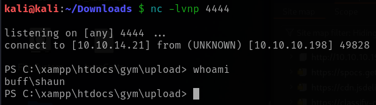
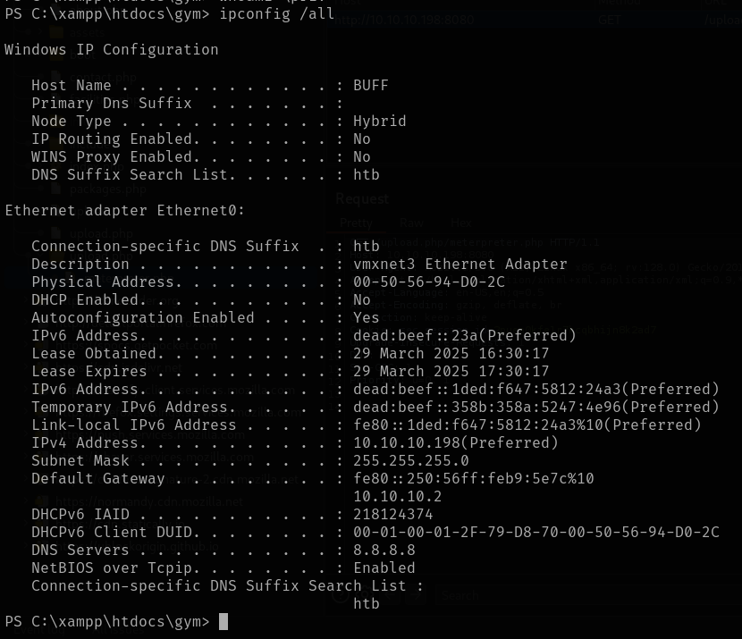
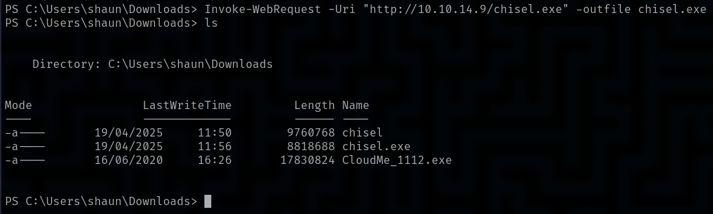

# Buff

This is my write-up for the machine **Buff** on Hack The Box located at: https://app.hackthebox.com/machines/263

## Enumeration

First I started with an nmap scan, which shows the following:

I decided to explore the website first to get a little bit of context and enumerate the server and the tech stack. On the default page we could see a fitness website with a carousel built in javascript, php and apache

Then I ran gobuster while I navigated through the website, and everything seemed normal, including the login request

The gobuster report does show some interesting directories

But before going that rabbithole I googled the port 7680 since I didn't know what it was, and it seems that it is associated with Microsoft Delivery Optimization which seems to be a P2P file distribution system. It seems that it's not a common attack surface, but I did some enumeration despite that, but I didn't get anything interesting

So I get back to the subdirectories of port 8080 and navigating around I saw that on /ex dir was an information disclosure about mysql

So I tried to enumerate if there was some kind of sql injection with sqlmap, but it doesn't seem to be the case

## Exploitation

Then I tried some exploits for apache and php but none of them were working, until I went to the Contact page and I saw that it was built with Gym Management Software 1.0 and with a quick google search, I found some exploits for it, and I end up getting a shell

So I tried to do some basic enumeration with it

But after seeing that I wasn't able to trigger any other commands like cd, execute certutils and so on

I decided to do some tweaks to the exploit in order to get a full interactive reverse shell

And with it, I got a powershell reverse shell back

## Post Exploitation

I tried uploading winPEAS, a meterpreter shell, etc... And nothing worked, so I decided to move forward and do some enumeration with the shell that I already had by pulling the local users

And some networking information, like ipconfig and netstat info

I also found password file that was lying there

Along with a xampp readme file, which seems to contain some default creds and explanations about configs and how things are meant to work

Since I was navigating through the directories, I also got the user flag

Doing some more navigation through the user files I found those 2 executables which could be interesting

Then I checked the processList and I found that CloudMe was running, and that I was able to execute it

But I didn't know what to do with it exactly, so I got a hint from the guide mode which suggested to check netstat, but I was not able to find the process there

Then I found out that I was able to pull files with an specific command for powershell, so I tried running winPEAS, PowerUp and a meterpreter shell, but none of them worked

Since I was a little stuck, I decided to check the write-up, where I saw that we had to do a port forward to the port 8888 to attack CloudMe, since I didn't know how they arrived to that conclusion, since it is not possible to compare the process id with netstat, and it's not possible to use lsof, I did some research about it, and since CloudMe is an external already known service, it is enough by googling it to see which port does it use, and also some exploits come out, so I noted for next times, to always look for weird process and executables, cause they could be a known service and not an internal thing, like in this case, so with that said, I went ahead and to do the port forwarding, so first I fetched Chisel

Then I ran chisel both on my kali machine and on the target, and I got a connection back

So I generated a payload as it says on the exploit script

And after running the exploit I got an elevated shell back

So the only thing left to do was to retrieve the root flag

