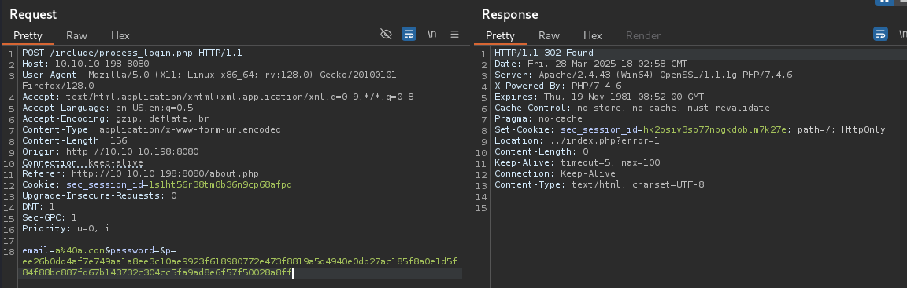
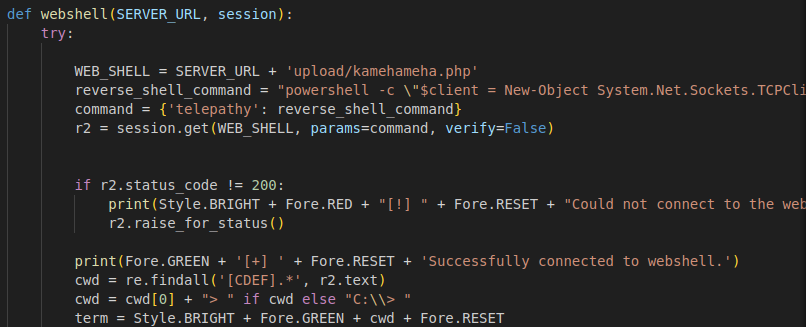

# Buff

This is my write-up for the machine **Buff** on Hack The Box located at: https://app.hackthebox.com/machines/263

## Enumeration

First I started with an nmap scan, which shows the following:

I decided to explore the website first to get a little bit of context and enumerate the server and the tech stack. On the default page we could see a fitness website with a carousel built in javascript, php and apache

Then I run gobuster while I navigated through the website, and everything seemed normal, including the login request

The gobuster report does show some interesting directories

But before going that rabbithole I googled the port 7680 since I didn't know what it was, and it seems that it is associated with Microsoft Delivery Optimization which seems to be a P2P file distribution system. It seems that it's not a common attack surface, but I did some enumeration despite that but I didn't get anything interesting

So I get back to the subdirectories of port 8080 and navigating around I saw that on /ex dir was an information disclosure about mysql

So I tried to enumerate if there was some kind of sql injection with sqlmap, but it doesn't seem to be the case

## Exploitation

Then I tried some exploits for apache and php but none of them were working, until I went to the Contact page and I saw that it was built with Gym Management Software 1.0 and with a quick google search, I found some exploits for it, and I end up getting a shell

So I did some basic enumeration with it

But after seeing that I wasn't able to trigger any other commands like cd, execute certutils and so on

I decided to do some tweaks to the exploit in order to get a full interactive reverse shell

And with it, I got a powershell reverse shell back

## Post Exploitation

I tried uploading winPEAS, a meterpreter shell, etc... And nothing worked, so I decided to move forward and do some enumeration with the shell that I already had by pulling the local users

The ipconfig and netstat info

A password file that I found lying there

The xampp readme file, which seems to contain some default creds and explanations about configs and how things are meant to work

The user flag

navigating around through the user files I found those 2 executables which could be interesting

--- 

TODO: Escalate privileges
