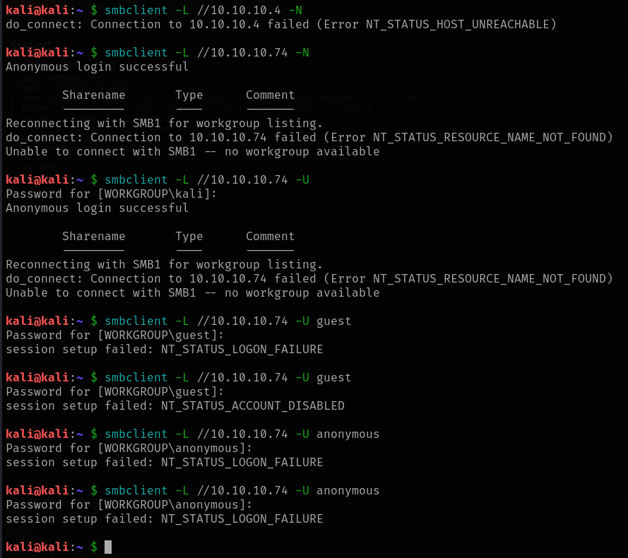
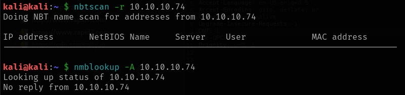

# Chatterbox

This is my write-up for the machine **Chatterbox** on Hack The Box located at: https://app.hackthebox.com/machines/123

## Enumeration

First I started with an nmap scan, which shows the following:

Since there was an http web on a port that is not common I explote it first, but anything was there

So I went straight to enumerate SMB, I run the nmap script to check if there was eternal blue, but it doesn't seem to be the case

And also run the enum4linux, but it didn't pull any interesting information either

And some nmap scripts to enumerate the shares, but there was no luck either

It was not possible to enumerate SMB manually either

So I googled how to enumerate RPC and only one command worked, and pulled a lot of information, but I didn't really know what to do with it

## Exploitation

So I tried to find some exploits for the achat and see if they worked, first I tried with one from metasploit

But it failed

So I tried with another one from exploitdb, which I had to modify a little bit to configure a reverse shell and fix some syntax errors, but it didn't work either

After that I did some enumeration on port 139, but nothing interesting came out either

Since I was stuck, I decided to check the write-up to see what was going on, and it seems that I copied wrong the msfvenom command from the exploit, cause you have to copy all the numbers on the line, not just the first one as I did, so I generated the payload again with that modification

Then I triggered the exploit again and this time I got a shell back

## Post Exploitation

Now with that shell, I did some basic enumeration of the target machine, first I got the systeminfo

Then I got the tokens, to see if there's any impersonation possible

And the netstat, to see if there's any internal port open, which seems to be the case with 1900 and 63410

I also got the user flag

And I run winPEAS, which pulled a lot of interesting iformation, like interesting files that can be accessed as the current user, along with the password for the alfred, which is Welcome1! and some hashes

Since I was doing this specific box because it was recommended as a practice on a course that I'm doing about windows privilege escalation, I decided to follow the walkthrough from this point, since the escalation is supposed to be with port forwarding, and I'm still new to it

So the first thing that we are supposed to do is to find the default password with the help of the commands of the following [page](https://sushant747.gitbooks.io/total-oscp-guide/content/privilege_escalation_windows.html) but we already found them with winPEAS, so we are good to go.

After that, we have to download [plink](https://www.chiark.greenend.org.uk/~sgtatham/putty/latest.html) and upload it to the taget machine

Then we have to uncomment and change the **PermitRootLogin** from **prohibit-password** to **yes** on /etc/ssh/sshd_config

And restart the ssh service

But then I tried running the same command as on the course and it gave me an error

So I went to the official write-up to check which way are they using, and it seems that there's a password reuse, so we can use alfred's password to access the administrator account

And with that I retrieved the root flag

