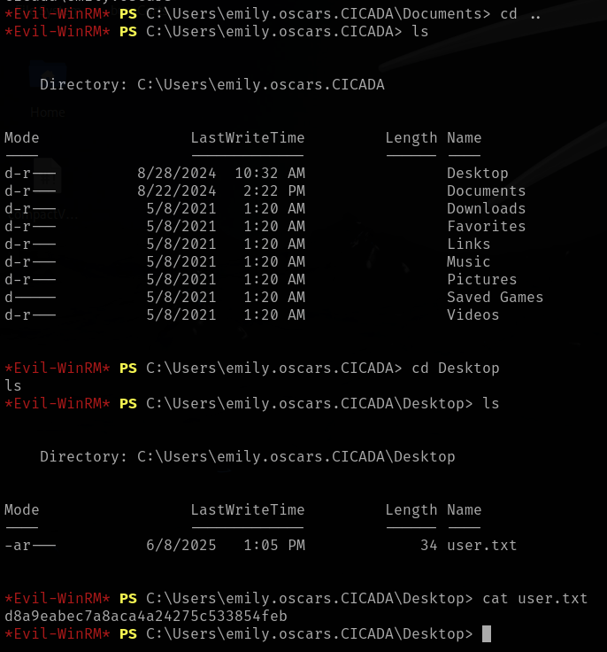
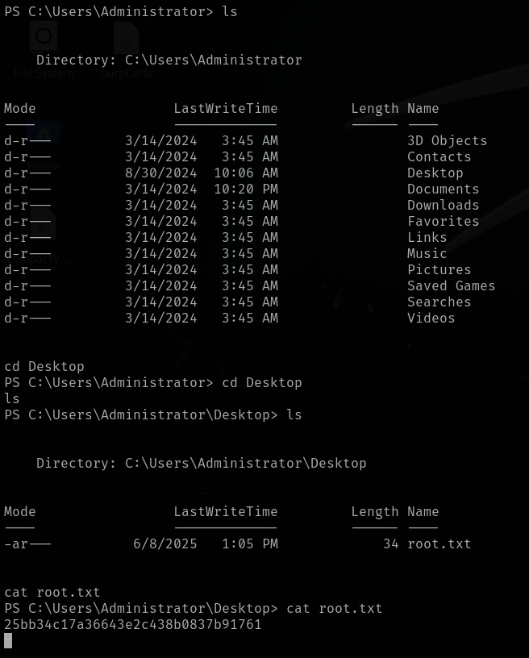

# Cicada

This is my write-up for the machine **Cicada** on Hack The Box located at: https://app.hackthebox.com/machines/627

## Enumeration

First I started with an nmap scan, which shows the following

There was a lot of ports open on this box, but since it wasn't familiar with many of them I decided to start with SMB which usually tends to have interesting information, also the nmap scripts pointed out that the message singing is enabled and required, which was different from other boxes

So I started by enumerating the shares, which were the following

Then I ran some nmap scripts to check if there was eternal blue, and to enumerate it further

After that I ran enum4linux to get more information, but I only got the domain name and some usernames

Then I started enumerating the shares manually, and I was able to get a connection with admin:admin, but the access was denied anyway when doing an ls

On the HR share though, I was able to list the files, and there was a note, I downloaded it

And when I checked it I saw the following password `Cicada$M6Corpb*@Lp#nZp!8` which is the default one for new users, and some explanations about how to change it and why

With that information, all that I needed now was to enumerate usernames and check if this password works with any of them, so first I used a metasploit module to enumerate kerberos users, but nothing was found a part from the already known users administrator and guest which aren't likely to have this default password set

Since I didn't find anything with kerberos, I moved to ldap to see if it was possible to dump some information, but it doesn't seem to be the case either

I also tried to enumerate the DNS, but nothing interesting came through

So I googled ways to enumerate the ports that we have open, and I found enum4linux next generation, which did a better job than the old one, but still didn't found anything, just some domain and SMB information that we already had from before, and as for the RPC it tried to enum the users and it got access denied all the time

Since the enumeration for the username was not working I decided to use crackmapexec to do some password spraying on winrm, but I didn't have any luck

So I moved back to kerberos and I tried user enumeration with a different tool called kerbrute and with the wordlist that I've downloaded previously for the winrm spraying, but nothing was found either

I also tried password spraying on kerberos, but with the same results

## Exploitation

Since I knew that I had to use the password that I found I tried again to enumerate the domain users, but I only obtained the user guest

So I checked the write-up to see what was I missing, and it says that it is possible to get the domain users with impacket-lookupsid, which then could be used as a wordlist for password spraying

Since the command used to filter the users on the write-up was a little bit crazy, I did some research on my own on awk and sed, and then I built my own command to filter the users

Now with that I proceed with the password spraying, but again it failed

So I checked the write-up again to see what was going on, and apparently we have to do the password spraying against smb instead of winrm, then we are able to see that michael wrightson is using the default password

Now we know that we can't access winrm with these credentials from the previous password spraying, so I tried to access other smb shares, but it seems that michael can only access HR

But now with michael credentials, we can use crackmapexec to do some further enumeration of the users, where we could see that david orelius has it's password as a description which is `david.orelious:aRt$Lp#7t*VQ!3`

After that I tried this credentials in winrm, but they didn't work either, so I went to smb, and I was able to list the contents of the DEV share, where we can see a backup script

With a quick look to the backup script we could see the credentials for emily oscars, which are `emily.oscars:Q!3@Lp#M6b*7t*Vt`

And now finally, with those credentials we are able to use winrm to get a shell

## Post Exploitation

Before starting the enumeration for the escalation I grabbed the user flag

Then I pulled the tokens and groups

After that I tried with the system information, but I got an error

So I moved to the networking information, first pulling the ipconfig

And then the netstat information to check the listening ports

Then I got a meterpreter shell, and pulled the system information, which wasn't working previously, and I saw that the target was x64 and my meterpreter was x86

So I tried to migrate processes in order to get a x64 meterpreter shell, and it worked

After that I ran the local exploit suggester

But before start firing exploits I ran winPEAS to see if I can gather more information and define a clear escalation path, but I got an error

So I got back and review the information that I had, and I saw that the privilege SeBackupPrivilege could be interesting to escalate privileges, or at least that was said on this [checklist](https://swisskyrepo.github.io/InternalAllTheThings/redteam/escalation/windows-privilege-escalation/#eop-impersonation-privileges), that made me google it, and I found this [blog](https://juggernaut-sec.com/sebackupprivilege/#An_Easier_Way_to_Extract_a_Copy_of_the_Local_SAM_File_Hash_with_SeBackupPrivilege) which was interesting, so I gave it a try, and I was able to dump the SAM files

Then I used secretsdump to get the hashes, as it was explained in the blog

And with that I was able to pass the hash from administrator to psexec and get a shell back

Now the only thing left to do was to retrieve the root flag

