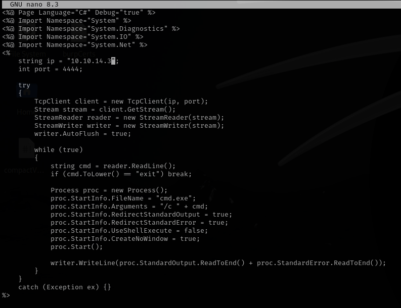
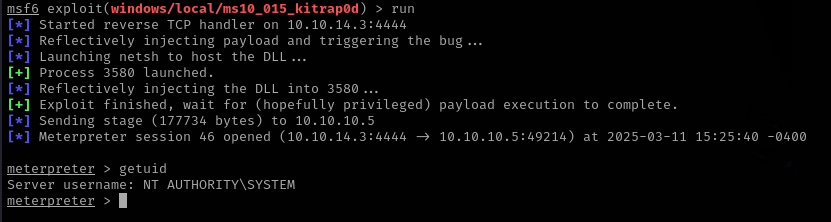

# Devel

This is my write-up for the machine **Devel** on Hack The Box located at: https://app.hackthebox.com/machines/3

## Enumeration

First I started with an nmap scan, which shows the following:

Since anonymous login is allowed, I connected there to see if there's something interesting that we could pull, or if we are allowed to upload files, which it seems we are, so probably we can upload a reverse shell, and since the port 80 is open as well maybe we can get it executed from there

With that information, I procced to enumerate port 80, which show us the following default page. This tell us that the server is running IIS7, which we already know from the nmap scan, but it's good to confirm

We could see that we are able to access the file that we uploaded before with ftp, so now the next step will be google for a reverse shell for IIS7 and upload it

## Exploitation

I found the following aspx shell online

Then I upload it to the server via FTP

I start a netcat listener

but after trying to access the shell on the server I got an error

So I tried a different approach, which was a simpler shell that grants a cmd over port 80

And this time it worked

I tried some one liners to connect back to my netcat, but none of them worked, so I got back to trying a direct reverse shell. I found a different one which is quite longer

And this one connected properly

## Post Exploitation

When I went to get the flags, it seems that we have no access, so we'll have to do some privilege escalation

### Enumeration

I did some information gathering in order to prepare for the privilege escalation by pulling the systeminfo

And the priviliges and groups, where we could see that SeImpersonatePrivilege is enabled

### Privilege Escalation

After some googling about how to escalate privileges on that version, I saw that using [JuicyPotato](https://github.com/ohpe/juicy-potato/tree/master) was recommended. So I cloned the repo and tried to compile it

But since it is compatible with windows and not linux, I was getting some compilation errors, so I've decided to pull a precompiled one

Then I tried to upload it to the target machine, but I've got an error, since I did not have writting permissions on that folder

So I had to find a folder with permissions

But when I run it, it gave me an error, it seems that I've uploaded the wrong version

## Different Approach

Since I felt that I was going down a rabbit hole, I checked the official write-up, which gave me the hint to use msfvenom to get the shell in the first place

And with that, after configuring the metasploit listener, we get a meterpreter shell

With that session, since we already know that the windows is x86 from before, I used the local exploit suggester to get modules that I could use to escalate privileges

I checked the official write-up again to see which one is the one that works, then I use it to gain the root shell

Now it's only matter of get the flags, which we already know where they are from before

