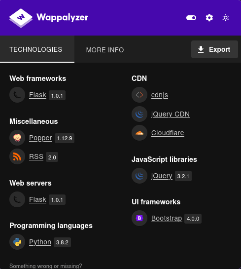

# Doctor

This is my write-up for the machine **Doctor** on Hack The Box located at: https://app.hackthebox.com/machines/278

## Enumeration

First I started with an [nmap scan](./res/Doctor/10_10_10_209_nmapReport.txt), which shows the following

Since I didn't know what port 8089 was I decided to google it first, and apparently it is used for the API communication with splunk, which I discovered that is a big data platform. With that said, since only port 80 and ssh were open, I decided to focus on http for now, after navigating there we could see some kind of health related site as a default page

After that I ran gobuster on it as usual, and while I was waiting for it to finish I checked the tech stack with wappalyzer

Then I took a look to the source code, but nothing stood out, it seemed a normal html code for a landing page, I also clicked around, but everything seemed to redirect to the main page. After that the gobuster finished, and it only found some endpoint that could be listiting some things, but nothing too interesting

After that I checked nikto results, which apart from the apache version, only found those endpoints

So I went to explore those endpoints, but nothing stood out

Then I tried LFI on one of those requests, but there wasn't any luck either

After that I checked the options of the endpoints to see if there was possible to do a PUT or something like that on any of them, but it wasn't the case

I also ran dirbuster, to see if it found something different, but it wasn't the case either

After that I triggered the nmap scripts to check for http vulnerabilities, but they didn't found anything either

So, I changed the strategy a little bit, and I researched how to pentest port 8089, first I started with a netcat command to grab the banner, which didnt't work

Then I saw that splunkd works on https, that's why I wasn't able to access the web the first time I tried, but now we got this page

I checked the links and rpc and static weren't accesible, while services and servicesNS asked for credentials, I tried some default credentials that I found online, but they didn't work

So I searched for exploits of the specific splunk version, when I found [this blog](https://eapolsniper.github.io/2020/08/14/Abusing-Splunk-Forwarders-For-RCE-And-Persistence/), which wasn't a exploit itself, but it has a really good explanation on how does splunk work under the hood, the problem is that we didn't have the credentials nor a shell to retrieve them from the common locations mentioned there, so I continued searching for other exploits, when I found the PySplunkWhisperer, which was the one they were talking on the previous blog, and since I read on the documentation that the default credentials didn't work on remote, I decided to give it a try thinking that maybe it will work with the exploit, unfortunately it wasn't the case

After that, I decided to do a bruteforce attack against splunk, since we know from the blog that I mentioned earlier that splunk doesn't have account lock out, first I tried with hydra, but it wasn't working out well

Since splunkd was taking the request parameters on base64 on a header, I decided to make my own [script](./res/Doctor/splunkd_bruteforcer.py) to bruteforce this, unfortunately no valid credentials were found

After that I kept researching for ways to pentest splunkd, and I found this [pentest cheatsheet](https://github.com/burntoberoot/splunk_pentest_cheatsheet), which was interesting to have the structure of splunk and some other information, but it didn't work either. So I checked the write-up for a hint on what to do next, which was to add doctors.htb to our /etc/hosts, since there was references to it on the port 80 website. After doing that if we navigate to that new domain, we could see that there's a login page

Then I checked the login and register requests, but there wasn't anything weird

So I went ahead and create a user and login, where we could see the following page

Playing around with the page I saw that it was possible to create posts with the new message option, and also that there's an option to change the username and email, though when I tried to update it, it didn't work, which made me think that maybe it is processed in a different way

So I tried some SSTI payloads, but they didn't work

After that I ran gobuster against it, to see if it discovers something else, which didn't seem to be the case

I also checked wappalyzer, to check the tech stack behind it

And I ran nikto as well, which didn't found anything else either

After that I checked if there was LFI on any of the new domain endpoints, but there was no luck

So I used sqlmap to see if there was some kind of sql injection, but it wasn't the case either

After that I searched for exploits for the python and flask versions that we had, and the Werkzeug exploit kept showing up for both of them, so I gave it a try, but I got the output that the debug mode is not enabled

## Exploitation

Since I was running out of options, I checked the write-up to see what I was missing, and the thing was that actually there is SSTI when posting a new message, but it isn't displayed on the post page, instead we have to go to /archive, which we found previously with gobuster, and check the source code there, where we could see that it is actually getting executed

Now with that, we can actually send a reverse shell payload and get the shell back on our netcat

## Post Exploitation

After that I began the enumeration for the escalation, first I've checked some files that were on the directory where we spawned, and were actually interesting

Before digging deeper on what the script is doing and inspecing the python files, I decided to do some reconnaissance on the target, first checking which users where available, which apparently there was 2 more apart from web and root

Then I decided to check the hosts, where I found brawl, which could be interesting, probably we'll have to do a port forwarding, considering that there's a reference to sql in the first script, and now this

So I decided to check the network information, to see if there was any other port listening internally, and it seems to be the case

I also checked the user groups

And lastly, before exploring the files mentioned earlier and maybe doing a port forwarding, I decided to check the os information

After that I went to check the run.py code, which I saw that was calling a module from flaskblog, when I navigated there, I saw that there was a config.py, which seemed interesting, and actually it was, since it contained mail credentials and a call to the db key

So I tried a combination of those credentials over ssh with the known users, but there wasn't any luck

Then I transferred the site.db to my kali machine with a quick ftp that I've created, since the python http module didn't work here, so I'd be able to read it, because sqlite3 wasn't installed on the target

With that I was able to read the db and I found the user admin, with it's encrypted password

Then I remembered, that once you have access it was possible to access to the password easily according to the previous blog I read, but unfortunately for this case we don't have permissions

So I decided to ran hashcat while I continue enumerating, since I don't expect it to actually crack the password, but you never know

Since some mail credentials were mentioned on the config.py, I went to the mail folders to check if there was something there, but it wasn't the case

But, since I was on var folder, I wandered a little bit there, when I saw that inside log, there was some files accessible from adm group, after some reasearch on how to escalate with adm group I checked some of them but I didn't found anything

So I decided to ran linpeas to check if I was missing a cronjob or something else, and it found some interesting things, the first one being some other databases

Then I saw that linpeas was highlighting the python cap_sys, I did some research, and tried to escalate privileges with it, but it turns out that you need some kind of root access for it, so it wasn't possible

After that, I tried to put a reverse shell into the blog script, and reboot the machine, but it was not possible to do a reboot, so it didn't work either

Since I was stuck I checked the write-up, and there I saw that the way to escalate was to check for password on /var/log which where we found Guitar123, which apparently is the password for shaun, I found that earlier, but I've tested it with ssh, which didn't work, but if we do a su shaun, as the write-up suggest, we get a shell as shaun user

Then I checked the env for shaun, since it's one of the things that could change, and I saw that there mail was specified

But unfortunately nothing was there

After that I returned to the home directory, and I grabbed the user flag

Then I got chisel to do a port forwarding

But unfortunately port 5000 got me to the same page as before

So I ran gobuster against it, to make sure there wasn't anything else there

Since I wasn't finding anything even with the port forwarding, I decided to check the write-up, where it says that shaun credentials could be used in conjunction with the exploit that we found before (PySplunkWhisperer) in order to obtain an elevated shell since splunkd is running as root. I assumed that since shaun credentials didn't work on ssh, they won't work there as well, but then I tried it, and I saw that I was wrong

With all that information, I used the exploit, and apparently it was working, since I got the message of authentication, but I didn't got the shell back, even copying the same payload as the write-up

So I did a test with curl, to check if the payload was being executed at all, and it seemed to be the case

Then I tried sending some other payloads, and when I tried wrapping them in parentheses it suddenly started to work

And then the only thing left to go was retrieving the root flag

