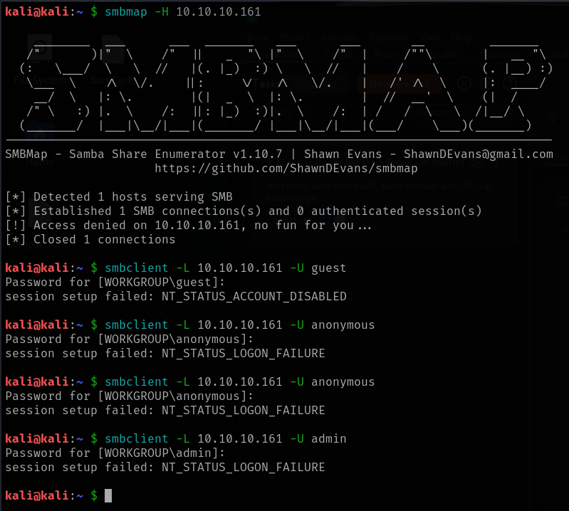
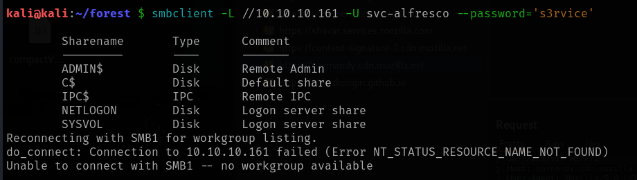
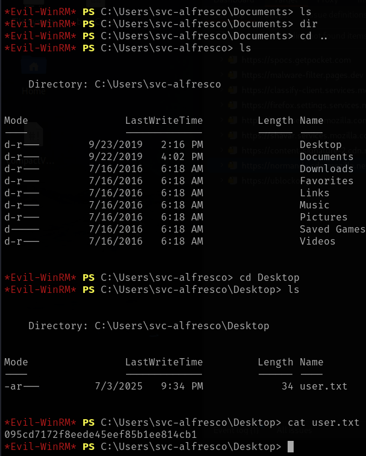
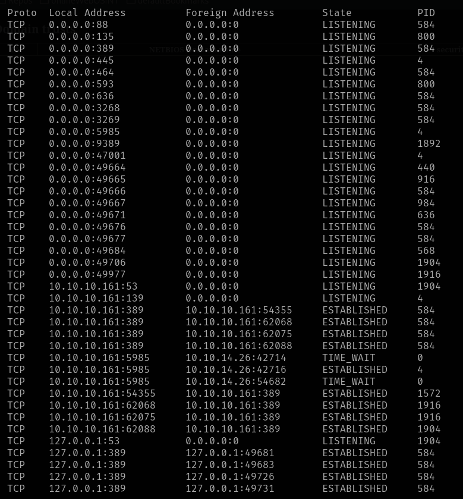
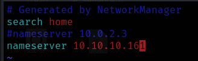
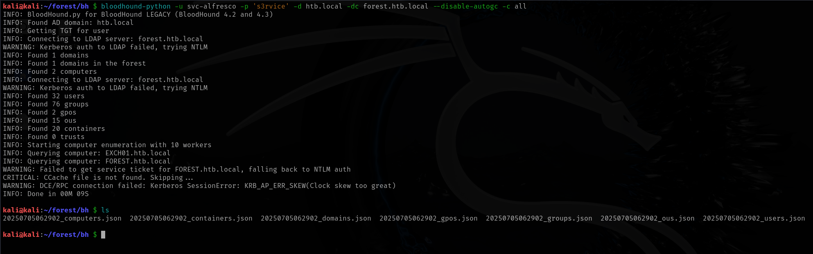

# Forest

This is my write-up for the machine **Forest** on Hack The Box located at: https://app.hackthebox.com/machines/212

## Enumeration

First I started with an [nmap scan](./res/Forest/10_10_10_161_nmapReport.txt), which shows the following

Since SMB is open, I tried to enumerate the shares, but it wasn't possible

Since I didn't know where to start exactly, and it always happens to me with Active Directory, I ask chatgpt for a checklist to pentest it, and the first step was to use dig to query all DNS records

Then I continued with enum4linux, which printed a lot of information, like users, groups and password policies

After that I used ldapsearch to pull some information from it

Where I saw that there was some account names, so I did a grep of all of them

Then I used awk to get just the usernames, and I ran GetNPUsers.py to identify users with pre-auth disabled, but I wasn't getting anything, so I tried again with the users that I got from enum4linux, and then I got svc-alfresco hash

## Exploitation

After that, I went straight to hashcat to crack the hash, which gave me the following credentials **svc-alfresco:s3rvice**

That allowed me to enumerate the shares

But when I tried to enter the shares I got an error on all of them but the SYSVOL, which after downloading all it's content and checking it, there was only some policies, which isn't that useful

So I tried a different approach, which was getting a shell with winRM, and it actually worked

## Post Exploitation

Then I retrieved the user flag

After that I started gathering information for the escalation, by checking the privileges and the groups

Then I took a little detour to dump the domain info from ldap to check users, groups and policies, but there wasn't anything that stood out

So I came back to the target machine to check the netstat to see if there was any internal port open

And also the ipconfig to check if there was another subnet, which wasn't the case

After that I checked if there was windefend running, which also doesn't seem to be the case

Then I moved to bloodhound to see if there was a path to the domain controller, first I had to modify the /etc/hosts and the /etc/resolv.conf in order to make bloohound-python work

With that I was able to retrieve the data with bloodhound python

And after installing bloodhound GUI and uploading the data retrieved before I checked the domain admins, which only had the user administrator

So I queried the path to get to that user, there I saw that the user we already own is in all those groups, that are inside one another

Then I clicked at WriteDacl and tried the commands of the abuse section, but one of them got stuck

After a little research I saw that the cause could be insufficient permissions and that there was some commands to be executed on the genericAll section in order to put that last group into the exchange windows permissions group

Then I got back to the writeDACL commands, and this time they worked

But when I tried to do the secretsdump it failed

I was a little confused, so I went to the write-up to check which will be the correct process, and after following it, I finally got the hashes. After that, I did a little research about how this works, cause I was curious of what were the differences between the write-up and what I was doing, and apparently in this case it seems that creating a new use could make the difference because group membership may not have taken effect immediately

After that I used psexec to pass the hash and get an elevated shell as administrator

Then the only thing left to do was to retrieve the root flag

