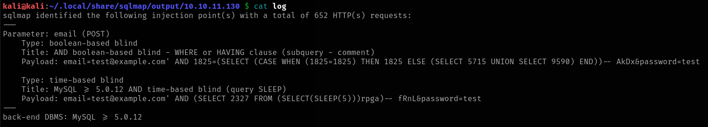
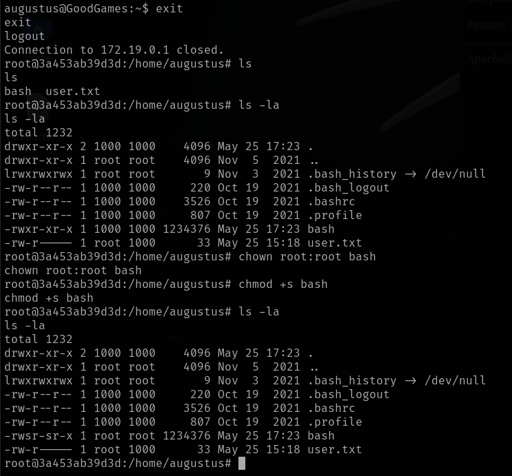

# GoodGames

This is my write-up for the machine **GoodGames** on Hack The Box located at: https://app.hackthebox.com/machines/446

## Enumeration

First I started with an nmap scan, which shows the following:

Since only port 80 is open I navigated there to see what are we up against, and the default page was the following

Also wappalyzer shows the following versions

After that, I ran nikto and gobuster while I clicked around, and nikto pulled some interesting information, like an apache version and some vulnerabilities that could be explored later on

As for gobuster, it only found the same pages that I did navigating around and with burpsuite

I also pulled the headers and tried to run the nmap script to identify http vulnerabilities, but since the server is returning a 200 code even for the 404 the script is failing, it also happened with gobuster, but I was able to work around it by adding the flag `--exclude-length 9265`

Since I wasn't getting any more information I started searching for exploits for the versions that I had, but I didn't found anything apart from one exploit for Werkzeug which didn't seem to have the debug mode active, so it was not possible to use it

So I moved to another approach, which was to test for sql injection since there was a lot of requests on logins, and so on, first I used sqlmap

Which reported some kind of blind injection, which was good to know that could be something there but not too useful

After that I started testing for sql injection manually, and I found something on the login page, with the following query I was able to obtain a login succes regardless of the email, the password had to be valid though

So I kept trying different queries, and I found one that let me login just with the email

With that in mind, I got back to the website looking for other users and emails so I can exploit the injection, and I found a post from the admin

And a bunch of other users on the blog, but no emails, not from the admin nor from the other users

But since I've done other boxes before, and the emails are always kind of similar, I started trying combinations, until I found the one that worked

And with that I was able to login in as admin, and the first thing I saw was the configuration button that has been added

Which led us to the following page (after adding the domain to the /etc/hosts), where it seems that we need another credentials, I've tried some default credentials and the same injection that I've used before but they didn't work, so we are at square one again

Since gobuster didn't work here cause you are always redirected to the login page, also it doesn't seem to be another pages

I checked the source code to see if I could extract some information, and I saw that the csrf token was kind of hardcoded, which could be interesting

And from all the js calls, I saw one to volt.js, which I thougth that could be interesting

So I went there to explore that source, where I found the product page

And there I found the folder structure

With that I was able to find the package.json which contains the version and some other information

After that I searched for exploits, but nothing came out, so I checked the source codes of the login page, volt.js and gulpfile.js deeper, but I didn't found anything. Since I was stuck there, I checked the official write-up and I saw that I should have used sqlmap to exploit the sqlinjection and get all the user information from the DB, since I didn't know that sqlmap was able to do that, I took a break to research on sqlmap, and after that I did what the write-up suggested and dumped the DB, which showed the following

Since I saw the next lines of the write-up and they were talking about crackstation, I went straight there and cracked the hash previously retrieved which was **superadministrator**

And with that I was finally able to login into the volt dashboard as admin

I also saw that there was SSTI on the dashboard, but I didn't know what it was exactly, so after reading a little about it, and understanding it's basics I've started testing for it, and I found that there's injection on the full name field of the settings, with the first payload I tried which was `{{7*7}}`

After that I googled a reverse shell for that and I got a shell back, which seems to be already root

So I went to retrieve the flags, first the user

And then the root flag, but I wasn't able to find it anywhere

So I checked the write-up again to see where was it located, and instead of that I saw the title privilege escalation via docker escape, so it seems that our work here isn't done, so I went back where we spawned and after a quick check of the files I confirmed that indeed we are into a docker

Knowing that I went to google to check how to escape docker, and after understanding the process and gathering some command of it, I went ahead and tried it on our machine, but it gave me some permission errors

Since nothing that I found online about docker escape was working, I got back to the write-up to check what I was missing, and the first step they did was scan for open ports with a handmade bash script, because there's no nmap there, with that we found that port 22 is open, since it is missing, meaning that the connection is not refused

With that information, we are able to ssh into augustus account, which is on the actual machine, there we could copy bash into augustus home folder

Then we have to get back to docker and give permissions to the bash that we just copied, making it owned by root, and adding SUID to it

After that all we have to do is get back to augustus ssh and exploit the SUID we just created

And now all we have to do is get the root flag

