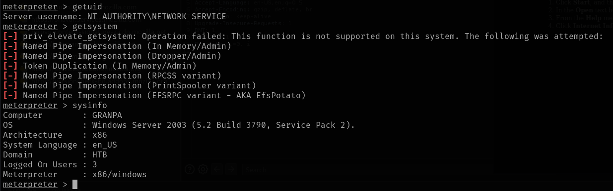

# Grandpa

This is my write-up for the machine **Grandpa** on Hack The Box located at: https://app.hackthebox.com/machines/13

## Enumeration

First I started with an nmap scan, which shows the following:

Since only the port 80 is open I navigated to it and we are presented with the following page

I run gobuster to see if there's any interesting subdirectories

Since I wasn't finding anything interesting on the directories neither on the source code, I decided to run some vulnerability scans

With that information we know that the exploit probably would be in how those files are handled and the front page, but since I was not familiar with it, I researched how IIS work more in depth

## Exploitation

After gathering the information I started looking for exploits and try some commands suggested, but none of them worked

Until I tried a metasploit module that was suggested, which actually worked

## Post Exploitation

The problem was that this shell seemed to have really low privileges that I couldn't even run getuid

So I tried migrating processes and it actually worked, at least now we are able to run getuid and some other commands in order to escalate privileges

Since it is a x86 system i tried with the local exploit suggester, which showed the following

And after some tries, one of the modules suggested worked, and now we have system privileges

So now the only thing left is to get the flags

