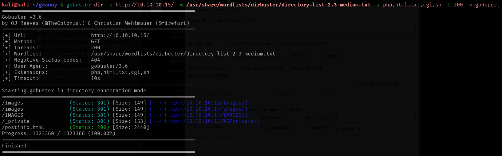
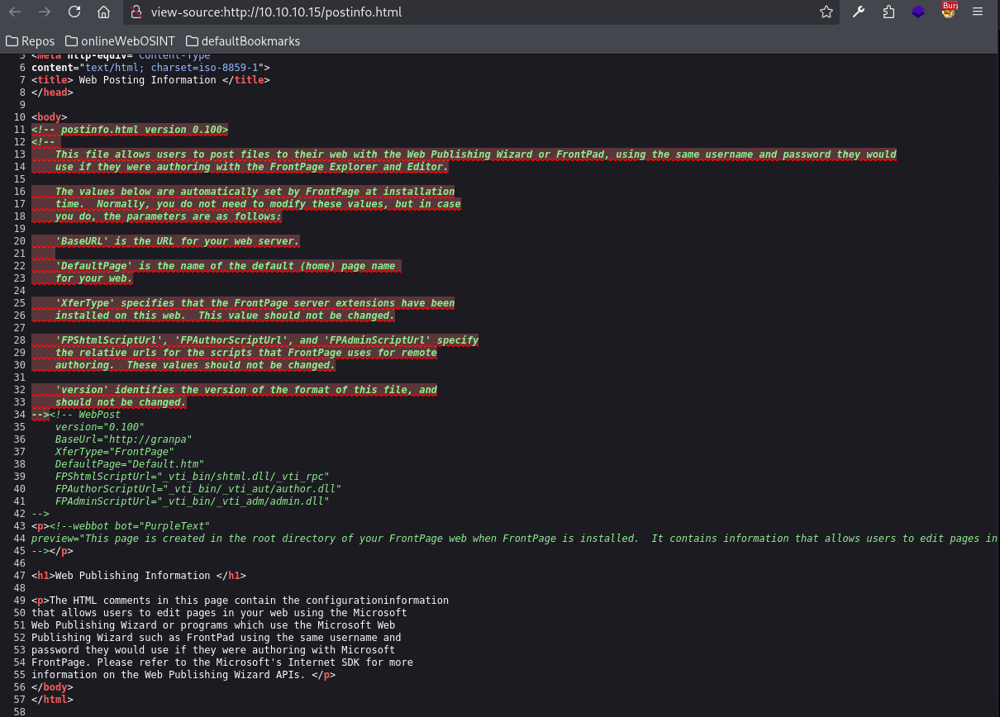

# Granny

This is my write-up for the machine **Granny** on Hack The Box located at: https://app.hackthebox.com/machines/14

## Enumeration

First I started with an [nmap scan](./res/Granny/10_10_10_15_nmapReport.txt), which shows the following

Since only port 80 was open, I went there first to see what were we up against, and there was only the default page of IIS

So, since we got nothing from the web and nmap said that there was a webdav running there, I ran gobuster to see if we were able to find the webdav directory

Then I checked the postinfo page, which apparently have some configurations there that we may use later

After that I ran dirbuster, to see if it finds something else, which doesn't seem to be the case

And also feroxbuster, with almost the same results

Then I started exploring those files, starting with the ones on postinfo, which appears to be an output of a post form or something

From there I jumped into vti_bin directory listing

Then I explored some directories from feroxbuster, which contained some javascript files

After that I ran davtest, which apparently was able to upload a bunch of files to the webdav through PUT

## Exploitation

So I used cadaver to connect to it

Then I created a reverse shell and uploaded there, but when I tried to execute it I got an error

Since I new that I had writing permissions, probably I was doing something wrong, so I tried with metasploit, which had a module for iis webdav, and it got me a meterpreter shell

## Post Exploitation

Then when I tried to run the getuid to see which user we were, I got an error

Since other commands like getuid weren't working as well I tried migrating processes, and then it worked

After that I started with the usual enumeration, starting with the system information

Then I checked the privileges, both with meterepreter and a shell, which gives a little bit more information, and also attempted to get system, which failed

After that, since we had a meterpreter shell, I tried running the local exploit suggester

Since there was a webdav running on the target, I tried first with that option, which apparently worked, cause it got us a shell, but it wasn't a privileged one

Then I tried with the next exploit and the same thing happened

After that, before stop firing exploits without reason and getting back to the enumeration, I tried one more exploit from the list, the kitrap0d, which I recall it has worked for me on previous boxes, and this one actually worked

And with that I was able to get the user and admin flags

## After work

Since I was only able to get the initial shell on the target with metasploit, I checked a YouTube video explaining how to do it without it, and apparently the target only executes asp, so we have to upload a shell with that extension, but when I tried to reproduce it, I got an error

So I got back to the video, and I saw that the problem was that we were not allowed to upload asp files, so we have to upload a normal html file with our payload

Then use the move method to actually create the shell.asp

And with that we got the shell back

I also wanted to explore which was the intended way to escalate privileges, so I checked the write-up, but there wasn't too many information, just to use the exploit ms15_051_client_copy_image from the local_exploit_suggester, which is almost as we did it, just using another exploit, so I returned to the video I was watching previously to see if there they used a manually way, but the same exploit from metasploit was used, so I found another video where they used an exploit called churrasco, and they uploaded the exe and with that got an elevated shell
