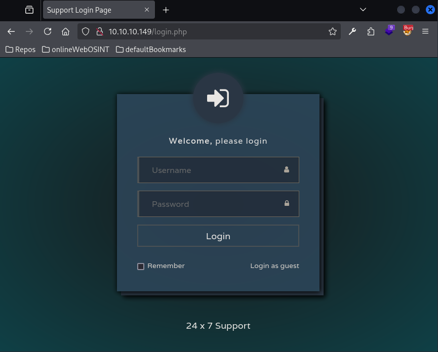
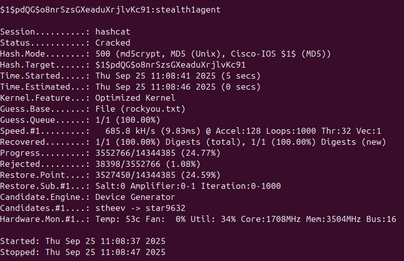
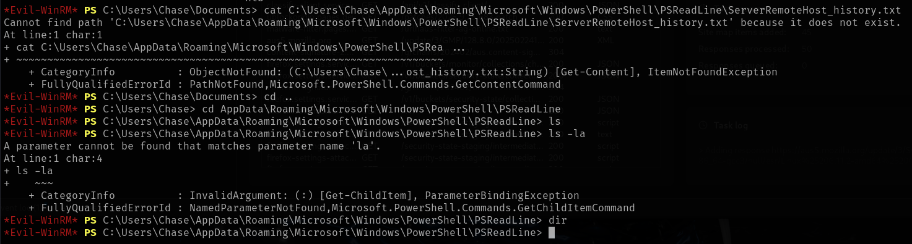
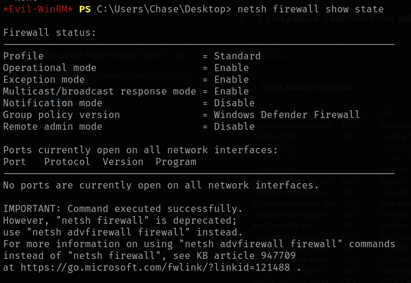

# Heist

This is my write-up for the machine **Heist** on Hack The Box located at: https://app.hackthebox.com/machines/201

## Enumeration

First I started with an [nmap scan](./res/Heist/10_10_10_149_nmapReport.txt), which shows the following

Since port 80 was open, I navigated there first to see what were we up against, which apparently is an IIS server, which presents a login page right away

So I checked the tech stack real quick with wappalyzer

Then I logged in as a guest, where I saw that there's an [attachment](./res/Heist/config.txt) with some configuration

Which apparently contained some credentials

So I googled how to decrypt those passwords, and I found and online tool that does it for us

I also cracked the md5 hash that was there which leaves us with **stealth1agent**

Now with that I ran gobuster to see if there was any other page that can give us information, but it didn't seem to be the case

And I also ran nikto, which didn't provide much more information as well

Then I went to check smb, starting with enum4linux, which didn't gave us any useful information, apart from the OS version

And some smb information that we already knew from the first nmap scan

So I tried to list the shares manually as a guest, but it didn't work

Then I tried with the user hazard and all 3 password convinations, and the md5 one worked, so we have the following credentials **hazard:stealth1agent**

After that I used crackmapexec to enumerate the shares further, which apparently we only have access to the IPC share and I also tried to enumerate the users, which wasn't possible

So I tried to read the IPC share, which was available, but as expected no listing was possible, so I tried to get some more information with rpc, but apart from server information we couldn't take anything else

I also tried to login with winrm just in case, but it didn't work either

Since I was running out of options, I checked the write-up which explains that we can enumerate users with cme by bruteforcing the RIDs which stands for Relative Identifier and it's part of the SID and those are used to identify a user or service on a Windows host. So I ran the command suggested, and I got a list of users back

## Exploitation

Now we are able to bruteforce those with cme, and we get a successful login with chase user `Chase:Q4)sJu\Y8qz*A3?d`

And with those credentials we can finally get a shell via winrm

## Post Exploitation

Then I went to the desktop to grab the user flag as usual

And there I saw a todo list, which contained 2 tasks that could be interesting as a hint, cause it maybe a missconfiguration on the router config that let us escalate

But before digging deeper into that, I wanted to do some basic enumeration as usual, starting with the groups, privileges and system information, which unfortunately the last one wasn't accessible

Then I checked which users exists, which are the ones that we already knew, and which groups there were in

I also checked the localgroups, and which users were in some of the interesting ones, but apparently it was only Administrator, despite that I'll probably run winpeas later just in case I've missed something

After that I tried to check the powershell history, and the location was found

But when I navigated to the directory nothing was there

So I moved on to check the network information, starting with a netstat, which didn't show any port listening that we didn't already know about

Then I checked the ipconfig, to see if there was something else there, since we knew that there could be some missconfigurations with the router and so on, but everything looked good

I also decided to check the routing table to get as much information as possible as how the network is built

And finally I pulled the firewall status

As well as the firewall configuration

I also ran winpeas to double check the information and see if I missed something, and it found an unattend file, but unfortunately the password was deleted

After that I saw that it found a firefox DB on AppData\Roaming so I explore it, but the password was really cryptic, so I moved on

It also found that lateral movement is possible with uac, but we already have "the best" low level user, so I'm not sure it is worth exploring

With all that information, I started looking for files manually, either for router configs or where the issues page was, then I saw that there was a script called runphp.cmd that was copying some config files from iis folder

But when I navigated there, there was no iis folder

So I did a search for the issues.php file, but it wasn't anywhere either

Then I googled where IIS gets installed, and they mentioned an xml called applicationHost.config which should be located under system32, but we had no access there

So I searched for the file to see if it was somewhere else, which seemed to be the case, but when I opened it, it seemed corrupted

And every folder I check that could contain useful information I get an access denied, so from my point of view right now, if chase has to check the issues and the router config, he has to have access to the IIS where those are, though on CLI he hasn't so either we find his email and access it through web (hopefully there's some useful info there) or we move to hazard user (since he should have acces there to get the files, that's why they've created the account on the first place) or someone else and access IIS from there. Since I wasn't being able to find the email, or access the IIS files, I decided to try and switch user to hazard, but it didn't work either.

So I checked the write-up to see what I was missing, and according to it, the correct way to escalate here is to check the processes, to identify what was being used to read the issues.php, which in this case is firefox

Then use a tool called [procdump](https://learn.microsoft.com/en-us/sysinternals/downloads/procdump), to dump the process memory, in this case, we grab the firefox PID

After that we can inspect the dump, since it contains a bunch of weird characters we could use strings to obtain the useful ones, despite that the file is still huge, so I used less and grep to check for credentials, and as expected, the admin credentials were found there

With that we can try and login as administrator via winrm, and we get an elevated shell, then all we have to do is retrieve the root flag

