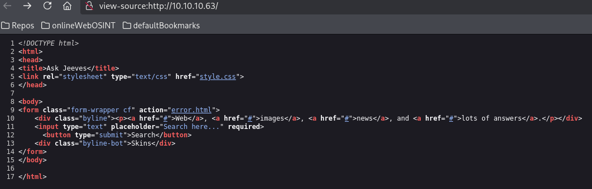
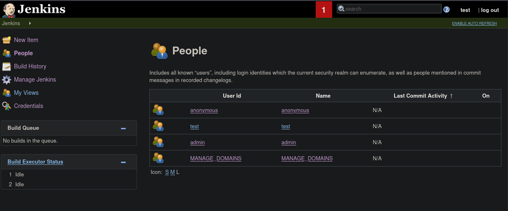

# Jeeves

This is my write-up for the machine **Jeeves** on Hack The Box located at: https://app.hackthebox.com/machines/114

## Enumeration

First I started with an nmap scan, which shows the following:

Since port 80 is open, I went there first to see what was running on the website

I also run gobuster against it to see if there was any interesting subdirectories, which didn't seem to be the case

I also navigated to port 50000, but as nmap scan said, anything was found there

And gobuster didn't find anything either

So as usual, first I tried to enumerate SMB before diving deeper on port 80. I started with enum4linux, which didn't retrieve any useful information

Then I tried to enumerate it manually, without any luck either

Lastly I checked for eternal blue, which isn't the case, and I run some other nmap scripts in order to retrieve some information, but nothing else more than the first general scan came out

So I got back to enumerate port 80, and I went straight to the error.html subdirectory, since is the only one we can explore apart from the main one, and it shows some information disclosure

With that information in mind, I went ahead to try some SQL injection payloads on the search bar, but it seems that doesn't matter the input, we are always redirected to the error page. So I tried with sqlmap, and apparently it is not injectable

So I run some nmap scripts

And a nikto scan to see if there was something interesting there, but it doesn't seem to be the case

Since nikto identified some methods tha could be interesting, I pulled the headers and methods, but we don't have any endpoints where we could post anything, so I don't think that it would be useful

At this point I don't think that we can gather much more information, at least with the tools I know right now, so I decided to try some exploits with the versions we know they're using, first I started with jetty, but the exploit that I found did not worked

I wasn't finging any exploit for the versions that we know, and checking the code we could see that the form is redirecting directly to the error page, that's why the sql injection wasn't working

Since I hit a roadblock, I decided to get a hint from the guided mode of hack the box, which was to scan the website with gobuster, but with directory-list-2.3-medium.txt wordlist, and it found a really interesting page, which I didn't found first cause I used a smaller wordlist

And burpsuite picked up a lot of subdomains with it

I explored the jenkins by checking the users, creating a test user, etc...

## Exploitation

Navigating around I found the script console, I tried the example command to get the PATH, and it worked

So I googled a groovy reverse shell, and I got it

## Post Exploitation

From here, I started to do some basic enumeration, first with the systeminfo

And since we got a service account, cause we are inside jenkins and can't go back on the directories, and I was doing the potato attacks section of the privilege escalation course that got me to this box as a practice, I went straight to check the privileges of the user, cause chances are that we are dealing with a potato attack here

I tried to pull the juicypotato.exe with certutil, but it wasn't available, neither the Invoke web request command

So I checked the api documentation to see if we were able to upload something there, but it doesn't seem to be the case

Since it doesn't seem to be the case I tried another approach, which was to create a project and set a build trigger that fetched the exe every minute from my machine, but it wasn't working either

So I decided to try from the script console that gave me the reverse shell on the first place, and it actually worked

Now that I had the juicypotato exe there I run it, and it created a process with admin rights, the problem was that I was not able to migrate to it with the actuall shell

So I tried to execute a reverse shell with it

Since it didn't work, I've decided to try a different potato attack, but I was getting stuck at the same point

Then I got the user flag

And I thought that since the problem was that I wasn't being able to migrate processes, maybe with a meterpreter shell I could do it, so I created one

And after download it and run it I got a meterpreter shell

Then I tried the getsystem command, as I always do when I got a meterpreter shell, and it got me to system, without needing to execute any external exploit

So I went ahead to retrieve the root flag, but it wasn't where it always is

So I tried searching for it with the shell, but it didn't found anything

With that into account, I decided to check the write-up to check how to retrieve the root flag, and to check which privilege escalation path the did, cause even though I got system, I feel like I could learn more if they are using a potato attack or somehing along those lines

So after checking the walkthrough, they've used a metasploit module with the session that they had before to escalate the privileges, so it's kind of the same, I was expecting a more manual way, but it's okay. I also learned from this that running getsystem could be dangerous, cause you could get picked up by AV or crash a machine, so maybe that's why they've used the other method

And about the root flag, it seems to be hidden on the desktop, with something called alternate data streams, which I didn't now what they were, but this [article](https://www.malwarebytes.com/blog/101/2015/07/introduction-to-alternate-data-streams) explains it well, and the information be checked with the following commands

