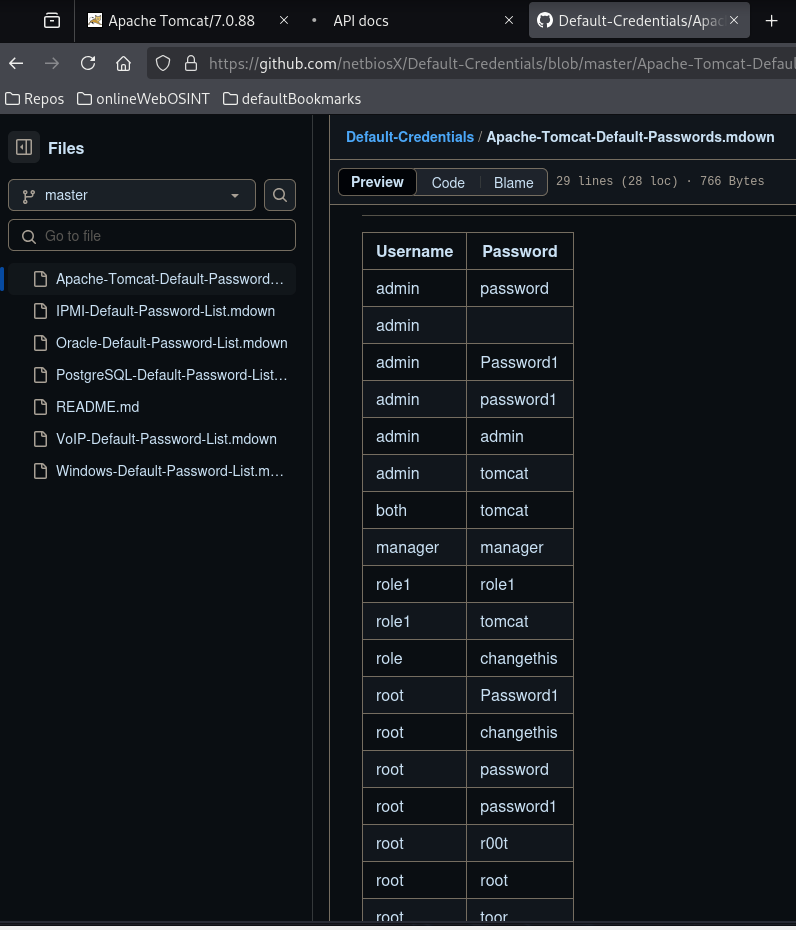
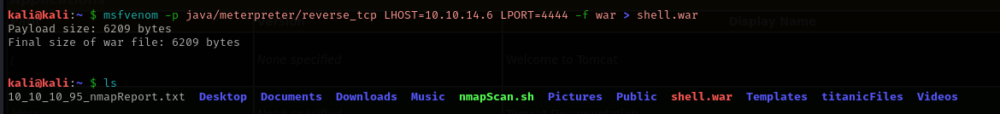

# Jerry

This is my write-up for the machine **Jerry** on Hack The Box located at: https://app.hackthebox.com/machines/144

## Enumeration

First I started with an nmap scan, which shows the following:

Since only the port 8080 I procced to go to webpage, which a default apache tomcat page is presented

I run gobuster to see if there's any interesting directory, which it seems to be the case 

Before enumerating this new directories, I activate burp suite scope, to see if it catches something else

it seems that the /docs is only documentation about tomcat, but on /manager we get a login page, so first I'll try with default credentials for tomcat

I found the following list of default credentials online

And after some trys, I was able to log in with **tomcat:s3cret**

If we scroll down we could se the server information, a part from that, it seems that it is running some kind of deployment process with WAR files and XML, but I'll have to google it, since I don't know how it works

After googling it, it seems that WAR files are packaged Java web applications, which seems to be executable, I've navigate it to the examples dir, and there's some executable scripts, so probably we will be able to upload a reverse shell here

Just to see how it works, I opened the source code of Hello World servlet and then execute it

## Exploitation

So I created a war reverse shell with msfvenom

Then I've uploaded it on the war file deployment section

And now we could see that it appears on the applications of the maneger panel

Then we open it and we could see that a shell pops up

## Post Exploitation

Since the uid was Jerry instead of system, I though that we'll have to escalate privileges

But after some basic enumeration and moving throught the directories, I saw that we were able to get inside the Administrator folder and retrieve the flags

