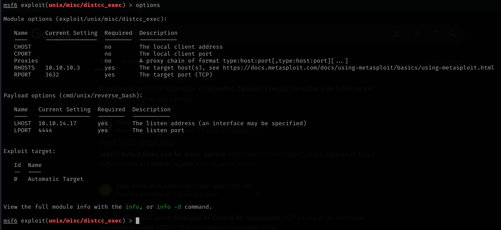

# Lame

This is my write-up for the machine **Lame** on Hack The Box located at: https://app.hackthebox.com/machines/1

## Enumeration

First I started with an nmap scan, which shows the following:

Since I didn't know what was running on port 3632 I google it first, and I found out that there was DistCC (Distributed Compiler Daemon) running, which appears to be a distributed C/C++ compilation tool used to share CPU power across multiple machines 

It seems that no authentication is needed and it says taht could lead to RCE if misconfigured

So I run a script that was suggested on google, and to my surprise it seems to be vulnerable

## Exploitation

So I went straight to the metasploit module that was recommended on google with the following options

And at first it didn't work, but after changing the payload I got a shell as a daemon

## Post Exploitation

Doing some enumeration with the daemon user I was able to pull the etc/passwd file and check the groups, all the other things that I looked for like shadow file and things that require root privileges in general were out of reach

Looking through the folders I found the user flag, which was accessible with daemon user

Since I wasn't getting anything else by enumerating through the folders, I googled ways to escalate privileges from daemon user before switching to enumerate ftp or smb. And I found the following command, which it seems that lists SUID binaries, that are programs that run as root even when executed by a lower-privileged user

And since **/usr/bin/nmap** was there, I followed the tutorial that I found online which is the following

With that I got root privileges, and the only thing left to do was to get the root flag

I checked the official write-up out of curiosity, and it seems that we should have exploited the Samba CVE-2007-2447 vulnerability