# Legacy

This is my write-up for the machine **Legacy** on Hack The Box located at: https://app.hackthebox.com/machines/2

## Enumeration

first I started with an nmap scan, which shows the following:

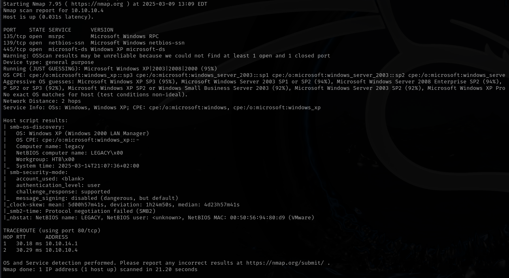

We see that SMB and RPC are open, I looked up on google what RPC and NetBIOS are, cause I was only familiar with port 445, but it seems that the 3 of them are related

Since the nmap scan also reported that smb default singing is open, I've started the enumeration there.

First I checked the smb version with metasploit

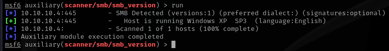

But when I tried to enumerate the shares with smbclient, I got a bunch of errors instead

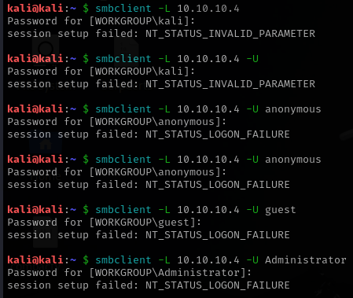

So I run enum4linux, that confirmed that the shares can't be enumerated

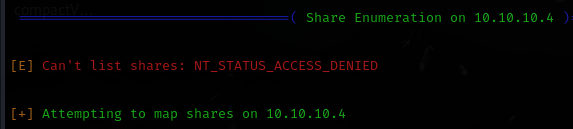

Since it seems that it was a dead end, I googled how to enumerate smb further, and I found 2 interesting nmap scripts, which indeed found a vulnerability which appears to be Eternal Blue

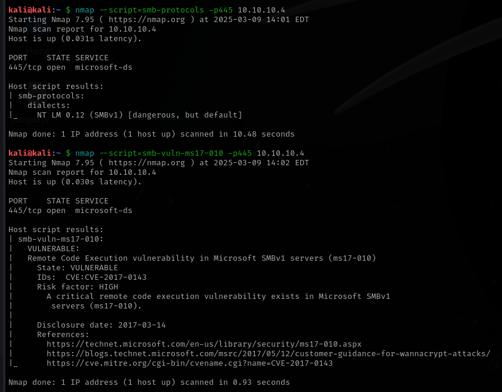

## Exploitation

So I went to metasploit in order to exploit that vulnerability, but it failed

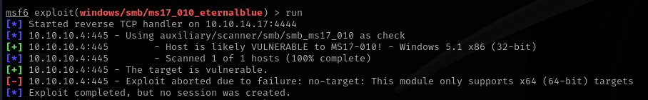

So after trying a couple times and checking the options to see if something was wrong, I saw on the targets that there wasn't a option for windows XP

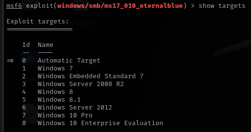

With that in mind, I did the search again to see if there was something there that met our criteria, but it seems that it wasn't, at least it wasn't specified, so I decided to try with the second module, which seemed more generic

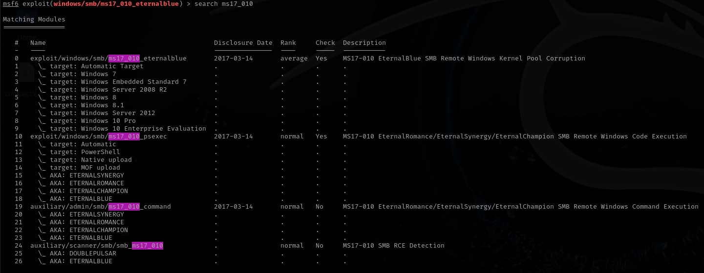

And after setting up the options

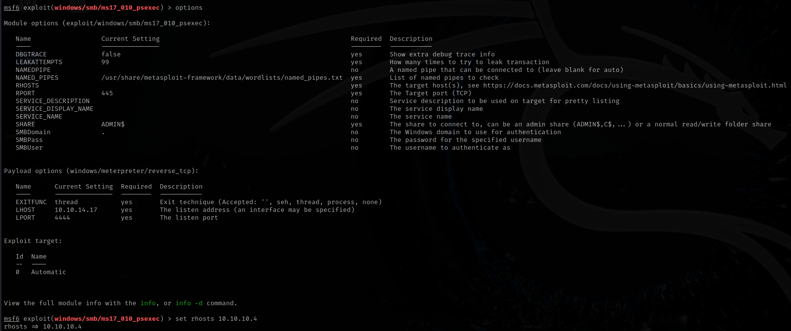

I got a meterpreter shell back

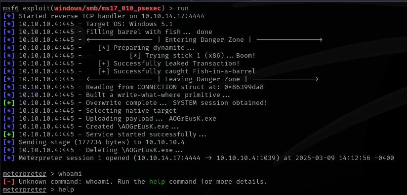

And it seems that the exploit gave us sytem privileges right away, so now all we have to do is look for the flags

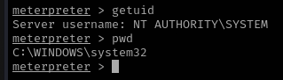

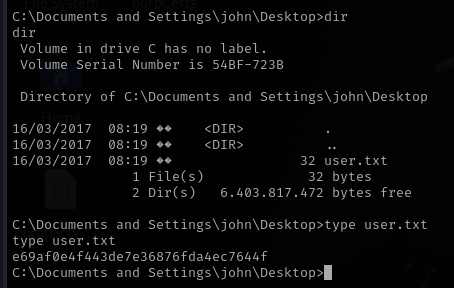

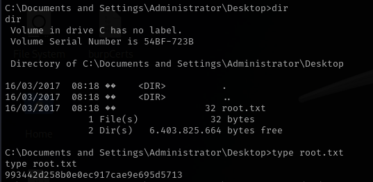
