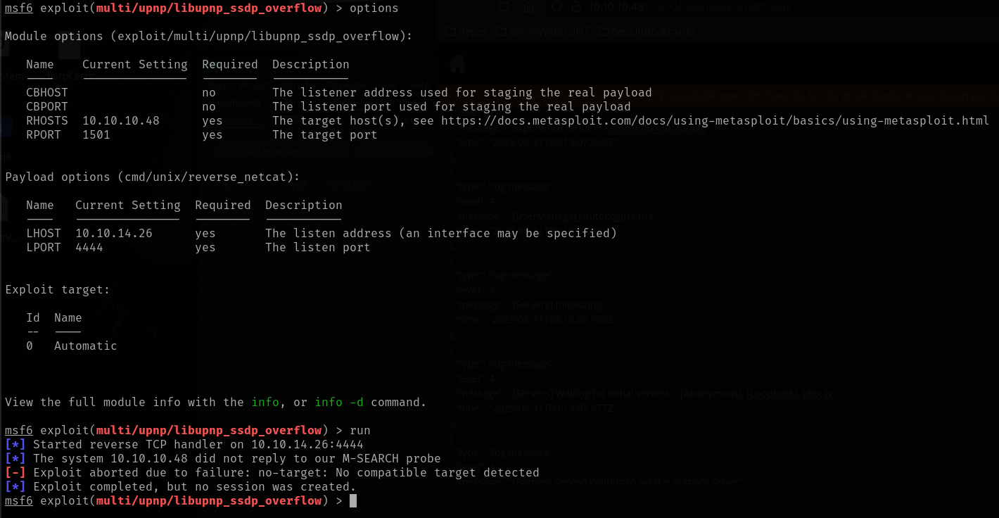
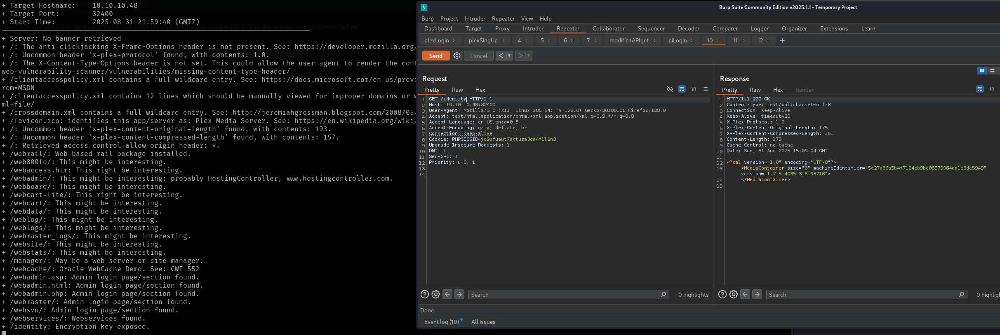
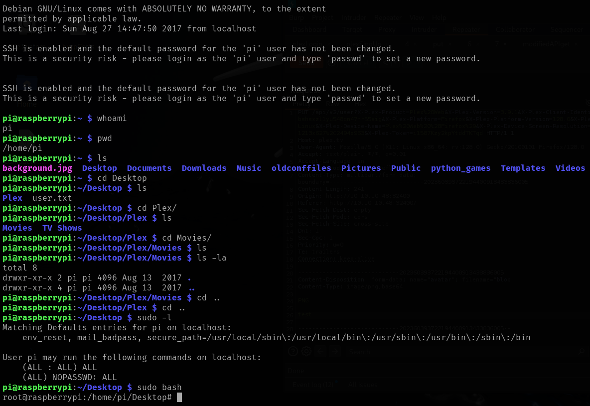

# Mirai

This is my write-up for the machine **Mirai** on Hack The Box located at: https://app.hackthebox.com/machines/64

## Enumeration

First I started with an [nmap scan](./res/Mirai/10_10_10_48_nmapReport.txt), which shows the following

Since port 80 was open, I navigated there first to see what were we up against, but the page appeared to be blank, and from the burpsuite request it seemed to be not found

Then I checked wappalyzer, which did retrieve some information about the server tech stack, confirming what nmap said about lighttpd version, so even though there no page displayed something is going on on the background

After that I checked the other ports, starting with the one that said plex media server, and this one actually displayed a page, which was a login page

The other ports displayed a blank page as well, so I decided to start the enumeration on port 32400, first I tried some default credentials, but it didn't work

So I proceed to create an account, with the credentials **testfasfsafsa:123456789-aA**

With that I was able to login, where we could see the plex dashboard

Then I started navigating around, and I saw that there was an option to upload a profile image, where a put was sent, and afterwards there's a get to the API, so that could be really interesting

First I tried to upload a txt and a html, but it didn't work, the same image was maintained, so before going deeper on that option, I decided to do some more enumeration, which lead me to get the plex version, which was 3.9.1

After that I researched about platinum, cause I didn't know what it was, and even though I didn't found any information about it, the word UPnP kept showing up, I even found a [metasploit module](https://www.rapid7.com/db/modules/exploit/multi/upnp/libupnp_ssdp_overflow/), I tried firing it, but it failed

So I continued with the research about UPnP technology, I was reading a [post](https://www.upguard.com/blog/what-is-upnp) about it, when I saw this paragraph, which considering the name of the box... it is probably what I have to exploit

Before start digging deeper there, I tried to enumerate the DNS to see if I could get any valuable information that could be useful later, but it wasn't the case

So I ran gobuster on port 80, and it found some interesting things, the versions, which wasn't helpful and the admin panel

I also ran gobuster on plex, which found a lot of things worth exploring

Then I tried some default credentials on pi-hole, but they didn't work

After that I explored some of the pages found by gobuster on plex, but all of them lead to the same xml, which didn't contain anything

Then I googled for exploits on our version of upnp, and I found that there's supposed to be directory traversal, so I checked if there was anything on those requests, but there was no luck

I also checked the request that the plex did after uploading the profile image, but there was no luck either

After that I ran nikto, which pointed out some of the information we found with gobuster, but the only thing that contained actual information was /identity which had a machine identifier and a version, which I don't know exactly from which thing it is, I assume plex, but it doesn't correspond to the one displayed on the page

Then I ran gobuster and nikto on the two ports left, but I got nothing, just a bunch of errors

## Exploitation

I also tried to mess with the put request from the avatar change, but it was blocked, so since I was blocked I checked the guided mode for a hint, which was "which is the default user and password for a Raspberry Pi device" which I've already checked and on the /admin login menu and wasn't working, also it was not possible to specify the user there, so I checked the write-up to see what was going on, and apparently we should had to assume that those credentials should work on ssh as well, and yeah, of course they did

## Post Exploitation

Then I was messing around when I ran sudo -l and to my surprise, it seems that we were able to run any command as sudo

After that I just went to retrieve the flags, and I got the user flag, but for the root one, I got another surprise

So I searched through the common mounting directories of linux and eventually I found the usbstick, but there was a note that said that the files had been deleted

Then I checked all the disks that were there, and explored some that appeared duplicated, to see if there was a backup or something, but it wasn't the case

After that I googled how to recover those files and photorec showed up, so I tried installing it on the target, but apparently it didn't get intalled properly cause dependency errors

Since I didn't think that was the intended way to go, I went back to exploring the files, but after some time navigating them I still didn't find anything

So I decided to check the guided mode for a hint, which was to use grep or string to try and read the data from the deleted file, since apparently rm doesn't change the file in memory, just changes the metadata, so if there wasn't a rewriting, the data should still be there, so I googled how to do that and I found [this post](https://lovethepenguin.com/linux-recover-deleted-text-files-using-grep-749551c3e12b) which was really interesting, then I followed the steps, and finally I was able to retrieve the root flag

