# Netmon

This is my write-up for the machine **Netmon** on Hack The Box located at: https://app.hackthebox.com/machines/177

## Enumeration

First I started with an nmap scan, which shows the following:

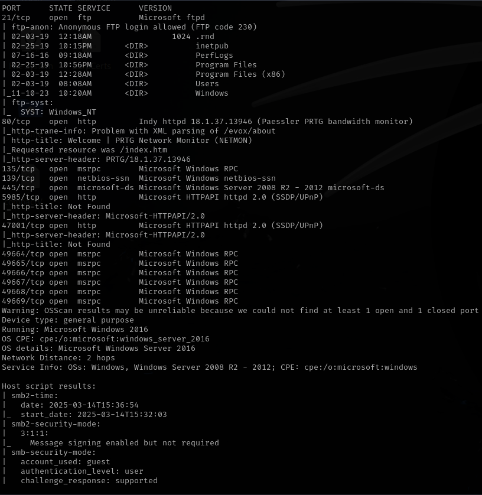

Since ftp with anonymous login is allowed I decided to start the enumeration there

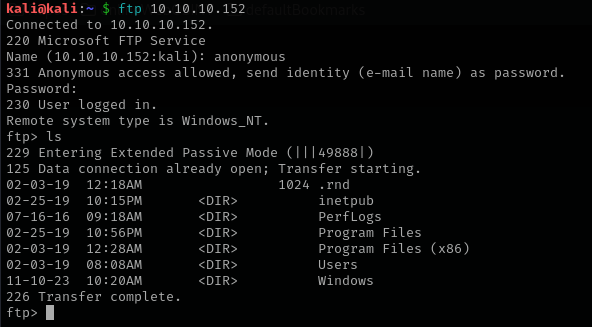

I pulled some files from FTP that I thought could be interesting but it seems that there's no sensitive information

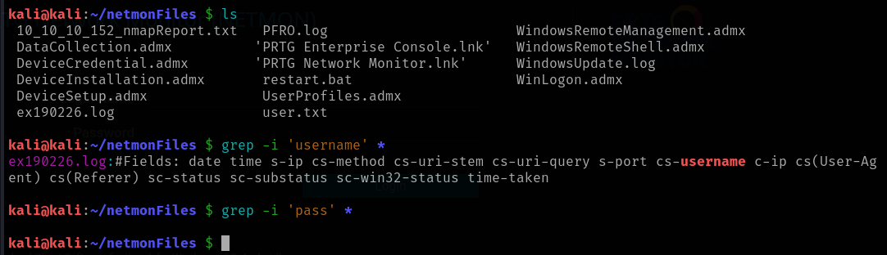

But atleast I was able to get the user flag

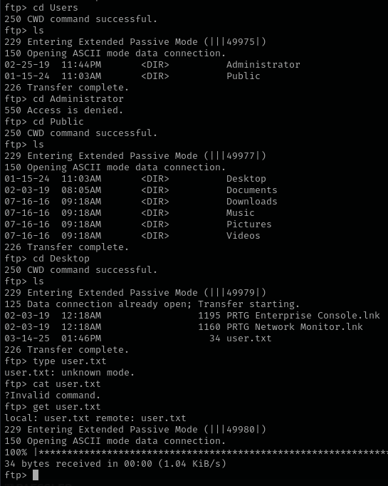
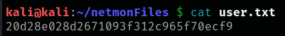

I also ran some nmap scripts to see if FTP has any vulnerability, but I got the same as the initial scan

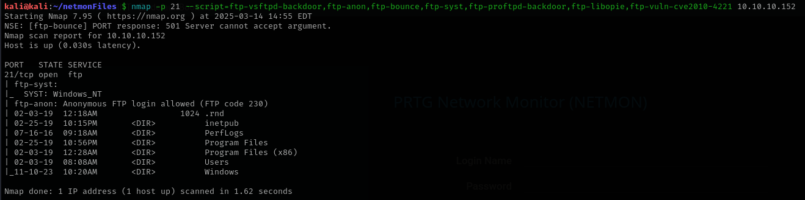

Since we couldn't get more information from ftp for now, I switched to enumerating port 80, which presented us the following page when we navigate to it

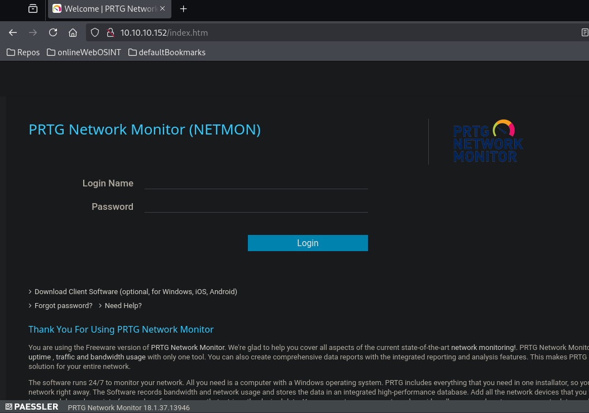

I tried some default credentials, including the one that is on the help documentation, but none of them worked

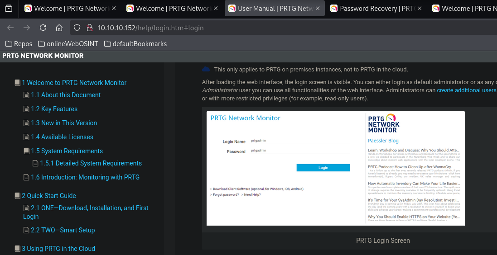

I also tried to scan the website with gobuster, but it seems that it is redirecting the requests, so gobuster is not able to scan it

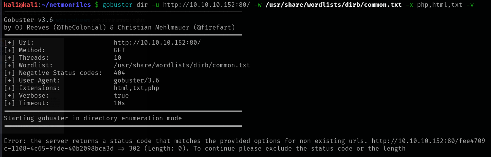

So I tried running some vulnerability detection scripts which reported the following:

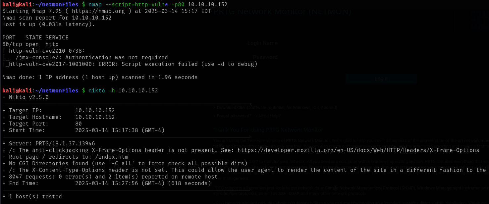

With that said, I went ahead to enumerate SMB, but after some tries I was not able to list the shares, cause it seems guest account and anonymous were blocked or disabled

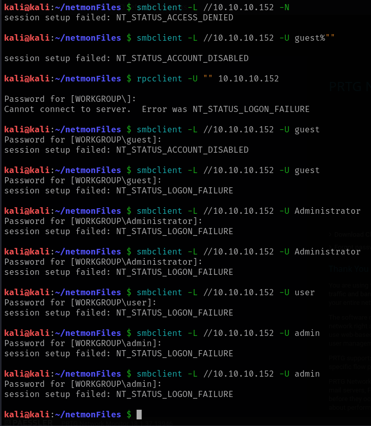

enum4linux also failed on the enumeration

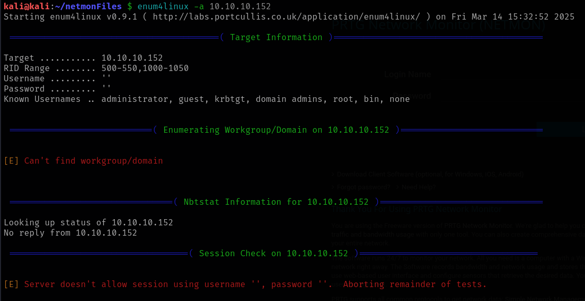

So I decided to run some nmap vulnerability scripts to gather more information

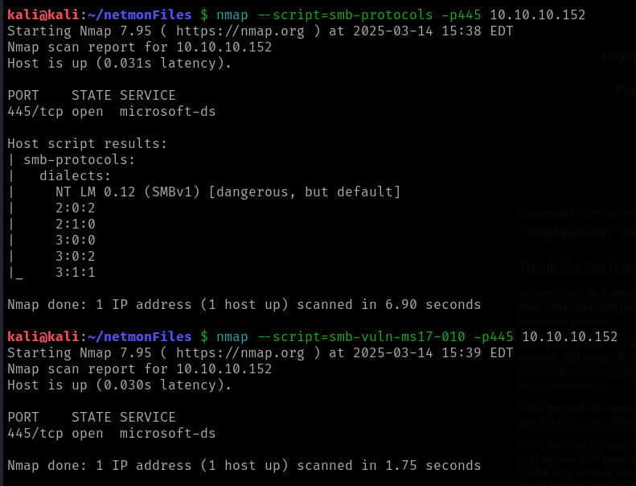

But the script only reported NTLM related vulnerabilities, which would be great if there was another users on the network, but this is not the case, so I got back to FTP, I pulled some other files that I considered interesting, and after reading some documentation about PRTG, I found out that it stores credentials on `PRTG Configuration.dat`

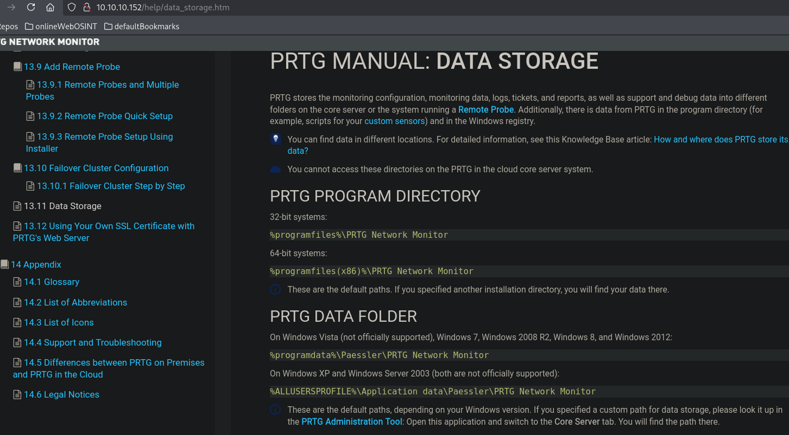

So I searched for them and I found an encrypted ones

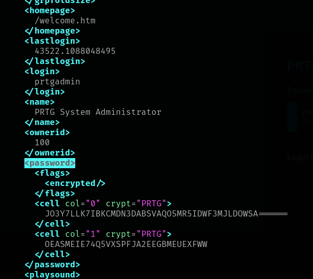

I tried identifying the hash and cracking it with hashcat, but it didn't work

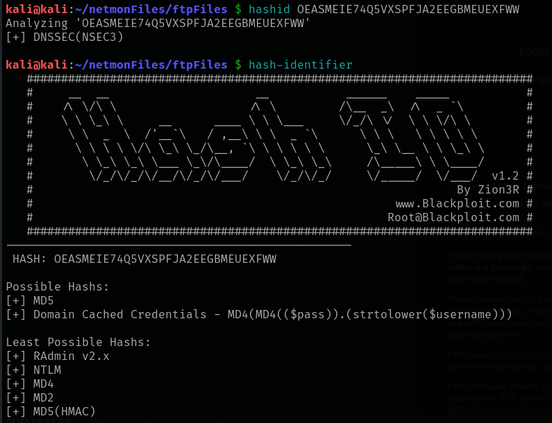

I also found a script on github that was specifically designed to crack PRTG passwords, but it didn't work either

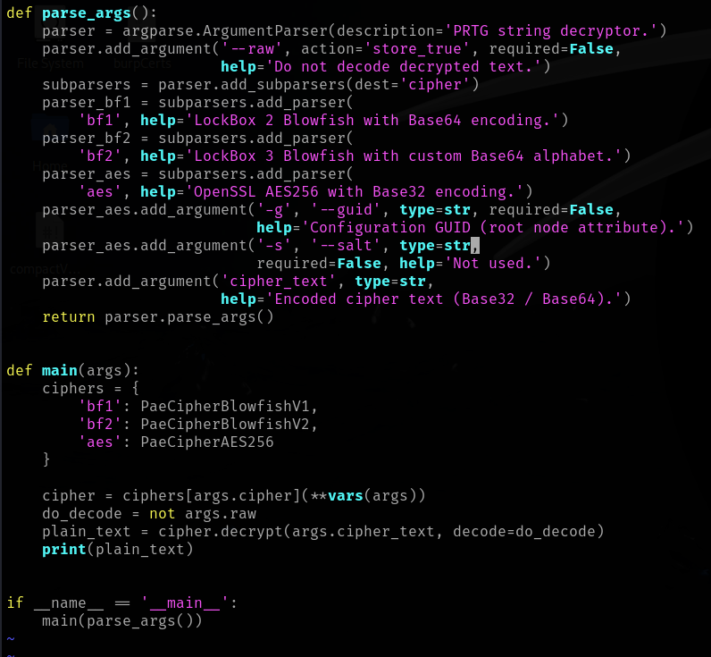

After a while looking around FTP and finding nothing, I found out that it is possible to do a `ls -la` on FTP, which allowed me to see some really interesting hidden files

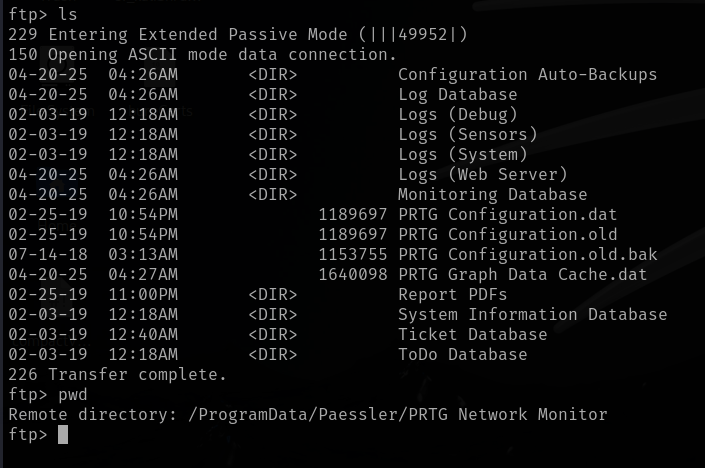

Which after taking a look on them, I found plain text credentials on `PRTG Configuration.old.bak` which were the following **prtgadmin:PrTg@dmin2018**

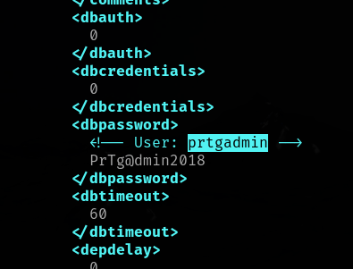

So I went ahead and tried them againts the port 80 login page, but they didn't work, so I got back to FTP and tried to enumerate all that I could within the hidden files in a hunt for other credentials, but I wasn't finding anything, and just when I was going to surrender and take a look to the write up, it came to my mind that this could be one case of a password reuse, so I checked the files date, and it made sense

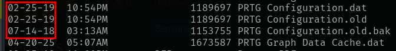

## Exploitation

So I tried changing the year on the password (PrTg@dmin2019) and it worked, I finally loged in

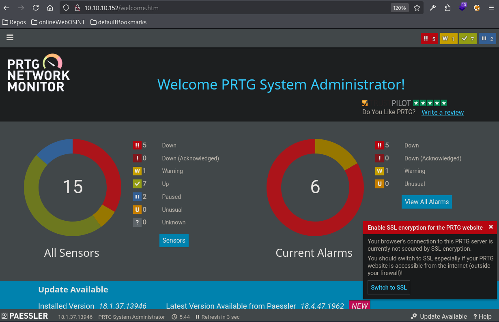

Since I went crazy with it before and I searched for exploits and all kinds of things, I know that there's a RCE exploit that requires authentication, so now that we have it the only thing left to do is use the exploit and get the elevated shell

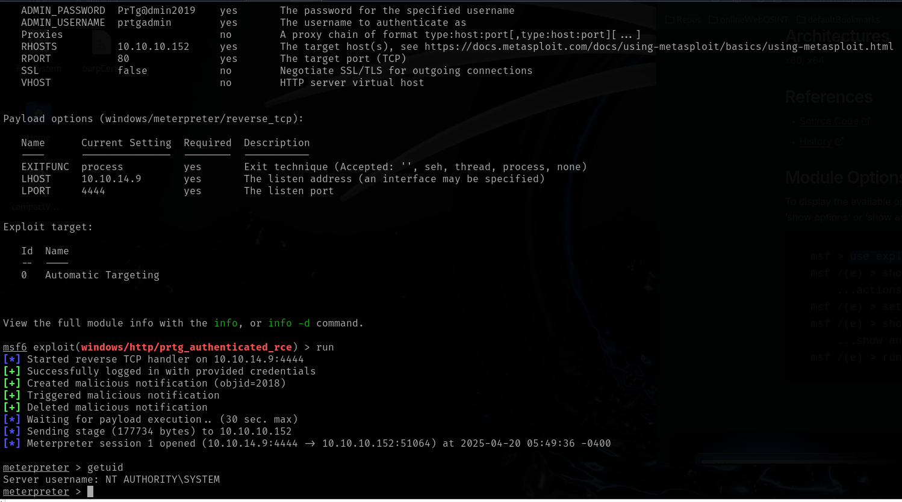

And with that we can retrieve the root flag

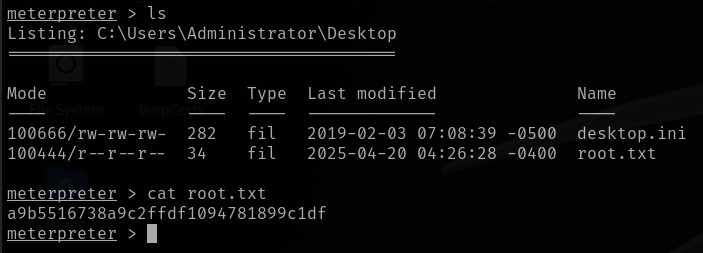
