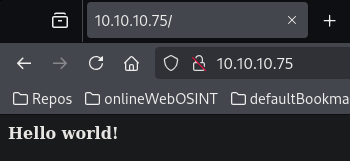

# Nibbles

This is my write-up for the machine **Nibbles** on Hack The Box located at: https://app.hackthebox.com/machines/121

## Enumeration

First I started with an nmap scan, which shows the following:

Since we can't do too much with port 22 apart from brute force it, or search for an exploit for that specific version, I'll start by enumerating port 80

First a gobuster scan, which shows the following:

If we navigate to the ip, we see this default page:

It seems that we only have access to the hello world page, the rest is forbidden, but atleast it tells us the apache version on the error, so we may be able to use it later to exploit it

I tried searching for subdomains with gobuster, but it seems that it didn't found anything either

The wappalyzer also didn't tell us much more

Searching on metasploit, it seems that there's a module that have RCE, despite that it doesn't match our version exactly, we can give it a try

After configuring it and run it, it seems that the target is not vulnerable

Since I was a little stuck, I googled how to enumerate apache further, and I found that with the command `curl -X OPTIONS 10.10.10.75 --head` it is possible to see which methods are allowed

And since post was allowed, I tried posting a shell, which didn't work, but instead it pulled the source code, which wasn't bad, cause I was able to see that there's another directory called /nibbleblog

I've captured the get request of the /nibbleblog on burp to check the code more comfortably, and I saw that there's a script call at the top button, but after googling it, it seems that isn't an attack vector

I also googled nibbleblog, and the admin.php page came out, but I tried some default credentials and I wasn't able to log in

Then I went to http://10.10.10.75/nibbleblog/content/private/config.xml cause on the blog that I found before they said that there may be the nibbleblog version, but it wasn't the case

But that left me thinking that maybe we could find some sensitive information through those folders

With that I was able to pull the users.xml file

Which gave me the idea to try the creds admin:nibbles since the email on the config was admin@nibbles.com, and with that I was able to acces the admin panel

## Exploitation

So now all we have to do is create a shell

And after some tries I found that we have to upload the shell on the plugins section in order for it to work

Then we only have to navigate to that page in order to get the shell

## Post Exploitation

It seems that we are nibbler use right now, and we can't access the root folder, so we'll have to do some privilege escalation

We can grab the user flag right away

After some enumeration I found with the command sudo -l that there's a script called monitor.sh that nibbler can run with sudo privileges and without password

And after some tries I was able to get root privileges by starting anothe shell from the script

Now the only thing that we have left is to get the root flag

