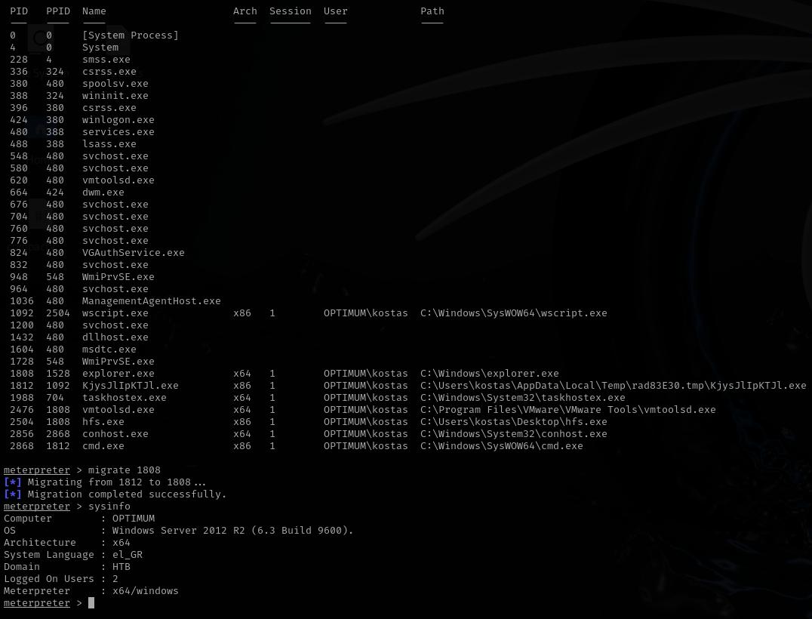
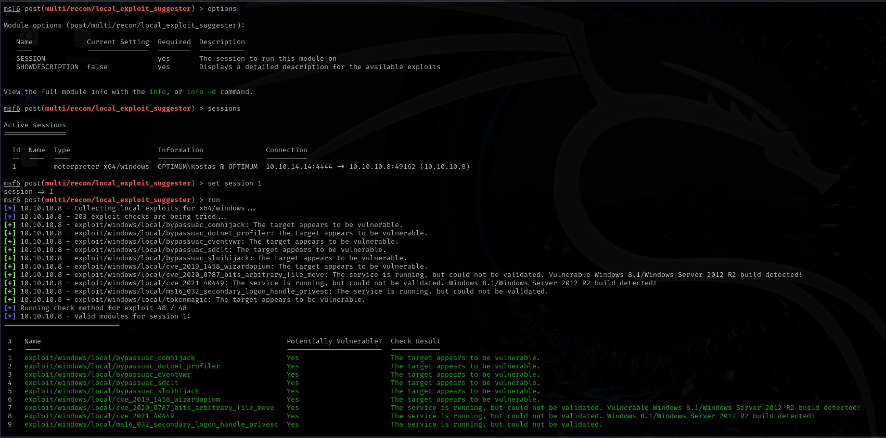

# Optimum

This is my write-up for the machine **Optimum** on Hack The Box located at: https://app.hackthebox.com/machines/6

## Enumeration

First I started with an nmap scan, which shows the following:

Since only the port 80 is open, I proceed to enumerate it, when we navigate to it we are presented with the following page

I run gobuster to see if there's some interesting subdirectories, but apparently not

After some navigation through the web, I saw that the server Information section redirect us to another domain, which is rejetto, which apparently is the technology used to build the server, it could be interesting to search information about it

I also tried searching for default credentials for rejetto, but nothing came out, instead and exploit for that specific version showed up, so we can give it a try

## Exploitation

So I went ahead and search for the metasploit module that was suggested

I configured the options and run the exploit, but it failed

So I tried with the second option that showed up before, and this one actually worked

## Post Exploitation

Doing some basic enumeration, we could see that we are kostas user, and that we have an x86 meterpreter shell, while the system is x64

So I did a process migration in order to match the shells

Then I used the local exploit suggester to see if there's some vulnerability to escalate privileges

Before trying the exploits from the suggester, I tried incognito and kiwi modules, but I wasn't able to get anything from them

I've tried the local exploit suggester modules, but nothing was working