# Paper

This is my write-up for the machine **Paper** on Hack The Box located at: https://app.hackthebox.com/machines/432

## Enumeration

First I started with an nmap scan, which shows the following:

Since only port 80 and 443 are open, a part from port 22, I navigated there to see what are we up against, and the default page was the following, for both ports

I checked wappalyzer to see the tech stack used

Then I ran gobuster to check if there was any subdirectories

And I also used gobuster to check for subdomains, but it didn't found anything

After that, I checked the source code of the page while nikto was working. Which found some things worth exploring

I also ran the http scripts from nmap, but they didn't found anything

So I checked the options with curl, because we saw on nikto that post was open, and curl confirmed

But after trying to upload a file I got an error that tells that the method isn't implemented, so it wasn't possible to upload anything

Then I revisited the nikto output, and with that I found that there was some subdirectories that were disclosing some information, like the readme from the icons

That also made me think that maybe there I could be able to upload something with a post, but it wasn't the case either, I also tried the TRACE method, since nikto said that it was allowed, but I got the same result. I also searched for exploits for the known versions, but I only found DoS

Since I was a little stuck, I check the guided mode from HTB to get a hint, which was to check the headers for a domain, there I found the **office.paper** domain

With that information, I added the new domain to /etc/hosts to be able to navigate there, where we find the following page

I started by checking wappalyzer, which displayed the following

Then I googled the wordpress version and I found the following [exploit](https://www.exploit-db.com/exploits/47690) which displays wordpress secret information

With that I was able to access the rocket chat and create an account there

After login in we could see the default options, where there's a link to the admin settings, which currently we don't have access

After messing with the requests a little bit I was able to pull some users from the api, but it seems that only the bots and me

So I continued messing with the requests to see if I could bypass the validations and get an admin user, but it wasn't possible, I also tried SQL injection on both the login and the register, but there was nothing there either

I googled how to pull a list of all users, and after checking rocket chat api official documentation I was able to do it, but still there wasn't any emails, nor any user identified as admin

So I went some steps back and I read the chats and all the information I could from the website, where I found the conversation about recyclops bot, which is pretty interesting, cause it's possible to do ls and cat from it

With that in mind I tried to pull /etc/passwd, and it worked, now we have all the users in the target machine, I also tried the shadow file, but there wasn't enough permissions as expected

## Exploitation

After that, and seeing how the bot it triggering commands, I tried to execute some other commands apart from the ones predefined, but the bot was properly configured

So I kept going with enumeration through the allowed commands, and after listing dwight's home folder I saw a bunch of files related with the bot

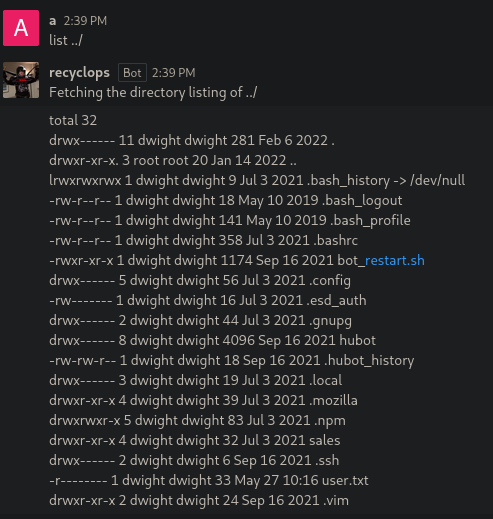

First I checked the restart script, to see how it works and in case there's some credentials in it

That led me to the start script, and there I saw that the .env file was being used

And there I found the credentials for recyclops

With that, I logged out of the chat and tried this credentials, to see if I was lucky and recyclops was an administrator, but again the bot config caught me

So I changed the approach and tried login in via ssh on dwight's account with **dwight:Queenofblad3s!23**, cause I assumed the password would be reused, and indeed that was the case, I finally got a shell

## Post Exploitation

Then I started the enumeration for the escalation pulling the system information which confirmed that the target has CentOS 8

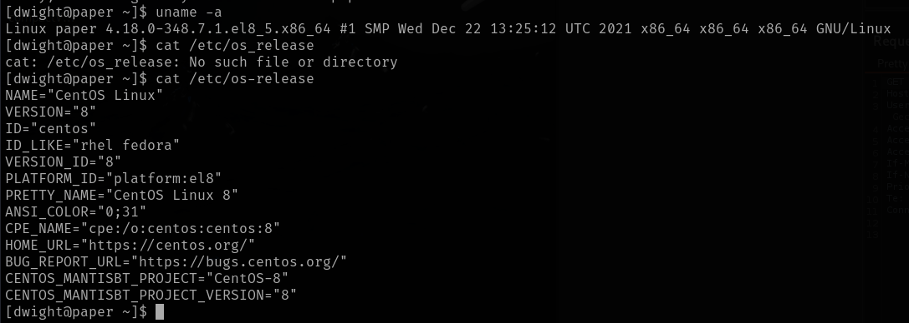

I continued by checking the sudo permissions, but apparently dwight doesn't have any

So I kept going with the SUIDs, but none of there were on GTFObins

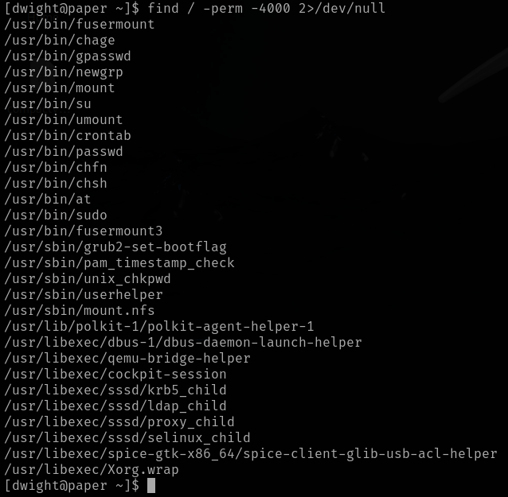

After that I checked the network information, which didn't display anything suspicious, apart from the port 48320 that is rocketchat, the ports for ssh and http that we already know, and some other ports for SQL and mondoDB

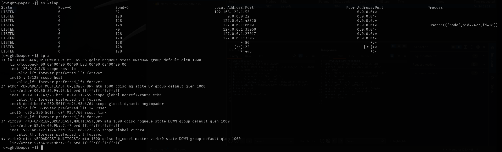

Then I changed the approach and went to metasploit to run the local exploit suggester

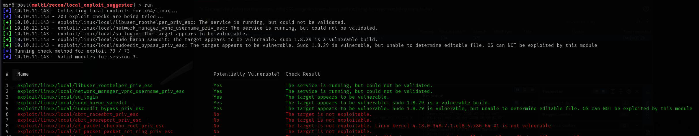

But any of those worked, so I migrated to linpeas, which displayed a lot of information this time, some of the most interesting is:

- mail information and backups
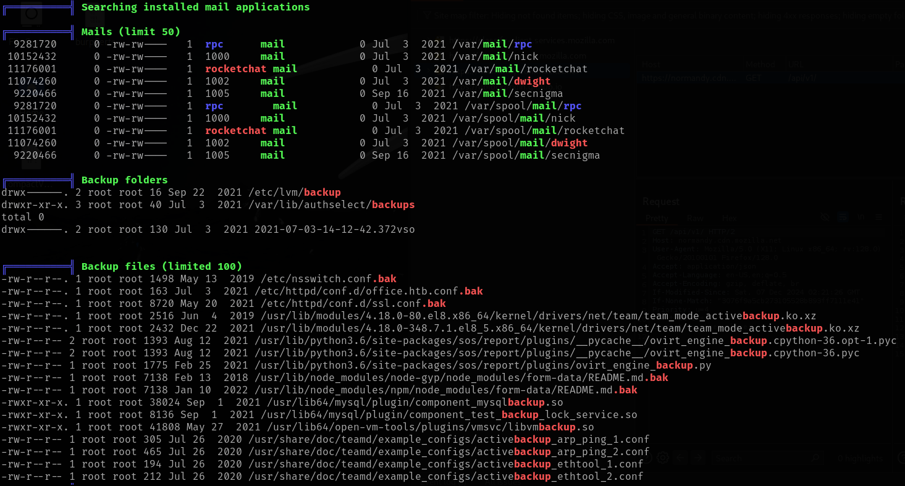
- unexpected files under opt and root
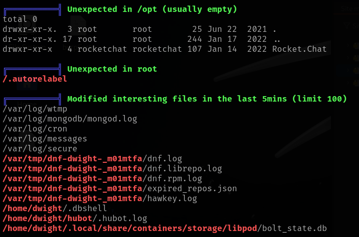
- some interesting files
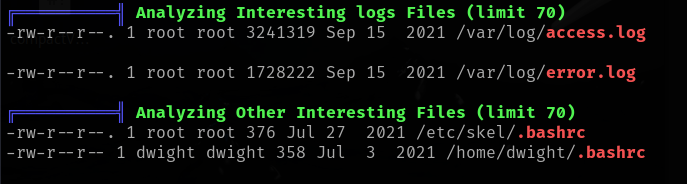
- ftp configuration
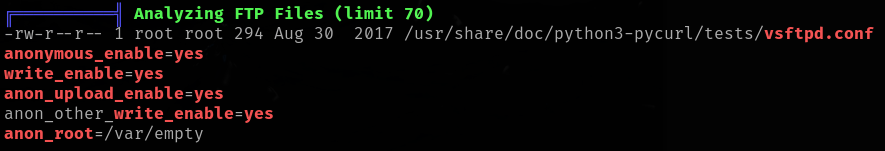
- rocketchat files, which include the mongodb configuration
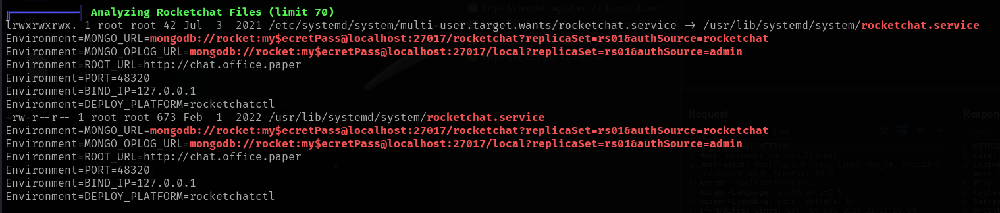
- some service files related to hubot
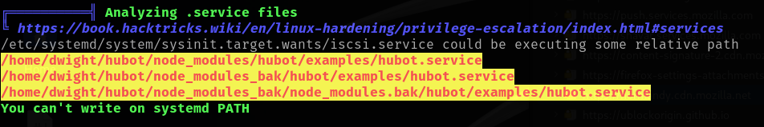
- cron jobs information
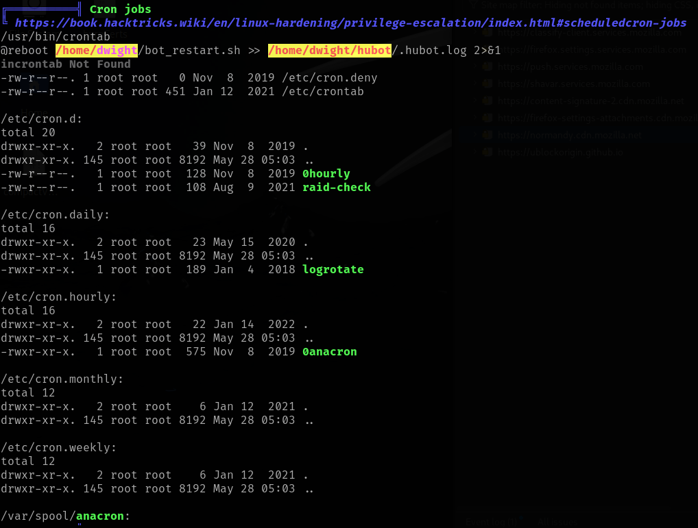
- linux exploit suggester
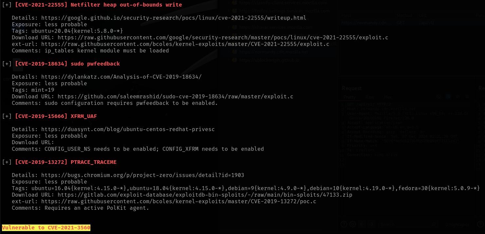
- and the PATH
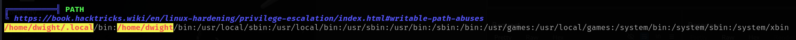

Since the CVE-2021-3560 was highlighted on the linux exploit suggester from linpeas, I decided to give it a try first, and it kind of worked, cause I was able to create the user and so on, but I was still not getting the privileges

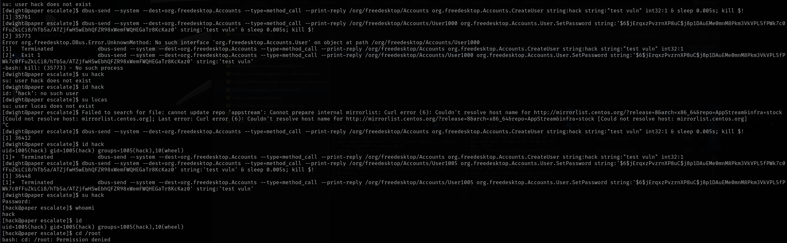

So after enumerate the files on the target, I moved to mondoDB with the following credentials **rocket:my$ecretPass**

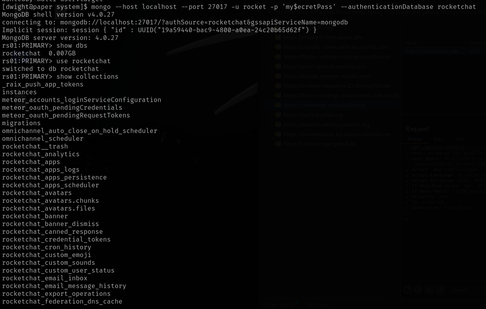

And there I was able to enumerate the users further

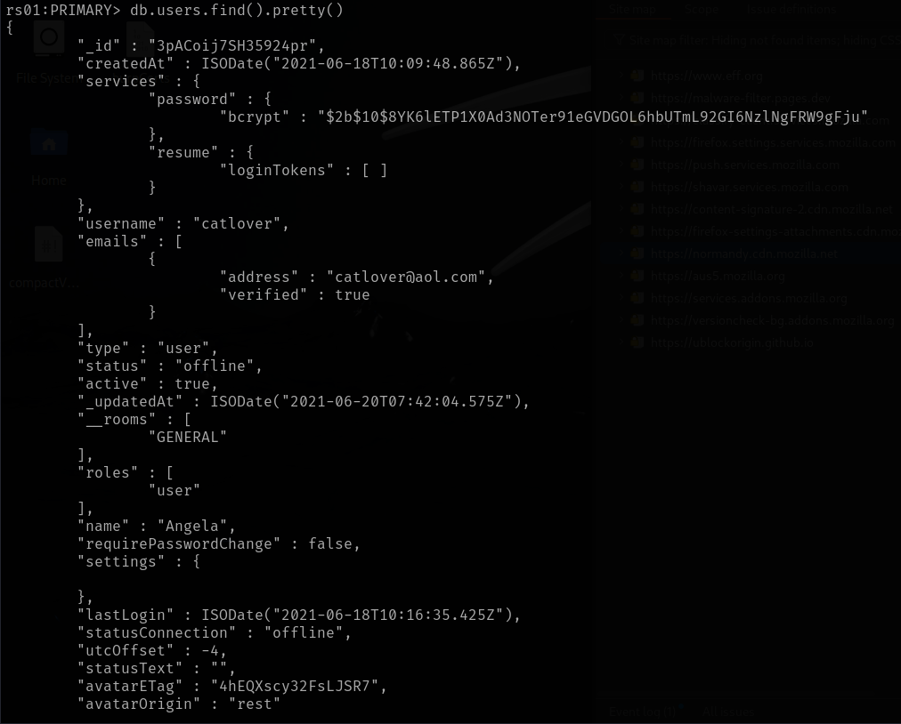

And I found that nick was an admin

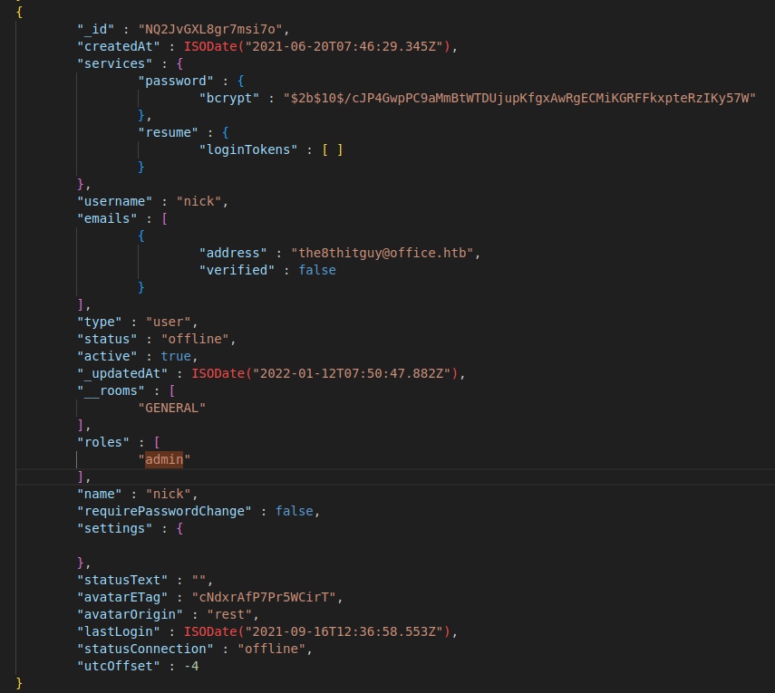

So I procced to crack it's password

I also checked rocket user, but it didn't have a password, I guess it's because it's a bot

While nick password was cracking I checked the cron jobs, to see if there was something interesting, but dwight is only running the bot restart script as dwight

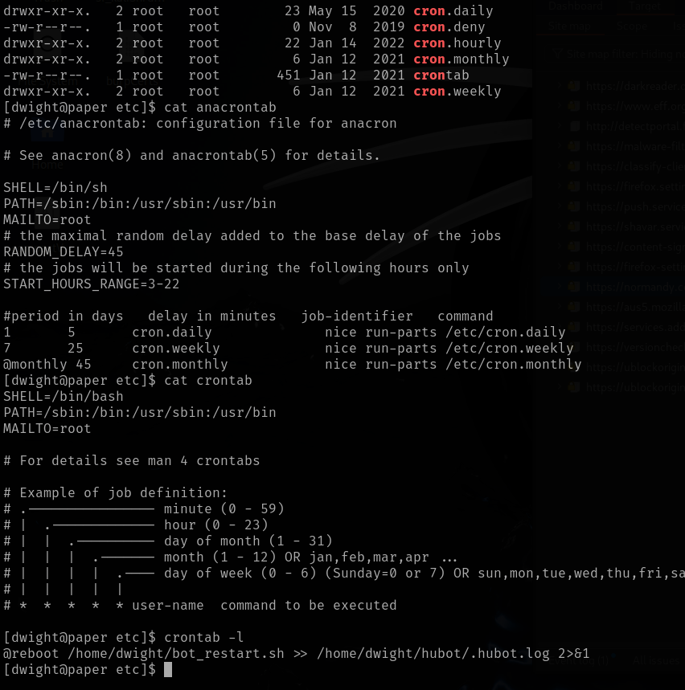

And all other cron jobs were only writable by root

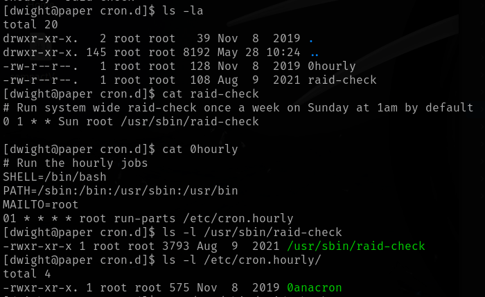

Since I was running out of options, I got the user flag in order to get a hint from HTB guided mode, which was to check the polkit version

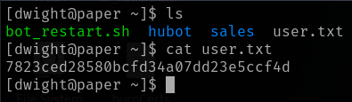

So after checking the polkit version, and googling it the same cve that I tried to exploit before came out, the one reported from linpeas, and the thing is that apparently, the exploit worked before, but I didn't know it, cause I dropped in that new user which apparently didn't have any other privileges than the ones I had before, but the magic is that it can run any command as sudo, so with that we can get a shell as root

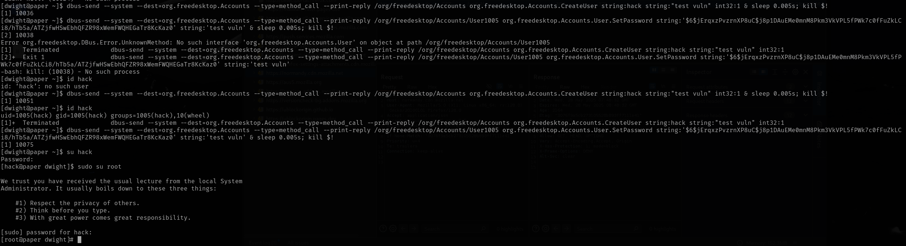

And with that we can get the root flag

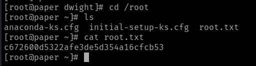
