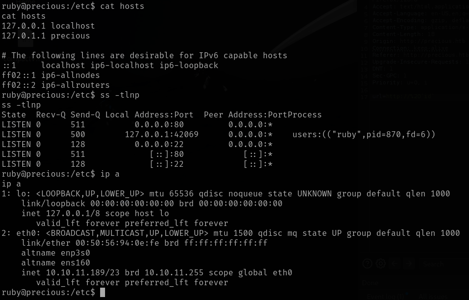
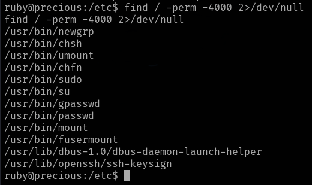
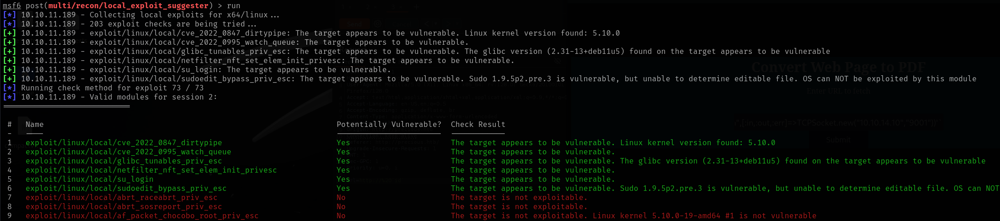

# Precious

This is my write-up for the machine **Precious** on Hack The Box located at: https://app.hackthebox.com/machines/513

## Enumeration

First I started with an nmap scan, which shows the following

Since only port 80 is open, a part from port 22, I navigated there to see what are we up against, and the default page was the following

I checked wappalyzer to see the tech stack used, but there was not much information given

Then I ran gobuster to check the subdirectories but it didn't seem to be any

And I checked for subdomains too, but it doesn't seem to be anything interesting either

I also ran nikto to see if there was any vulnerabilities or weird configurations, and the thing that picked my attention is that the server banner was changed, so maybe they're trying to hide the phusion passenger

With that in mind, I went to the Phusion Passenger [repo](https://github.com/phusion/passenger), to check more in depth how it works, and I looked for exploits, but the only relevant one that I found is a DoS from version 6.0.21 to 25

Then I tried to mess with the program functionality, but the name of the pdf is randomly generated, and it doesn't seem to execute any of the text inside the website

I also tried to mess with the request, but it didn't get executed

So since I was a little stuck I checked the guided mode from HTB for a hint, which was to look at the generated pdf metadata

## Exploitation

With that I was able to see that pdfkit was being used, and after a quick google search I found an exploit for it, which generated a payload for a reverse shell (which was pretty similiar to the one that I tried before, but I missed the backticks)

And with that I got a shell back

## Post Exploitation

Then I started the usuall enumeration to procced with the escalation, first I pulled the system info

After that the /etc/passwd to check which users were available, and henry came out, so probably we'll have to move lateraly first

Then I pulled the network information

The SUIDs

And the cron jobs, where I saw that there was some files on cron.d and crond.hourly

I procced to explore them, but there wasn't anything interesting

So I moved out to linpeas, where I saw that sudo tokens could lead to escalation, but I googled it, and after trying an exploit it lead nowhere

I also saw that there was some interesting files regarding the passwords, so I decided to take an screenshot and save it for later

Next, since I had a meterpreter session that I opened while trying the sudo tokens exploit, I ran the local exploit suggester, but unfortunately none of them worked

So I got back to manual enumeration, and after taking a closer look to the files under ruby home directory, I was able to find henry credentials which were **henry:Q3c1AqGHtoI0aXAYFH**

With that I connected to henry account via ssh and retrieve the user flag

Then I continued with the normal enumeration for this new user, and the first thing I saw is that we were able to trigger ruby with sudo

So I went to GTFObins and used the command to escalate with ruby, but it didn't work, apparently we can only run the whole command, not ruby in general

Since we can't manipulate the script, I analyze it to see if it was using something we can exploit, and I saw the file read of the dependencies.yml, then I tried to create one file with command injection, but I didn't have rights on the current directory

But since the script wasn't finding the dependencies file, I wondered if it was possible to use path hijacking, so I modified the PATH

And after creating a dependencies.yml on tmp I executed the command to check if it was being read, and it did

So I went straight to google, searching for a way to exploit the yaml file and inject commands, and I found this [article](https://staaldraad.github.io/post/2021-01-09-universal-rce-ruby-yaml-load-updated/) which explained it really well, I copied the payload, and it got executed

Then I only had to modify the payload to get me a shell, and run it with sudo, and I finally got an elevated shell

Now the only thing left to do was to retrieve the root flag

