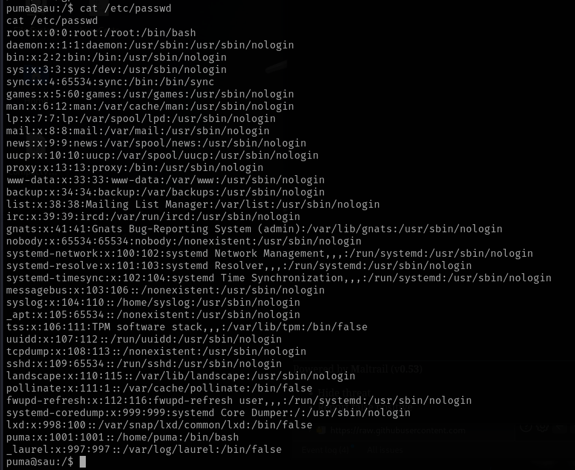
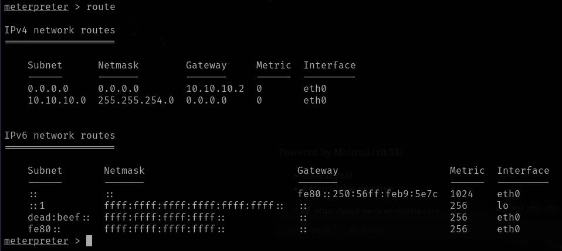

# Sau

This is my write-up for the machine **Sau** on Hack The Box located at: https://app.hackthebox.com/machines/551

## Enumeration

First I started with an nmap scan, which shows the following:

Since there was only an http page open in port 55555 apart from the ssh, I went there first to explore the target more in depth

Meanwhile I triggered gobuster to check if there was any interesting subdirectory, but it doesn't seem to be the case

## Exploitation

So I googled the request basket version, and I found an exploit for it

But I didn't know how it works, so I went to the request basket github and I read the documentation to understand how it works more in depth

After that, I finally got the exploit to work, but it still seems to be a missing piece

So I read some of the documentation of the API and how request baskets is meant to work, and after some tries, I run the exploit again but this time against port 80

And with that I was able to see a program called Maltrail that the server was running internally

It is also possible to enumerate the maltrail version just by scrolling down a little bit

And with a quick google search I found that there's an exploit which allows RCE, so I went ahead and configure the metasploit options for the exploit

And after running it I got a shell

## Post Exploitation

First I got the user flag

And I started the enumeration by pulling the system information

Then I dumped the /etc/passwd file

And after that I checked the sudo privileges for the current user

I also pulled the hosts, to see if there was something interesting

And after that I checked for internal open ports with netstat

And I also pulled some more networking information

After all that manual enumeration, I run linpeas to see if I was missing somethinga, and it reported some other vulnerabilities

So with that, I started trying to escalate privileges, first I tried the exploits suggested on the local exploit suggester, but none of them worked

Since none of that was working, I decided to try some manual ways to escalate, starting with the command that was possible to execute as sudo, which after some googling, I saw that the first step was to check the version, after that I googled exploits for that version, and I found a [blog](https://sploitus.com/exploit?id=EDB-ID:51674) that suggested to run the status of the service and then trigger a shell, and it actually worked

After that the only thing left to do was retrieve the root flag

