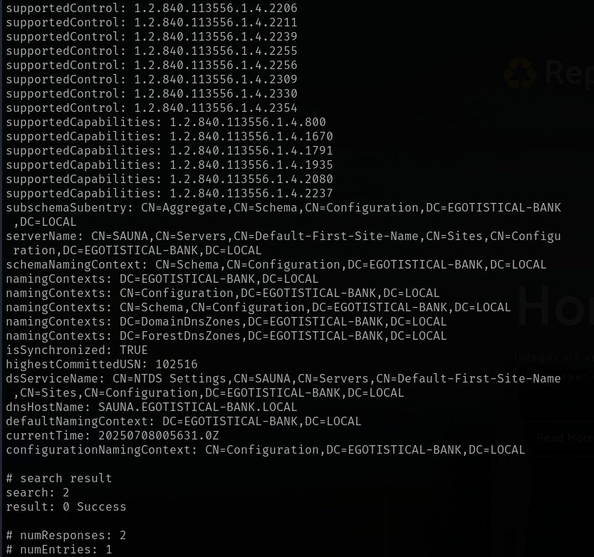

# Sauna

This is my write-up for the machine **Sauna** on Hack The Box located at: https://app.hackthebox.com/machines/229

## Enumeration

First I started with an [nmap scan](./res/Sauna/10_10_10_175_nmapReport.txt), which shows the following

It seems that the target has an Active Directory, but since port 80 was open I navigated there first to see what we are up againts, and the default page displayed is the following

Then, before digging deeper on port 80 I tried to explore smb shares, but it seems that wasn't possible

I also triggered enum4linux, which actually retrieved some interesting information about the domain

Then I got back to port 80, first I checked wappalyzer, which didn't tell us much

After that I ran gobuster, but it didn't find anything either, just the pages that are navigable from the website

And also nikto, which only found some methods that could be interesting

After navigating the website manually, I didn't find anything interesting either, just two requests that seemed to be not allowed, which was weird

So I moved to the other ports, first I started with a DNS dig, which didn't show much

After that I used ldapsearch to get the naming contexts

Which then I used to get a complete [ldap dump](./res/Sauna/ldapDump.txt)

After that I tried to get some more information with the impacket scripts, but nothing came through

## Exploitation

So I tried with kerbrute, and it retrieved a hash from the user fsmith

But when I got to hashcat, it didn't seem to work

After trying to crack the hash with some other modules and with john the ripper and it still didn't work, I went to the hack the box guided mode for a hint, which was to use the script GetNPUsers.py to retrieve the hash, and when I did, I noticed that the hash was different from the one retrieved previously

Then I was finally able to crack the hash and retrieve the credentials which where **fsmith:Thestrokes23**

And with that I was able to get a shell via winRM

## Post Exploitation

Then I retrieved the user flag

Along with some basic information about the target like groups, privileges and system information even though the last one was not available

Since it is an Active Directory I used bloodhound first to try to get a path to domain admin, so first I dumped all the information needed with bloodhound-python

Then I uploaded that information into bloodhound and search for a path to domain admin, but there wasn't any paths available, so I started by enumerating fsmith users to see which groups it was in

After that I enumerated the domain admins, which only had Administrator

So I checked the administrator groups, which were a lot

Since I wasn't getting any other option, I pulled the domain users to see if I could do a lateral movement

So I pulled the roastable users which was hsmith, the problem is that when I tried to pull the hash I got the clock skew too great error

After some research I found Rubeus, which should bypass the clock skew error, but it didn't work either

So, I changed the approach and I ran winPEAS instead, which found some interesting things, like the svc_loanmanager credentials, which are **svc_loanmanager:Moneymakestheworldgoround!**

But then when I tried those credentials they didn't work

So I did a password spray within the known users, but nothing came through either

I didn't understand what was going on, so I checked the write-up, and I found that the username was svc_loanmgr and not the whole name as I was using, so with that I was able to get the info via bloodhound python

And after uploading it to bloodhound GUI, I saw that the use svc_loanmanager have the permission GetChangesAll over the domain, which after checking the abuse section we could see that it is possible to use secretsdump.py to get hashes

So I used impacket secretsdump and I got the hashes

Then the only thing left to do is relay the hash in order to get an elevated shell

And retrieve the root flag

