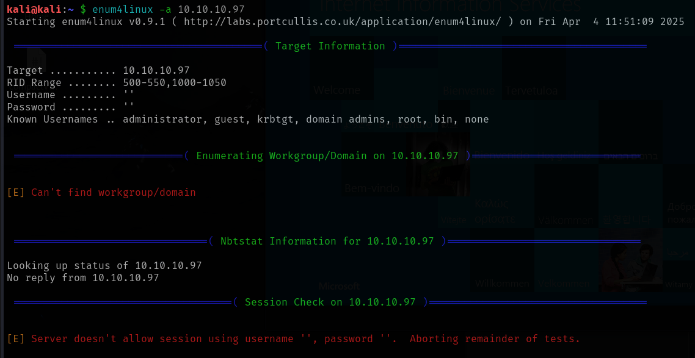
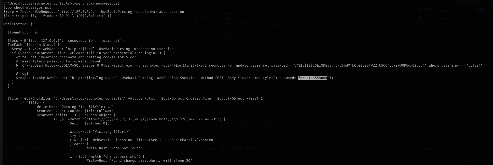

# SecNotes

This is my write-up for the machine **SecNotes** on Hack The Box located at: https://app.hackthebox.com/machines/151

## Enumeration

First I started with an nmap scan, which shows the following:

Since port 80 is open I went ahead to check what was on the webpage, which showed the following

I run gobuster, but it didn't report anything interesting apart from what we were able to see from the default page

I also explored the port 8808 default page, which seems to be an IIS

And also run gobuster against it, which gave ablsolutely nothing

So before I dive into enumerating the web further by checking how the requests are handled and so on, I wanted to enumerate a little bit the port 445, so first I checked for eternal blue, which isn't the case

Then I run enum4linux, which didn't gave any useful info either

It was not possible to enumerate it manually either

I also tried with some nmap scripts to enumerate the shares, which wasn't possible, and another one to enumerate protocols, which reported that NTLM is active, which will be interesting if it wasn't a CTF without any traffic

So I changed the approach to start enumerating port 80, first I tried registering, which didn't show anything weird on the request, neither does the login

But with that we are able to see the home defaultPage

Here wappalyzer gave us a little bit more info

Navigating around we could see that the contact.php and submit_note.php are sending information to the server, so maybe there's a way to upload a shell with it

So I checked if there was XSS, which seems to be the case

## Exploitation

Since XSS worked, I tried creating a php shell and fetching it with a script

And it seems that the shell is fetched, but the execution is blocked by CORS

So I tried a different approach which was to upload a reverse JS shell, and it connected, but doesn't seem to be working

After playing a little bit with it I discovered how to use it, but it still doesn't seem to be useful

I also checked the methods that were allowed and the headers, and I tried uploading a test image there, but it didn't work either

So, since I was stuck I checked the official write-up to see what I was missing, and it seems that since there's no password validation on the password change request, we can use CSRF (Cross Site Request Forgery), which I didn't know what it is, but it's pretty interesting, cause it seems that we are able to create a link from the password change request, manipulate it, and send it on the post of the contact form in order to exploit this vulnerability. So I went ahead and send the tweaked URL on the contact us form

And with that I was finally able to login as tyler user

Now if we check all of tyler notes, we could see that there's one particularly interesting which could be a login tyler / 92g!mA8BGjOirkL%OG*&

So I tried to enumerate the shares and connect to SMB with tyler's password, and it worked

So I tried to run psexec to see if I could get a shell right away, but it didn't work

With that in mind, I uploaded a png as a test and php shell to the server to check if it works

Then I tried uploading some reverse shells, but they didn't work

So I referred to the write-up again, which suggested to upload a netcat exe that's stored on our kali machine and use it to trigger the reverse shell, so I located the nc.exe

I created the reverse php shell

Ans I uploaded everything to the server

And finally got that reverse shell

## Post Exploitation

I tried doing some basic enumeration as usual, but it seems that systeminfo is being blocked

I was able to pull the privs of the user though

As well as the local groups and the antivirus status

Also it was possible to check the netstat

Navigating around I found tyler's password for SecNotes inside this script which is forested85sunk

I also got the user flag

Now I'd normally go with winPEAS or some other automated tool to help me identify possible escalation paths, but since I'm doing this box because it was part of the windows privilege escalation course that I'm doing, and there's they gave a hint of using WSL I'm going to try that even though I've never use it, and if I get stuck I'll get back to the course. So I got a [guide](https://swisskyrepo.github.io/InternalAllTheThings/redteam/escalation/windows-privilege-escalation/#example-with-windows-xp-sp1-upnphost) that suggested to find bash.exe and so I did

Since I had root privileges on the WSL shell I tried launching a reverse shell against my kali machine as the guide suggested

And it worked, but it only gave me access to the WSL subsystem

So I went back to the course to see what would be the correct way to do it. Which it seems that all we had to do is check the history of WSL, which contains the admin password which is u6!4ZwgwOM#^OBf#Nwnh

So now all we have to do is connect to it and retrieve the root flag

