# Shocker

This is my write-up for the machine **Shocker** on Hack The Box located at: https://app.hackthebox.com/machines/108

## Enumeration

First I started with an [nmap scan](./res/Shocker/10_10_10_56_nmapReport.txt), which shows the following

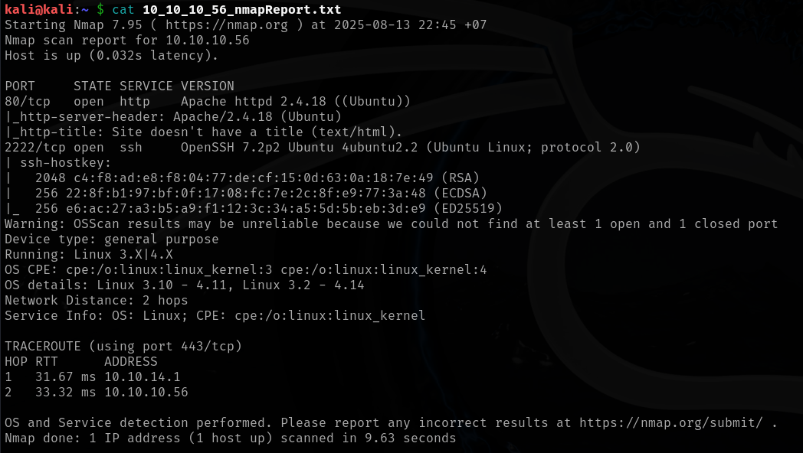

Since only port 80 was open, apart from ssh, I navigated there to see what were we up against

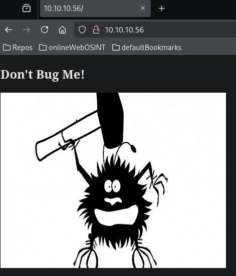

After that I checked the source code, while I was running gobuster, but there wasn't anything interesting

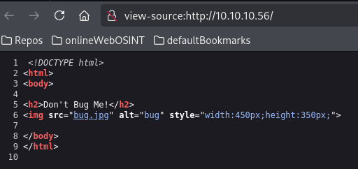

Then gobuster finished, but didn't have any results either

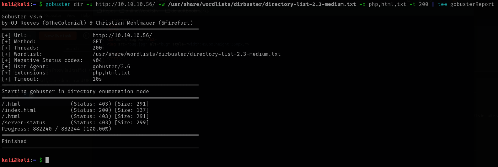

So I pulled the headers and the options to see what we where able to do, there we got the POST method which could be interesting

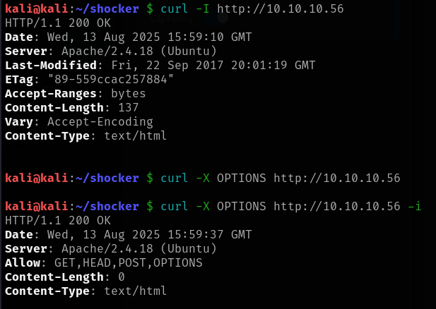

After that I ran nikto, which reported some other things worth exploring, and some http scripts from nmap, which didn't find anything

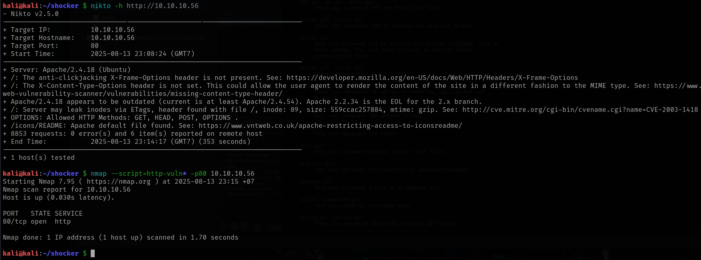

Then I ran feroxbuster, to make sure I wasn't missing any hidden directory, but it didn't seem to be the case

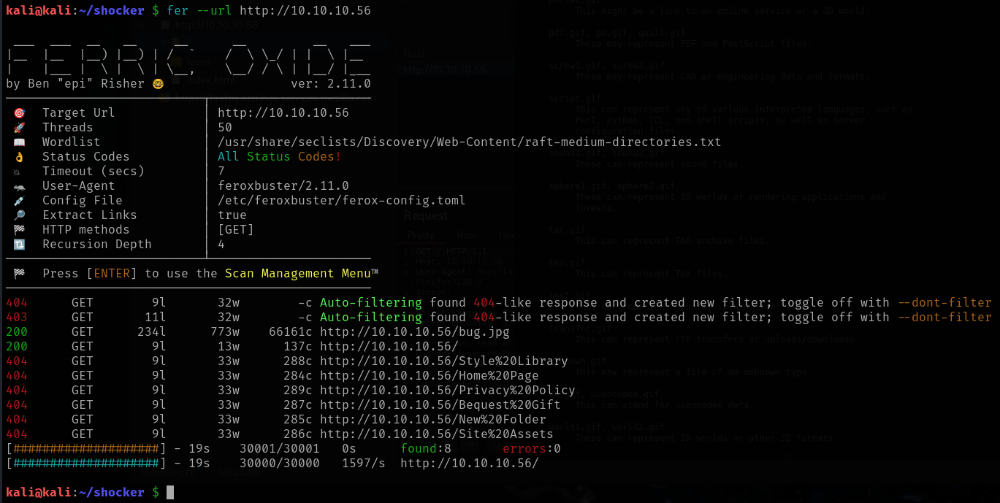

After that I tried to post an image to the web server, but it wasn't possible

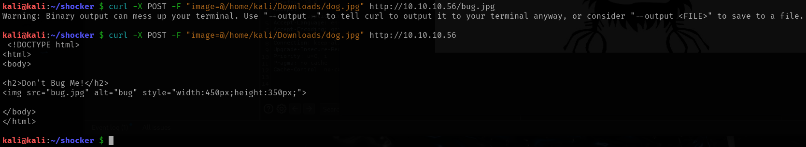

So I searched for vulnerabilities for the specific apache version, but nothing relevant came through, so I used an specific wordlist for apache on feroxbuster, but even though some results came through it was all redirections to the default page

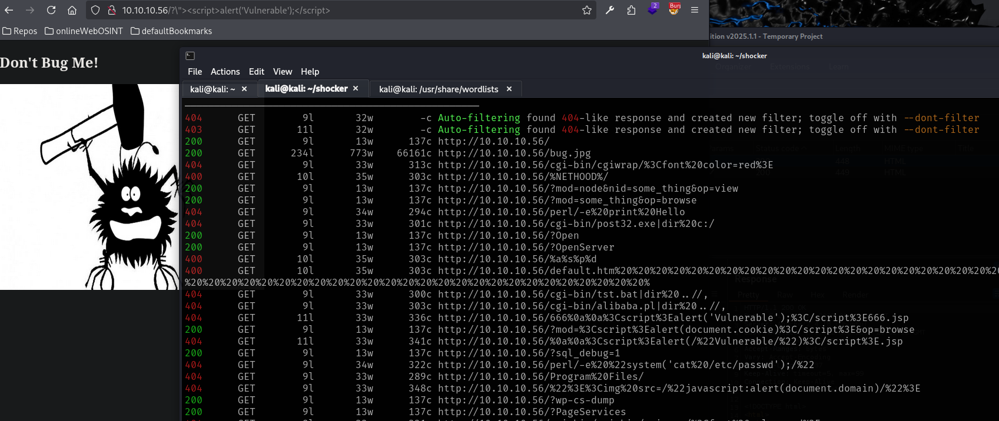

Since I was stuck I checked the write-up where I saw that we should have found the user.sh through dirbuster, by adding the sh and cgi extensions to the search filter, and while I did add some extensions including cgi, I missed the sh, though after that I did a test with gobuster and it still didn't find the file, so I guess that it's better to use dirbuster for that case

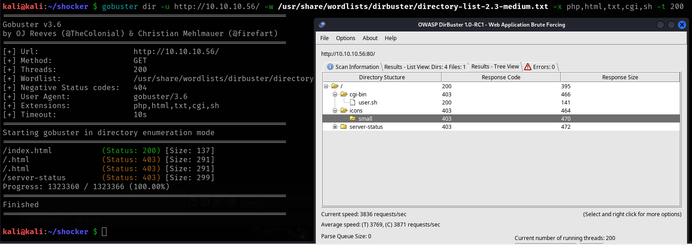

## Exploitation

Now with that information, if we navigate to the user.sh script we find this output

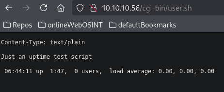

Then I googled how to exploit cgi-bin scripts and the shellshock name kept appearing, so I searched more about it, and I found [this post](https://yashpawar1199.medium.com/exploiting-the-shellshock-cve-2014-6271-vulnerability-043514bea7b8) where it was really well explained, so I grabbed the payload from there, put it in the user agent as described there, and I got command execution

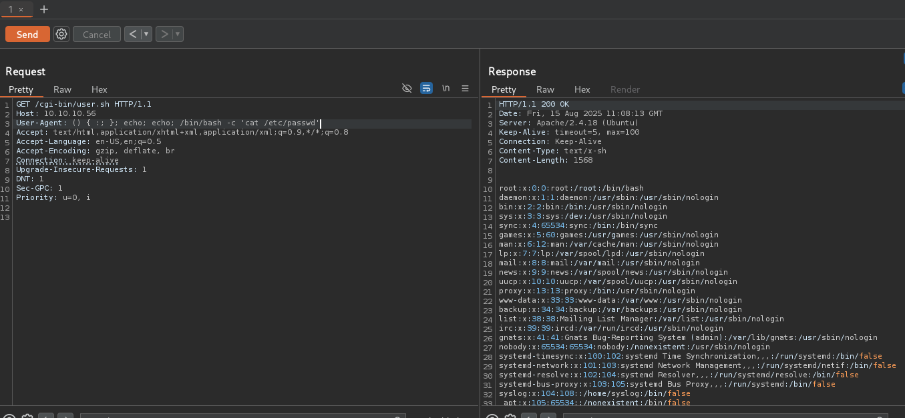

And with that I was able to get a shell on the target

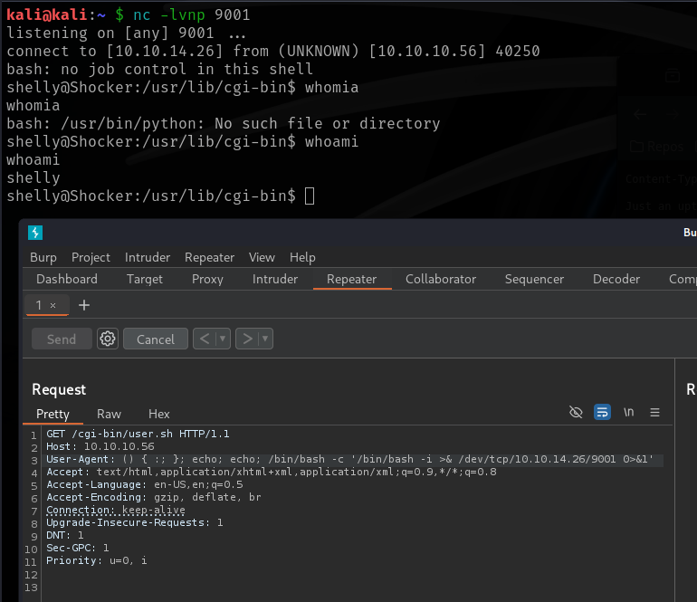

## Post Exploitation

Then before starting with the enumeration, I took the user flag

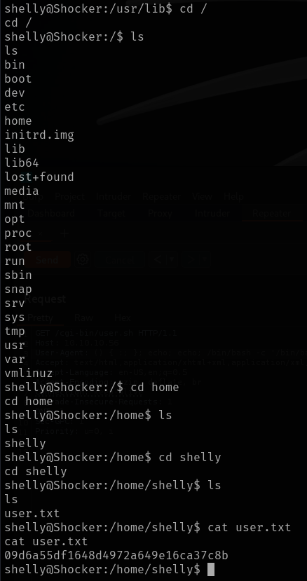

After that proceeded to pull some general information about the target

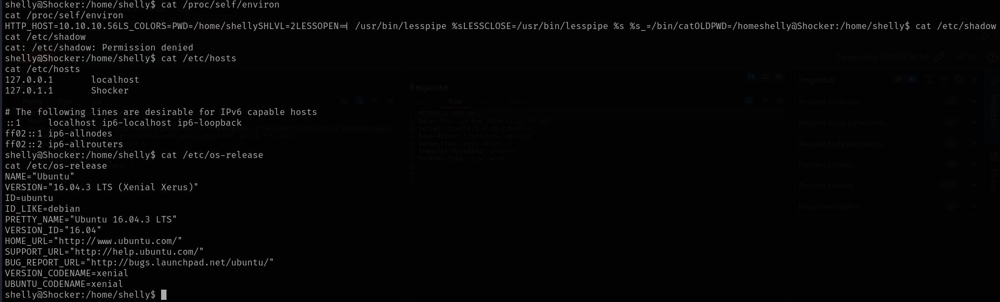

Then I ran sudo -l and perl came out as executable as root, so I went to GTFObins, grabbed the command, and get an elevated shell

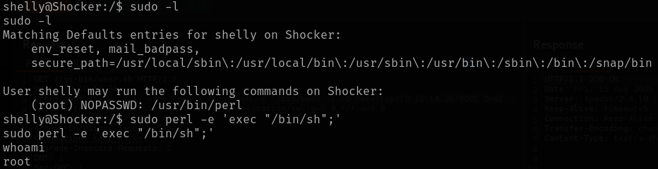

After that all I had to do was going to the root folder and grab the flag

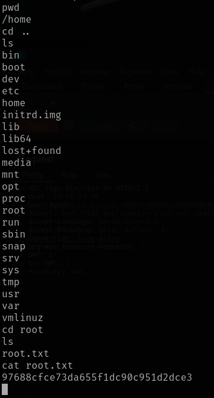
