# SteamCloud

This is my write-up for the machine **SteamCloud** on Hack The Box located at: https://app.hackthebox.com/machines/443

## Enumeration

First I started with an nmap scan, which shows the following

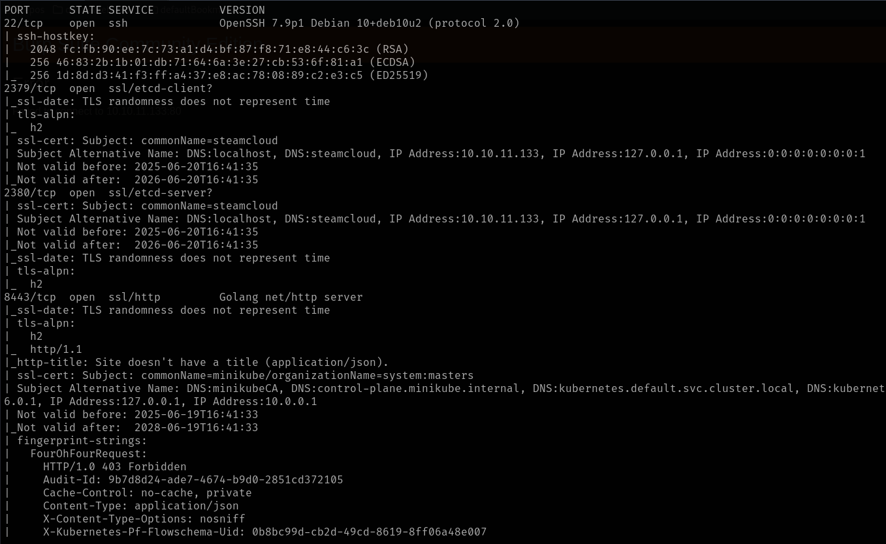
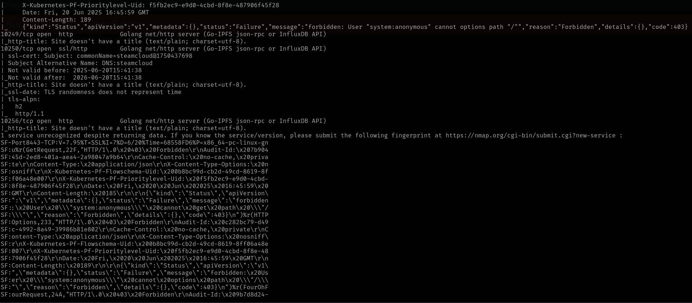

Since there was a lot of ports open, and I didn't recognize any of them, a part from SSH, I tried navigating to some of the ones that were tagged as http from nmap, but there was nothing there

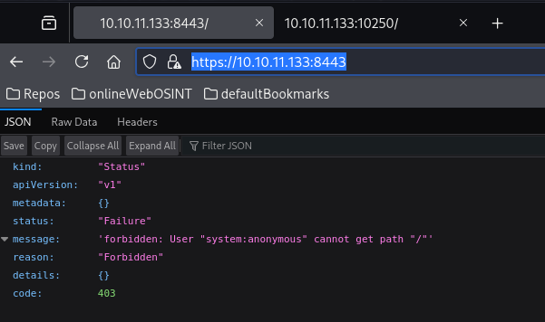

So I started at the beginning, and I googled the port 2379, which led me to [this documentation page](https://kubernetes.io/docs/reference/networking/ports-and-protocols/) where I found that this port is used for a kubernete API and also that port 10250 is used for the API as well and seems to have a control Panel. I created [this document](./res/SteamCloud/ports.md) to keep track of the open ports and it's functionalities

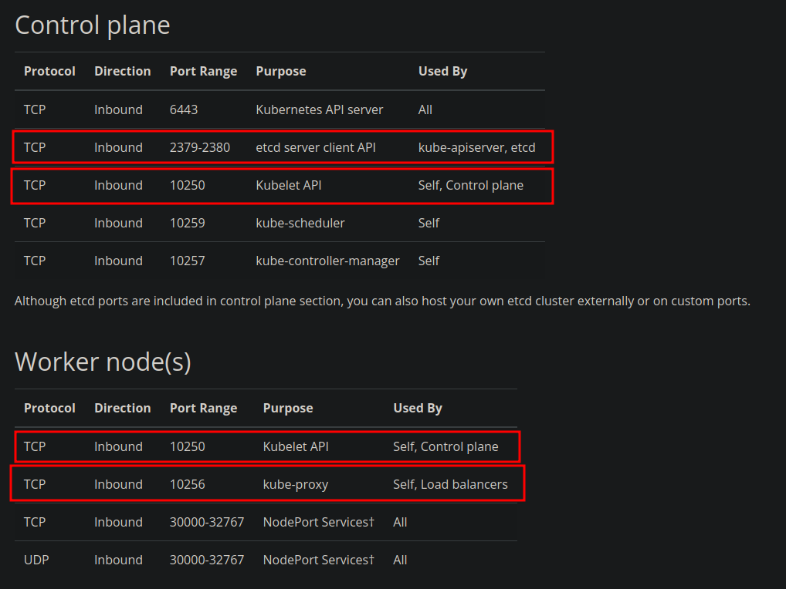

Before getting deeper into kubernetes documentation I checked the remaining ports, to see if they were related with kubernetes as well, starting with port 8443, which apparently is an alternative for port 443. And as for port 10249 it seems to be related with kubernetes as well

So with all that information, I went ahead and search information about kubernetes, cause I wasn't too familiar with the topic, first I started reading [this article](https://securitylabs.datadoghq.com/articles/kubernetes-security-fundamentals-part-2/)

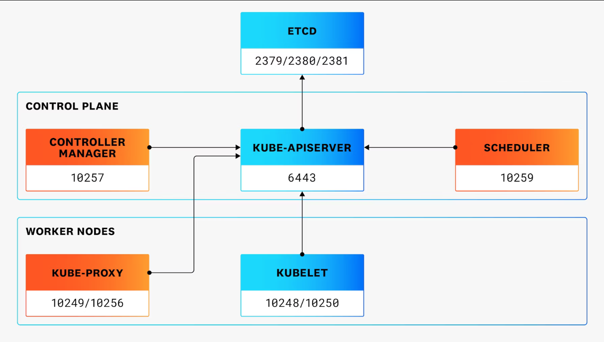

After reading the article, I figured that the port 8443 could be being used instead of 6443, so I tried the version endpoint, and it worked

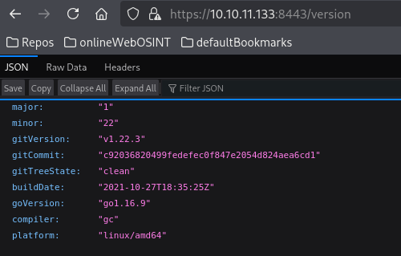

Then I continued with the [official documentation](https://kubernetes.io/docs/concepts/overview/) and some other sources

After that I tried searched for how to pentest against kubernetes, and I found a suggestion to check the /pods endpoint, where I found the following

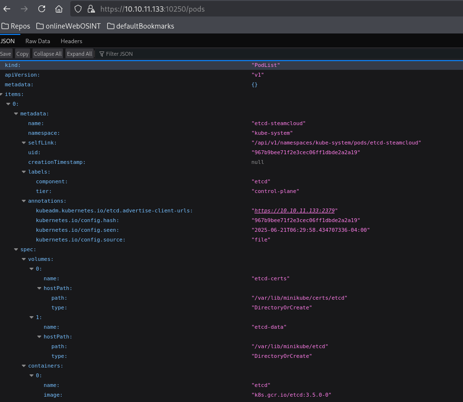

Since I didn't know what to do with that information, I used htb guided mode to get a hint, which was to look closer to the nginx pod and finding the access token directory

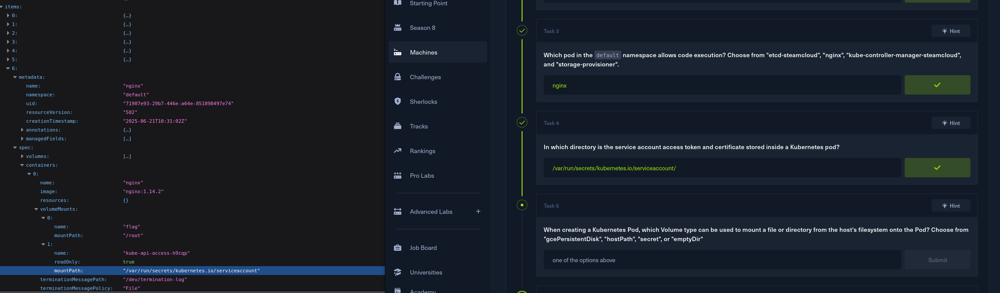

## Exploitation

With all that information, I checked the next hint, which was to take a look to [this part of the kubernetes documentation](https://kubernetes.io/docs/concepts/storage/volumes/), after reading it and trying some things I was still stuck, so I decided to check the write-up, where I found that we should use kubeletctl, so I went ahead and download it

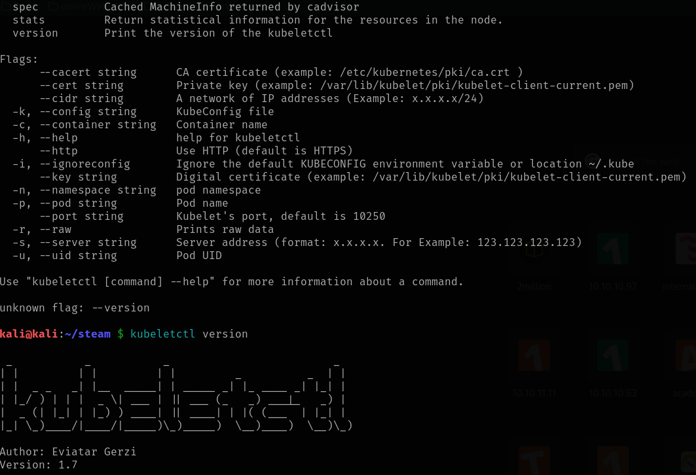

After that we use kubeletctl to obtanin a list of all the pods

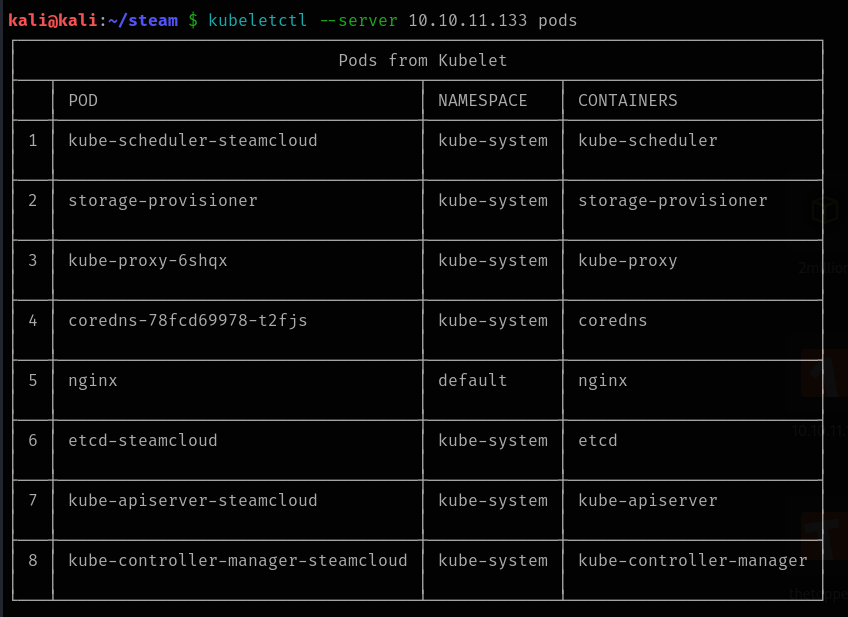

Then, we can use kubeletctl again, to scan the pods for RCE, where we confirm that the nginx pod is vulnerable to it

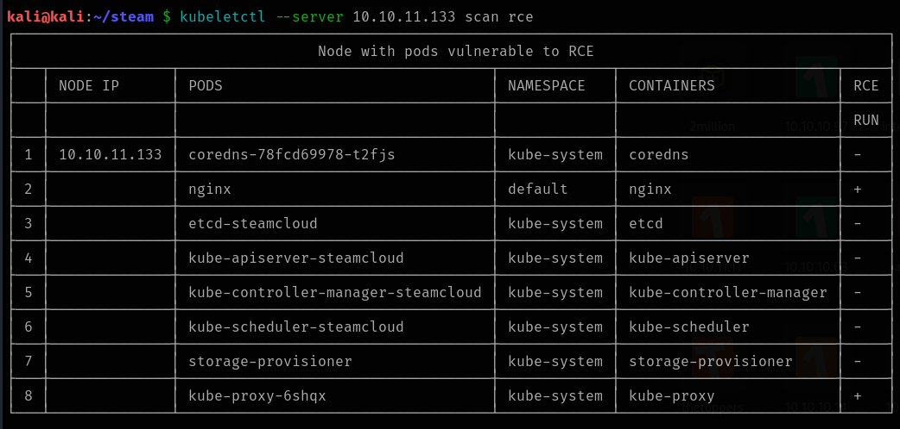

So I tried injecting a command there, and it worked

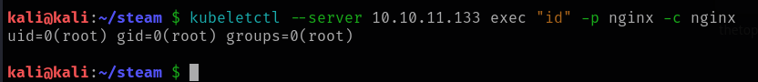

But when I tried running some reverse shells I got an error everytime

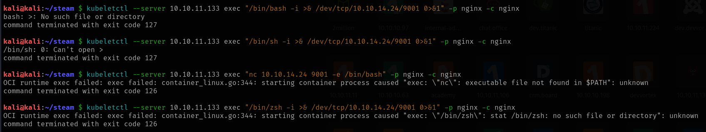

## Post Exploitation

Since we were running commands as root, I tried pulling the shadow file, along with the passwd file, and it worked, so probably we would be able to retrieve the flags from here, or crack the root password and get an SSH login

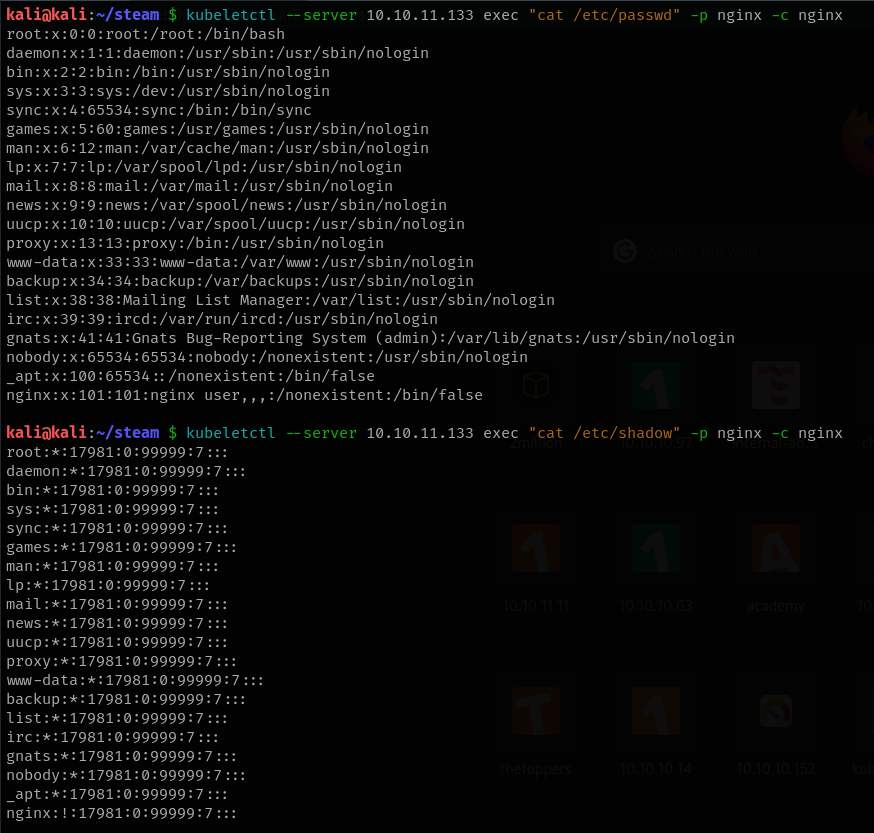

But I didn't think that was the proper path to solve the box, so I came back to the write-up, and apparently we should retrieve the flags with kubeletctl (without a shell), but the problem is that we still have to escalate privileges, because we are root only on this pod, so we can't retrieve all the flags yet. In order to do that we have to pull the token and the certificate

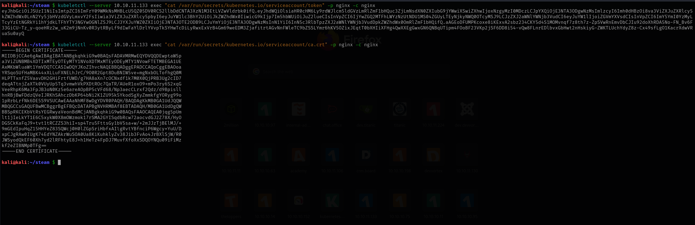

Then save the certificate in a file and export the token

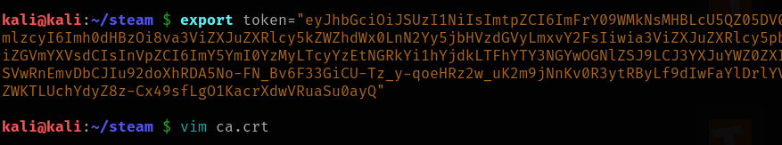

After that we could run the following command to check that the authentication with the API through kubectl with the exported certificates work

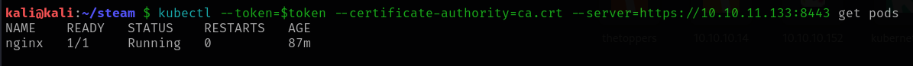

Then we can use the auth can-i command to check our permissions, where we could see that we are able to create pods

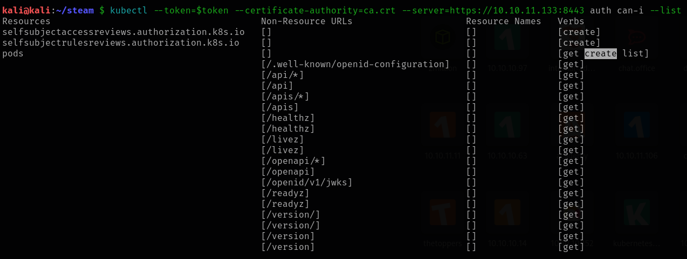

After that we just have to create a malicious yaml file and create our own pod which should have more permissions

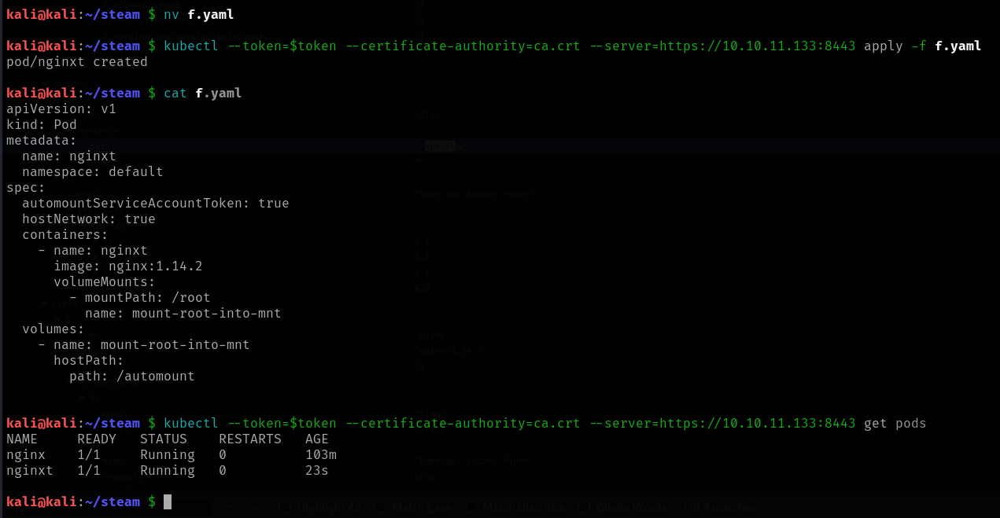

But then when I tried to retrieve the flags I got an error

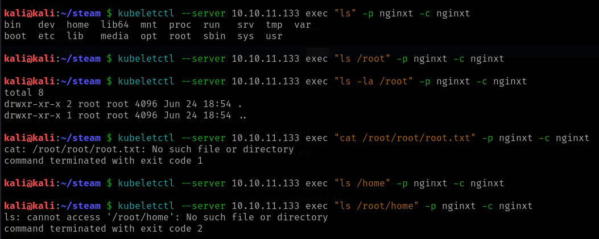

So I decided to watch a video to see how other people solved this, which gave a more solid understanding of the yaml file and what is it doing

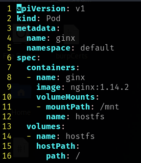

After that I created a new pod with it, and obtained a shell inside it

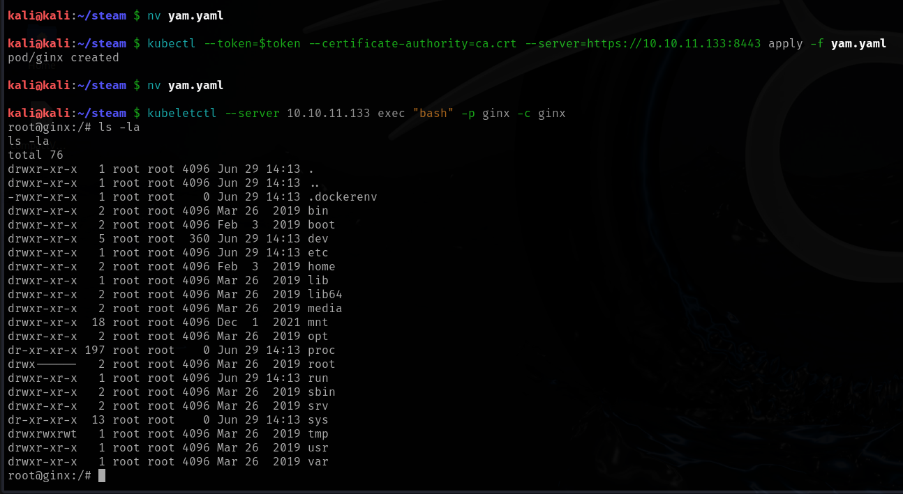

Then all I had to do is move to the /mnt folder where the root from the target machine was mounted, and retrieve the root flag. Now looking back, I think that the problem I had before was the automount on the yaml file, that is why the root folder wasn't where it was supposed to be

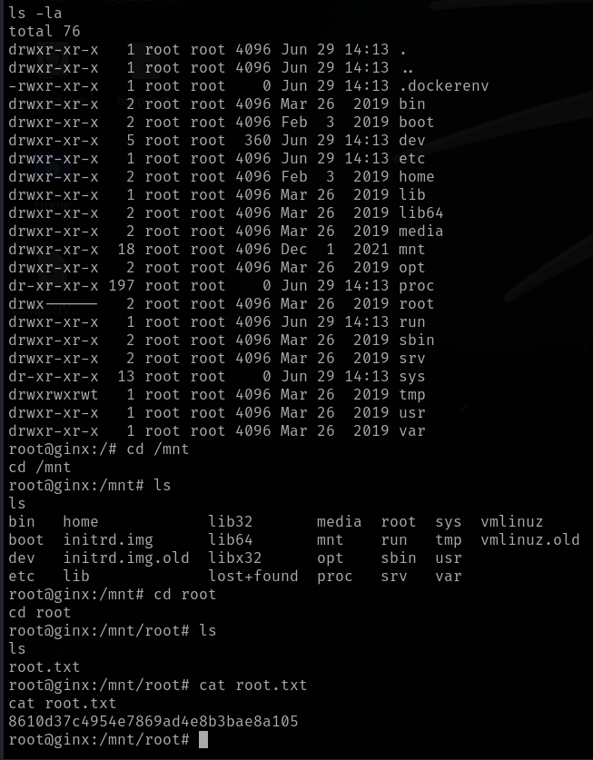
