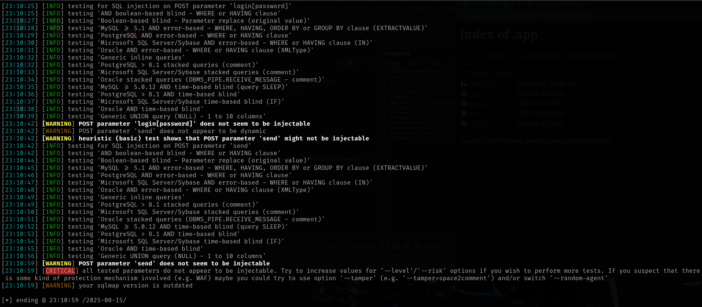
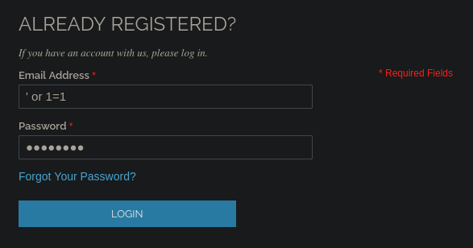
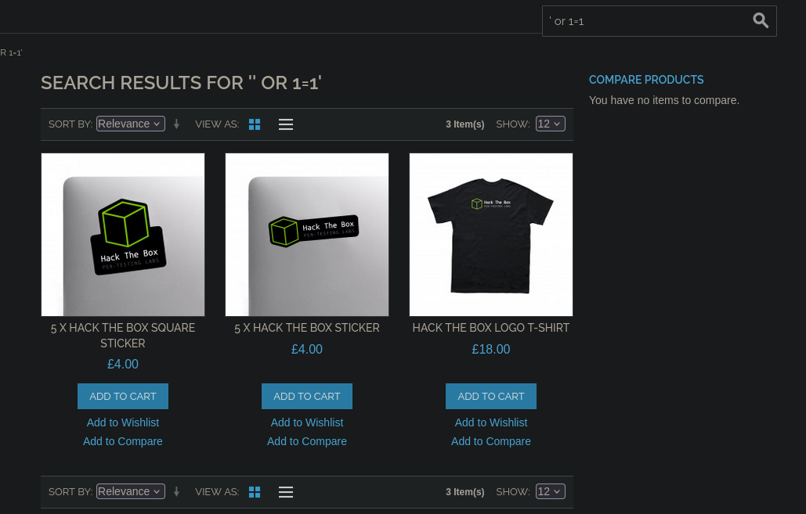
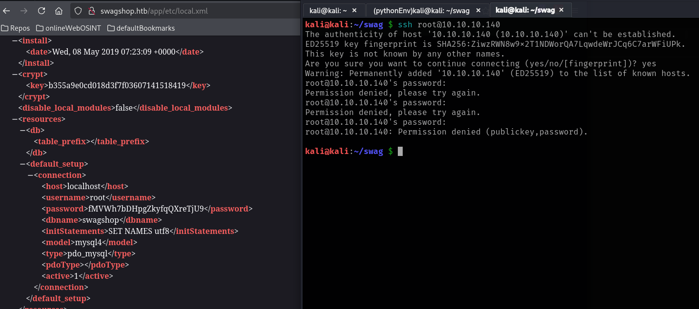

# SwagShop

This is my write-up for the machine **SwagShop** on Hack The Box located at: https://app.hackthebox.com/machines/188

## Enumeration

First I started with an [nmap scan](./res/SwagShop/10_10_10_140_nmapReport.txt), which shows the following

Since only port 80 was open, apart from ssh, I navigated there to see what were we up against

After that I ran gobuster to look for hidden directories, which actually found some interesting things

Then I ran feroxbuster, which found a lot of things

Since I had a lot of inputs, I also ran nikto to see if something was found there, so I could focus on something to start with, and indeed it was the case

So, first I checked the install file, but it didn't give too much information, apart from telling that the software was already installed

Then I checked the release notes, from where we can assume that the magento version is 1.7.0.2

Next I navigated to the app directory, where was some file listing

And after navigating through the files, I found the config.xml, where was listed the mage version

Considering the xml structures and some mentions of sql throught the files, I thought that I could be possible that there's sql injection, so I used sqlmap against the login page, but I got nothing

So I tried it manually, starting with the register form, but there was not possible to inject anything cause there was a good validation for the email, I found that the email was being checked as the identifier cause I tried to create two accounts with the same email and I got an error

After that I tried with the login form, but the same happened

So I decided to create an account, click around the web, and check if there's some sql injection on the authenticated side, and it seems to have some sort of sql injection on the product search, cause all of them were retrieved, though this isn't very useful

I also checked wappalyzer to get more information about the software used

After that I checked if there was SSTI with the search, but it wasn't the case

Then I checked the cookies, to see if it was possible to jump to another account with them, but they looked like a random string, so it wasn't the case either

## Exploitation

After that, I googled exploits for that specific magento version, and I found one RCE, but I got some errors while trying to execute it

So I checked the code to see what I was missing, and I found that the install date had to be the same as the local.xml, and when I checked it, I saw the root credentials, which unfortunately didn't work on ssh

I assumed that the password was encrypted, so I tried to figure out which hash it was, but it didn't seem to find anything, so I went to google and apparently having access to the local.xml file is dangerous, so it could be an interesting path to explore

But before that I tried to make the exploit work, and while I was messing around, I found the admin panel, but the password didn't workt there either, nor any default one

After a little bit of research about magento, it seems that the password from local.xml is not encrypted, even though it doesn't work on ssh neither on the admin panel, and after some tries, I was not able to make the exploit work, so I'm starting to think that where it says authenticated RCE, they mean on admin panel, not a normal account, so I googled a checklist for pentesting magento, and instead I found a [github repo](https://github.com/six2dez/pentest-book/blob/master/enumeration/webservices/magento.md), which seems nice for pentesting in general, which lead me to [magescan tool](https://github.com/steverobbins/magescan), then I proceed to install it and run it, where I got some information, like the actual version of magento and some accesible paths

With that information, I searched for another exploit, but this time with the correct version, and [this one](https://www.exploit-db.com/exploits/37977) showed up which had the same patch on the description as the first one that showed on the magescan, so it looks promising

After some tries and some fixing of the exploit, I managed to make it work

And with that, since now we have a real account on admin panel, I returned to the previous exploit, but I got some errors, I asked chatGPT about it, and it gave me an improved exploit on python3, but it didn't work either

So I searched for reverse shells from magento admin panel, and the [same exploit](https://gist.github.com/falcononrails/e754505f9339b5fa905c2dc8f0f3adf4) kept showing, so I debugged the code, but afer some tries, even adapting the exploit, making sure the login and the hash were correct I wasn't able to make it execute the command even though no errors were returned

Since I was stuck there, I checked the write-up to see what was going on, there the put a link to [this exploit](https://github.com/Hackhoven/Magento-RCE) which is written in python3 and should work better, but then when I got the same error as before, I just realized that the nexts steps of creating an order were necessary to avoid that error

So I followed the step of doing the reorder from the write-up

And then after seeing that the new order was there, I proceed to reran the exploit, and this time it finally worked. Then I also ran the exploit I was using previously, and it worked as well

After that all I had to do was to send a reverse shell as a command, which gave me some problems at first, but after some tries I was able to gained access to the target machine

## Post Exploitation

Once there, I saw that the shell spawned on the /var/www dir, which contained the files that we already saw from the browser, so I checked if I was able to navigate to another folders and see the content, so I went to the home folder, where I found another user called haris, but luckily we were able to access it and retrieve the user flag

After that I started with the normal enumeration in order to escalate privileges, first by pulling the /etc/passwd

Then I continued with some general information, like the hosts, the OS and the environment variables

After that I check the sudo permissions, where I saw that there was possible to execute vi as root

So I went to GTFObins to get the command in order to do the escalation, but then the www-data password was required, which we didn't have at the moment, I tried the one we found on the local.xml, **fMVWh7bDHpgZkyfqQXreTjU9**, but there was no luck

Then I pulled the SUID binaries, but there was nothing interesting

After that I checked which ports were open, cause I remembered that the credentials from local.xml were for the database, so maybe we could get some more sensitive information from there, and I saw that there was port 3306 open on localhost

So I used those credentials to login to mysql and it worked, now we could see all the databases

And after checking the tables of swagshop database, I saw that there was the table admin_user, where we could see the password for Haris

Since the password found seemed encrypted I took it to hash id, which says that most likely it's MD5

But before trying to crack it, I put it to cracknation which wasn't able to found anything

So I went to cyberchef to try and decrypt the MD5 format, but it didn't seem to work either

I also tried with hashcat, but didn't get results either

With that said, I went to google to search how does magento store it's credentials, cause I'm guessing it will have something to do with the crypt key of the local.xml, but after some research I saw that it has to be MD5 with salt and pass or the other way around, so I tried module 20 this time, which was salt and pass, with a wordlist created by myself, which I knew that contained the forme credentials, and this time it worked

But when I tried to crack haris hash with that I got nothing

So I went to the guided mode for a hint to see if that help me see what could be going on here, and it was weird cause the hint was to check which binary can be ran as root without password, but we already check that with sudo -l and it didn't work, though it is true that it says that the command could be executed as root without password, so I got back to that, and I tried again with vi, and also putting a script on the /var/www folder that was supposed to also have privileges, but nothing worked

Since I didn't know what was happening, I decided to check the write-up, where I saw that the exact command we should be using, where they're also passing the file to edit which is inside the /var/www/html folder, which I think was the key to make it work

Then with the elevated shell the only thing left to do was to retrieve the root flag

