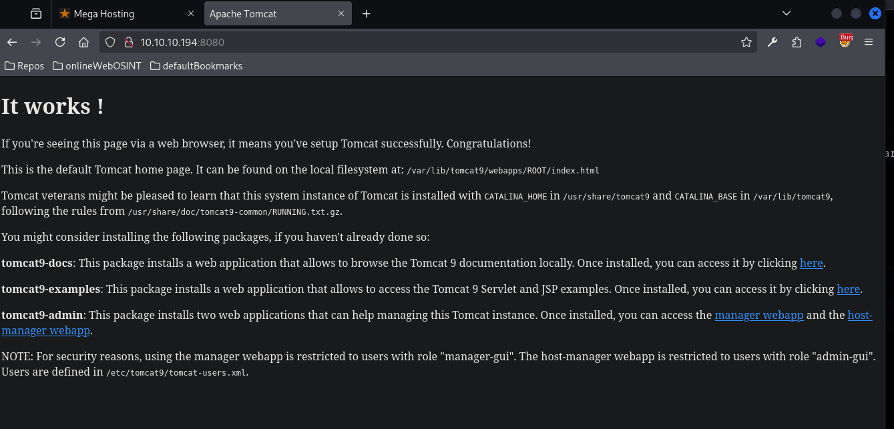
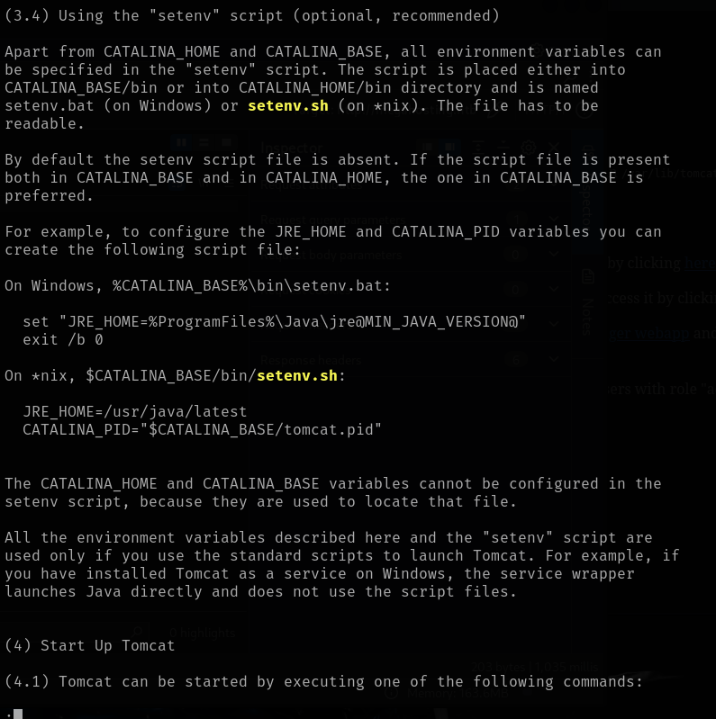
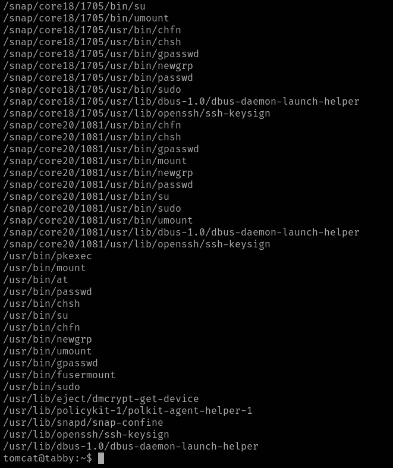

# Tabby

This is my write-up for the machine **Tabby** on Hack The Box located at: https://app.hackthebox.com/machines/259

## Enumeration

First I started with an [nmap scan](./res/Tabby/10_10_10_194_nmapReport.txt), which shows the following

Since port 80 was open I navigated there to see what were we up against, and the following page is displayed

Then as usual, I checked wappalyzer for the tech stack, which didn't show much, apart from the apache version, which we already knew from nmap

Then I ran gobuster, which found some endpoint, probably all of them are accessible with normal website usage, but it's worth checking

And I also ran nikto, which didn't found anything interesting

So, before digging deeper on port 80 and start checking the source code, requests, etc... I wanted to check port 8080, which has a default page that displays some interesting information

If we follow some of the links there we can see the tomcat version, which is 9.0.31

And some other interesting things like jsp examples and a manager login

So I decided to run gobuster against it

Along with nikto, in order to get as much information as possible before start trying to find vulnerabilities, and actually nikto found some interesting things for us

So first I checked the snoop file, since it was an information disclosure, but in that case it didn't give too much information

I also tried some default credentials for the manager login page, but they didn't work

Then I tried doing a put and a post, since nikto said it was allowed, but they didn't work

After that I decided to google for some exploits on this tomcat version, but since I didn't found anything good, I got back to port 80 to enumerate it further and check if I could get some valuable information from there. First I  checked the endpoints found by gobuster which mostly were forbidden apart from the readme and the news.php, which didn't have much

But then when I started clicking around the website, I saw that news were actually redirecting to megahosting.htb/news, after adding this domain, we could see a page where they are talking about a data breach

## Exploitation

Since I saw that there was a parameter on the url, I tried LFI, and it worked

Then I tried to get the files that were listed on port 8080 default page, but nothing was returned

So I tried downloading the running gz which should contain some other documentation

Inside there they talk about the setenv.sh script which is the one that sets up the CATALINA variables

But I also tried with on those paths, and nothing was returned

So I went back to the documentation, where I saw that a daemon.sh script should be located on catalina home, and this one was actually accessible, which confirmed the CATALINA_HOME path

But after checking the script I didn't see anything about the users xml file, so I got back to the documentation, and I tried all the path that I found there, but none of them worked

So, I checked the write-up to see what I was missing, and apparently the users xml is under usr/share/tomcat9/etc/tomcat-users.xml, which apparently you can discover by googling "/usr/share/tomcat9 directory" but for me it wasn't the case, cause the same paths that we checked before kept appearing, but anyway, with that we are able to get the users.xml which gave us the credentials **tomcat:$3cureP4s5w0rd123!**

With that we can access the host-manager site

Now the problem is that in order to add a reverse shell, we need access to the manager site, and with the current user we can only access the host-manager. I checked the documentation again to see if there was a way to add that role remotely or something, when I saw that there's an endpoint that let us execute commands, and even though I got an error, it wasn't a forbidden, which tell us it's working

I also used burpsuite to make sure that put is allowed

Then after some tries I got the command working, since we got back that the app has been deployed, though it failed to start

So I read the documentation and I saw that the context.xml was needed for the deployment, so I've pulled it, and attached it to the msfvenom payload as a template, but I still got the same error

After some googling and some tries, I finally got it right

And with that we got our reverse shell back

## Post Exploitation

So now we can start our escalation enumeration as usual

After that I pulled the os information, along with the user groups

Then I checked the SUIDs, but as usual there wasn't anything interesting there

After that I checked the crontab, but there wasn't anything as well

Neither on the home folder, and ash home folder wasn't accessible

So I navigated around for a bit, when I found a backup file that seemed interesting

I proceeded to tranfer it to my kali machine, in order to inspect it more comfortably

But unfortunately it was encrypted

So I had to get the hash with john the ripper

And crack it

Then I started checking it's contents, which apparently are the same as we find on the html directory accessible right now, but then I remembered that on news.php there was some kind of data breach mentioned, so I tried reading it and executing it to see if I got some information out of it, but nothing came out

After some time trying to figure out what to do with news.php, I thought that maybe that was a case of password reuse, so I tried to access ash account, and it worked

Then I grabbed the user flag

And after that I did some more enumeration to continue escalating privileges, starting with sudo -l and id to check the groups, and even though it wasn't possible to run sudo -l, ash user was on some interesting groups, like adm

So I ran linpeas to check for vulnerable files and so on, and it highlighted lxd, so I'll start by checking how to escalate with that

It has also found the files readable with adm group

But before digging into adm and trying to find another ways, I wanted to explore lxd, and with some googling I found [this blog](https://morgan-bin-bash.gitbook.io/linux-privilege-escalation/lxc-lxd-linux-container-daemon-privilege-escalation) which explains the escalation process step by step really well, so I started by checking the image list, which of course was empty

So I proceeded to follow the steps and download the alpine image, as explained in the blog

After that I downloaded the image on the target and tried to create the container, but I got the error of no storage pool found

So I had to follow the steps to create the storage pool, and then I was able to create the container

And with that I was able to follow the other steps, and get an elevated shell

Then all I had to do is retrieve the root flag

