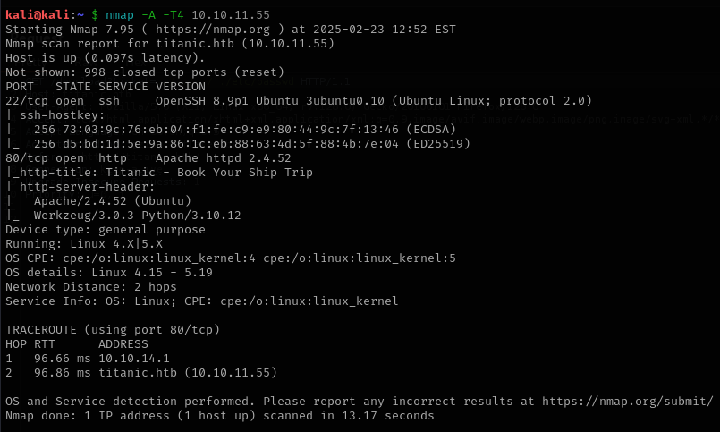
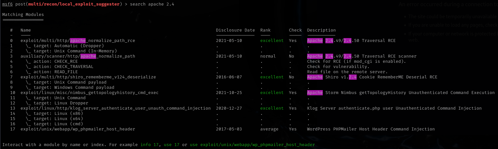
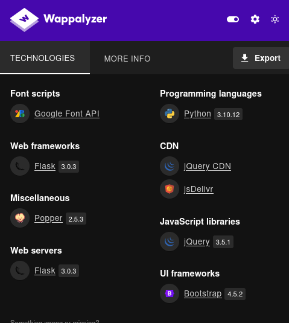
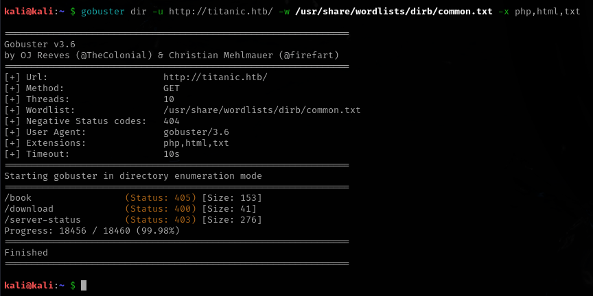
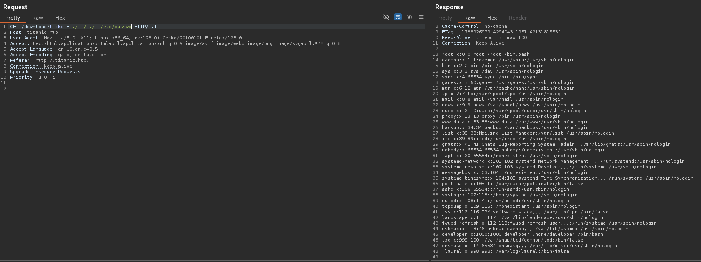
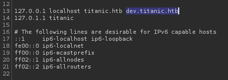
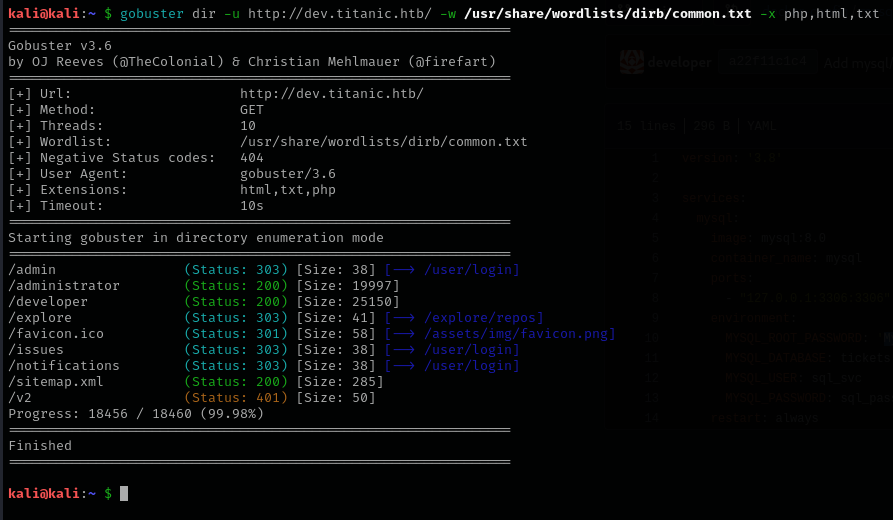
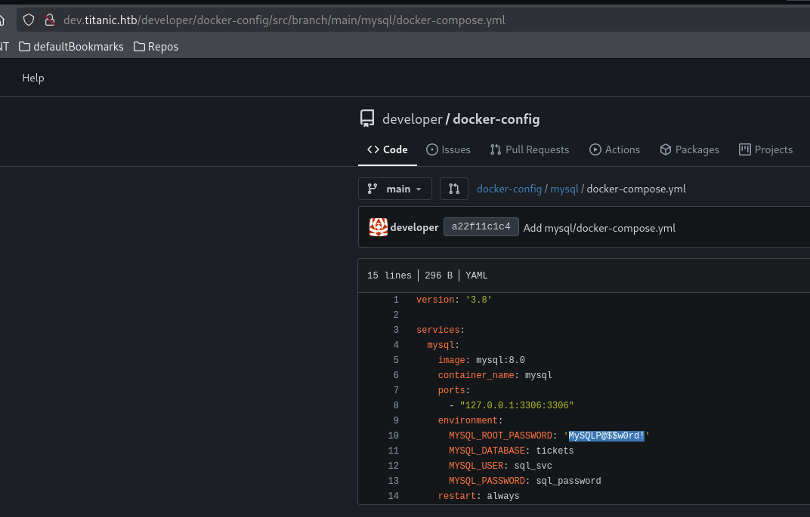
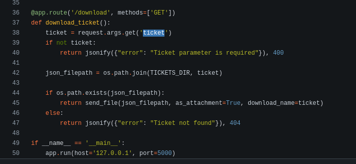

# Titanic

This is my write-up for the machine **Titanic** on Hack The Box located at: https://app.hackthebox.com/machines/Titanic

## Enumeration

first we start with an nmap scan, it shows the following:

- the port 80 is open, but exploring the web it seems that the host could not be resolved, so the ip should be added to the /etc/hosts with `echo "10.10.11.55 titanic.htb" | sudo tee -a /etc/hosts` and now firefox shows the page properly

- after some research for exploits for this apache version and for Werkzeug/3.0.3 it seems that the target is not vulnerable

- the wappalyzer show us some information, but nothing that we can exploit

- The gobuster shows that there's another directories to explore `gobuster dir -u http://titanic.htb/ -w /usr/share/wordlists/dirb/common.txt -x php,html,txt`

- After some tries playing with the directories and the POST and GET method, with the help of burpsuite, we could see that we have **LFI** on the downloads dir through the GET method

- With that the /etc/passwd and /etc/hosts were retrieved. For other files it gave error.
- From the /etc/hosts we could see that there's a subdomain **dev.titanic.htb** where 

- with gobuster we see some interesting dirs on that new subdomain

- Doing some digging into it, we could get some credentials of a mysql DB from the docker compose file. Probably where the flag is, but we can't connect directly, first we need to gain access to the ssh or something like that.

- Going to the explore dir we are able to check the source code, which is helpful, cause now we know that we can exploid the get method by sending a payload to get a reverse shell

