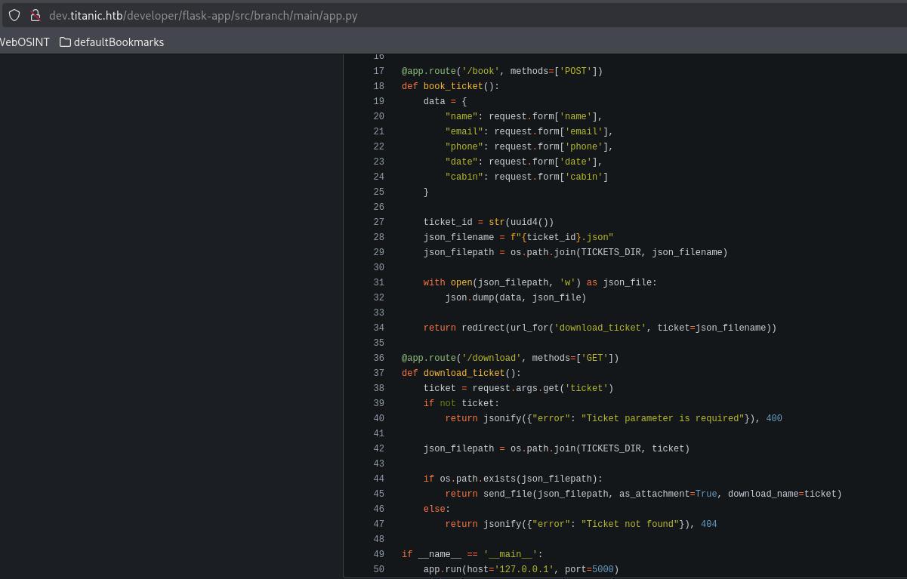

# Titanic

This is my write-up for the machine **Titanic** on Hack The Box located at: https://app.hackthebox.com/machines/Titanic

## Enumeration

First I started with an nmap scan, which shows the following:

Port 80 is open, but when navigating to the web it seems that the host could not be resolved, so I added the IP to the /etc/hosts with `echo "10.10.11.55 titanic.htb" | sudo tee -a /etc/hosts` and now firefox shows the page properly

After some research for exploits for this apache version and for Werkzeug/3.0.3 it seems that the target is not vulnerable

The wappalyzer show us some information, but nothing that we can exploit

Gobuster shows that there's another directories to explore

After some tries playing with the directories and the POST and GET method, with the help of burpsuite, I got **LFI** on the downloads dir through the GET method

With that I was able to pull the /etc/passwd and /etc/hosts. For other files it gave error, but from the /etc/hosts we could see that there's a subdomain **dev.titanic.htb**

Again with the help of gobuster we see some interesting dirs on that new subdomain

Doing some digging into it, we could get some credentials of a mysql DB from the docker compose file. Probably where the flag is, but we can't connect directly, first we need to gain access to the ssh or something like that.

Going to the explore dir we are able to check the source code, which may be helpful finding an attack vector

TODOs
- Further enumeration on versions
- Check the source codes for attack vectors
- Check if LFI is exploitable 
- Check if it is possible to upload and execure a shell on dev subdomain