# Titanic

This is my write-up for the machine **Titanic** on Hack The Box located at: https://app.hackthebox.com/machines/Titanic

## Enumeration

First I started with an nmap scan, which shows the following:

Port 80 is open, but when navigating to the web it seems that the host could not be resolved, so I added the IP to the /etc/hosts with `echo "10.10.11.55 titanic.htb" | sudo tee -a /etc/hosts` and now firefox shows the page properly

After some research for exploits for this apache version and for Werkzeug/3.0.3 it seems that the target is not vulnerable

The wappalyzer show us some information, but nothing that we can exploit

Gobuster shows that there's another directories to explore

After some tries playing with the directories and the POST and GET method, with the help of burpsuite, I got **LFI** on the downloads dir through the GET method

With that I was able to pull the /etc/passwd and /etc/hosts. For other files it gave error, but from the /etc/hosts we could see that there's a subdomain **dev.titanic.htb**

Again with the help of gobuster we see some interesting dirs on that new subdomain

When we navigate to this subdomain we are presented with this page, which give us information about the gitea version, and that's built on go

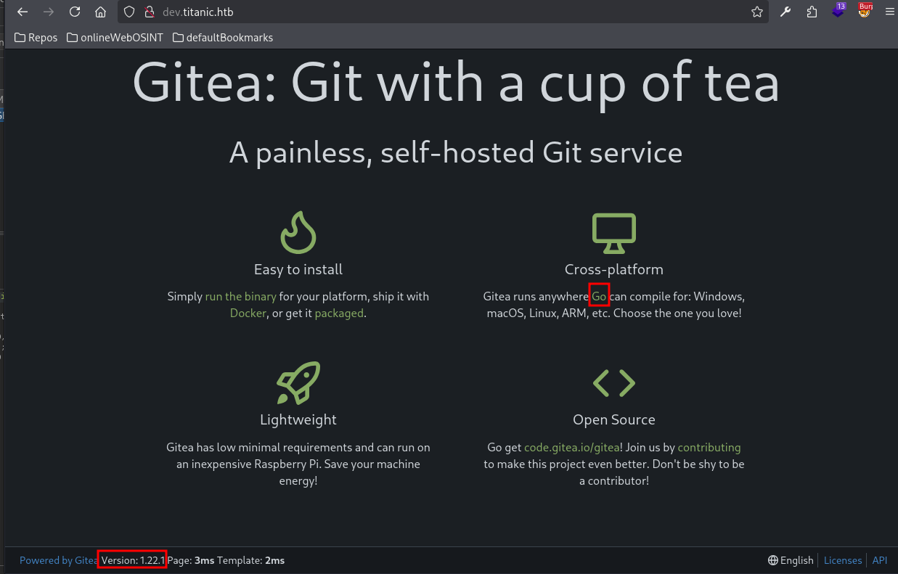

Exploring the gitea directories we are able to check the backend source code, after analyzing it a little bit deeper, we could see that the ticket generation from the POST request has the name and extension hardcoded, so we won't be able to push anything malicious there

Doing some digging into the repos, we could get some credentials of a mysql DB from the docker compose file. Probably where the flag is, but we can't connect directly, first we need to gain access to the ssh or something like that in order to do a port forward

After some exploration on the gitea repos I've decided to get back to the LFI to see if I could pull any other sensitive information, and after playing around a little bit, I was able to get the user flag

I also got the docker compose, which I already had from the repo, but that help me identify where was gitea installed locally

So with that information, I did some research about gitea, to see which is the common config files, and where are located, and with that I was able to pull the app.ini file, which contained some sensitive info, like where was the DB located, the JWT and so on

## Exploitation

Then I pulled the DB to check what was there

And it seems that it has a lot of tables, but after checking some of them the most relevant one seems to be the user

Which contained all the users on gitea and their passwords

The problem is that those seem to be encrypted, probably in **pbkdf2** as stated in the app.ini file

So I grabed the hashes, and I put hashcat to work to see if we have any luck

Meanwhile, since the hashcat process will be long, I tried to create a webhook from gitea with a test account that I've created to see if we could get any information from there

But it doesn't seem to be the case, since I wasn't receiving anything on my listener

After some research about this topic, I found out that there are different types of hooks, server side and client side, and this one is on client side, so it won't be useful anyway. Also the hashcat didn't return anything useful. So I decided to run nikto to if I could pull any valuable info from there

With that information I went to those endpoint to see what they contained, and while the first one seems to be unauthorized

The second one gave us a bunch of links to oauth

That made me remember about the oauth tables of the gitea.db, so I pulled all the information I could from there

Now I wanted to dig deeper in how oauth works and see if I can exploit it, but since it felt kind of like a rabbit hole to me, I decided to get back to trying to crack the user hashes, which also seemed like a rabbit hole, but at this point those two where my only options left, and this last one felt more like the way to go. So after some googling, I found this [article](https://www.unix-ninja.com/p/cracking_giteas_pbkdf2_password_hashes), which was really good at explaining how gitea hashes work and the steps needed to crack them with hashcat, so I went ahead with the first step which was using the python script to convert the hashes into something that hashcat can crack

Then I was finally able to run hashcat properly

And retrieve some passwords, one for the user test that I've created previously doing some testing against gitea, and the developer password, which is **25282528**

Since ssh was open, I used that to get a shell from there

## Post Exploitation

We also have the information from the previous enumeration that there should be a mysql db running, so I went straight to netstat but since the port 3306 is not displayed maybe it isn't the case

So I continued the enumeration by checking if there's something executable as root sudo or some SUID binaries, but it doesn't seem to be anything interesting there either

With that I decided to run linPEAS, so I proceed to download it, give it permissions and run it, it gave me a lot of outputs, and I've put the most interesting in the [linPEAS folder](./linPEAS)

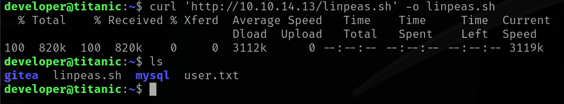

After that I tried escalating with some of it's recommendations, the first one being the sudo, so I checked the version

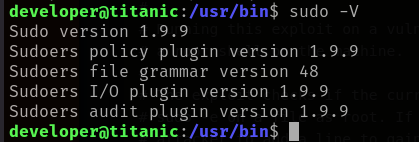

And then I found an exploit for it, but it didn't work

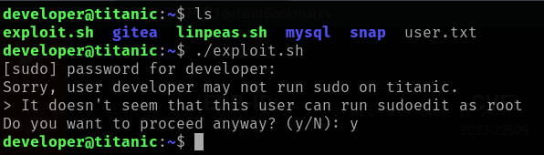

So I moved to the next interesting escalation path which was the pkexec, I started by verifing the version

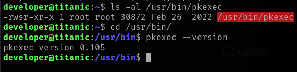

Then I tried to run the following [exploit](https://www.exploit-db.com/exploits/50689) but it didn't work either, it seems to be patched

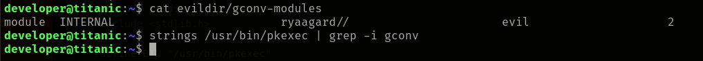

I also tried to see if there was mongodb running since there's a config file for it, but it doesn't seem to be the case

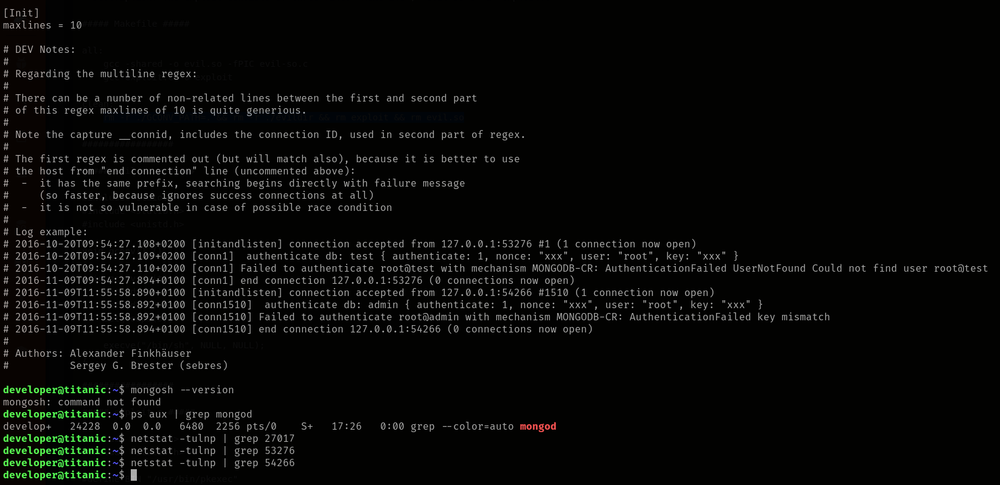

So I went ahead to try the last thing that linPEAS suggested, which was the .local/bin on path, but I didn't found anything there either

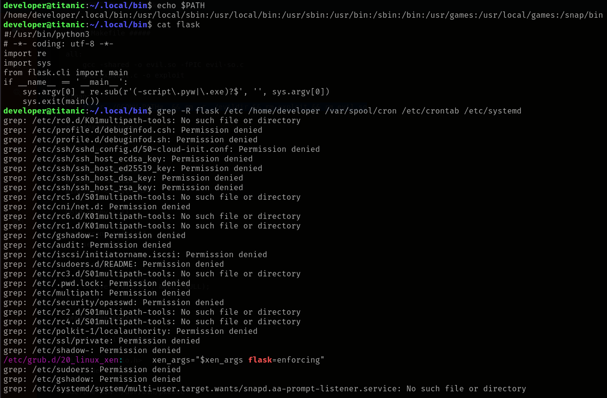

So I got back to enumerate the target manually with the help of the following [checklist](https://viperone.gitbook.io/pentest-everything/everything/everything-linux/privilege-escalation-checklist) and I started by the system information

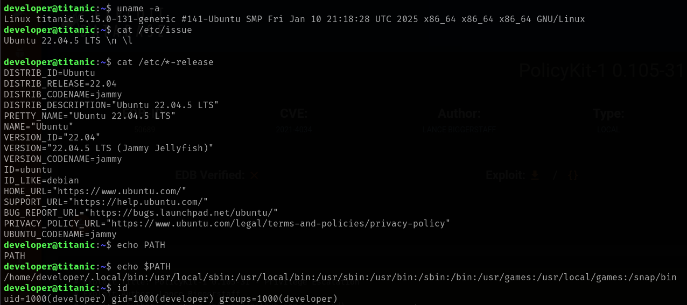
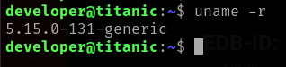

I took a little detour by getting a meterpreter shell and running the local exploit suggester, but none of those worked either

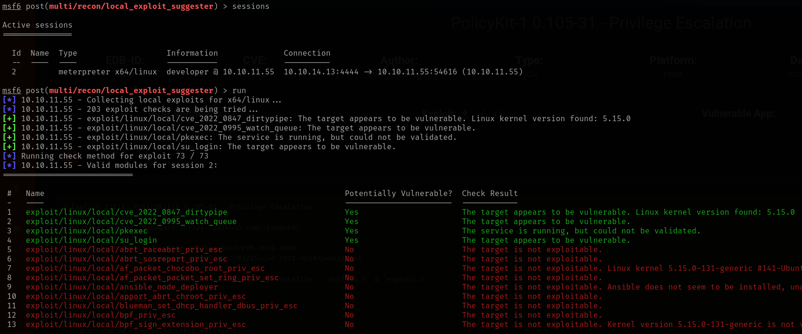

So I continued the enumeration with the following [checklist](https://swisskyrepo.github.io/InternalAllTheThings/redteam/escalation/linux-privilege-escalation/#cron-jobs) and the first thing that I checked was the cron jobs, but there wasn't any escalation possible either

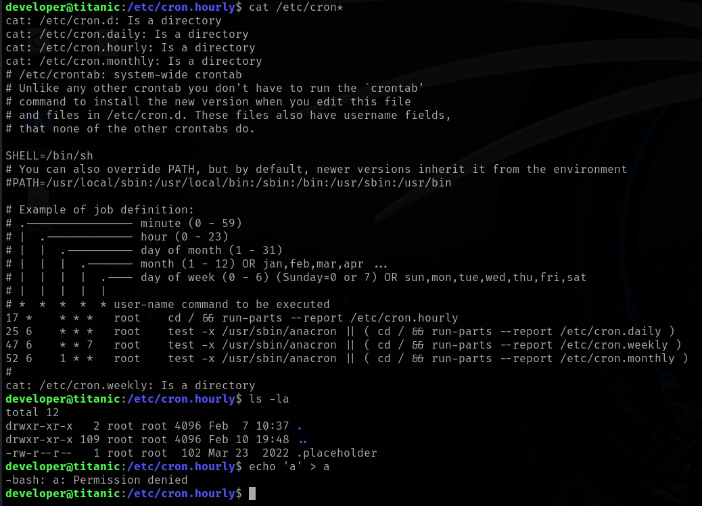

I also did some password search, but nothing interesting was found

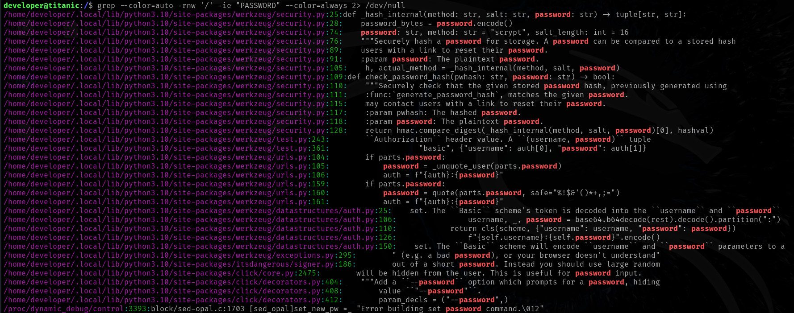

Since I was running out of options of thing to check and enumerate, I decided to take a look manually on the installed programs and files on the target system, and I found that there's a script on opt owned by root, unfortunately we cannot modify it with developer user, but after a quick google search of "/usr/bin/magick" I discovered that it is runnning ImageMagick

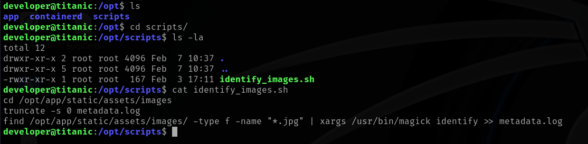

So I checked the version to see if there was any exploit for that

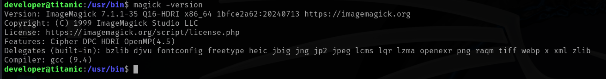

And I also checked if the images directory where the script is pointing is writable, which seems to be the case

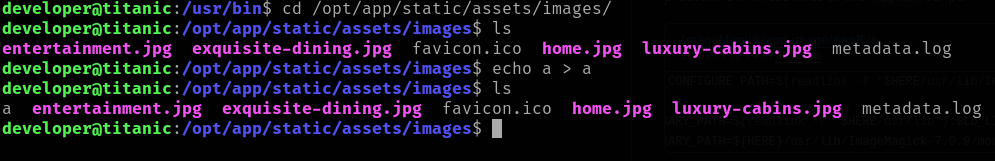

I searched some information about [ImageMagick](https://imagemagick.org/) and it seems that it's used for a lot of puposes related with image management, including reading metadata like in the previous script, I also found the following [exploit](https://github.com/ImageMagick/ImageMagick/security/advisories/GHSA-8rxc-922v-phg8) and after doing the proof of concept it worked, now I have to figure out how to apply it to my use case

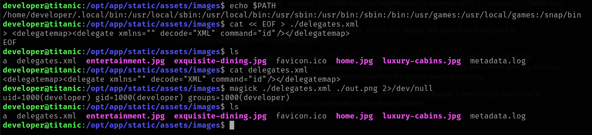

After some tries, I decided to try to create a file with it, and it worked

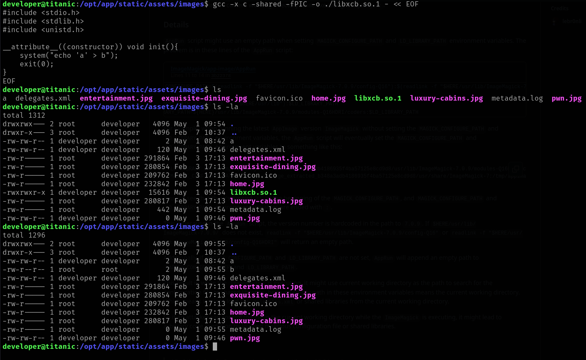

With that in mind I created a reverse shell

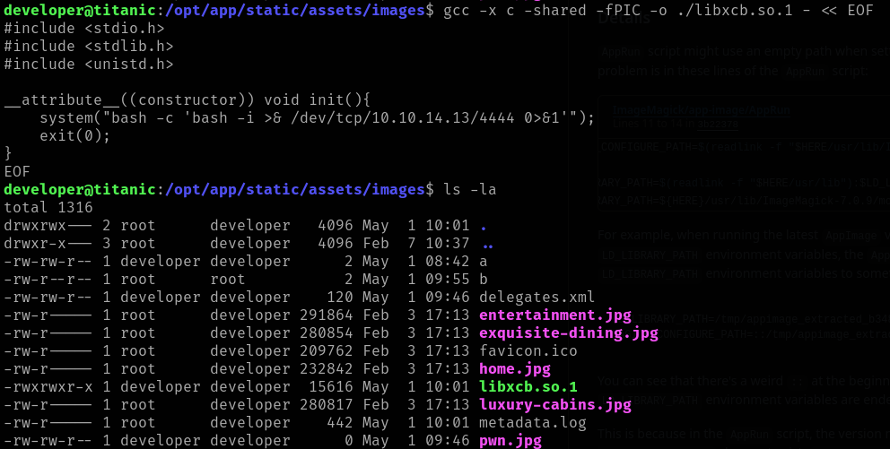

And I finally got an elevated shell

Now the only thing left to do is retrieve the root flag

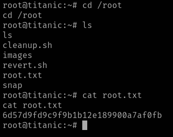
