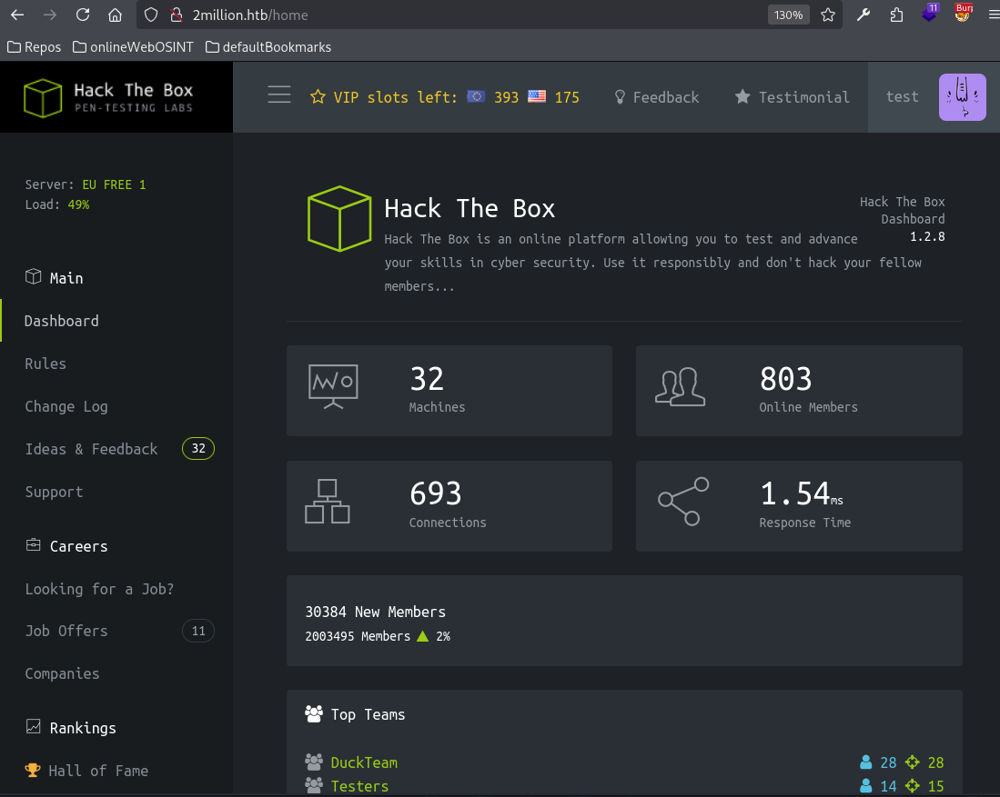
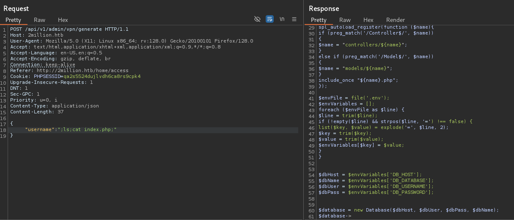
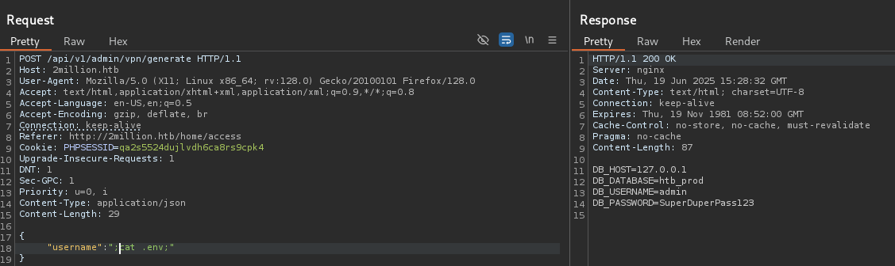
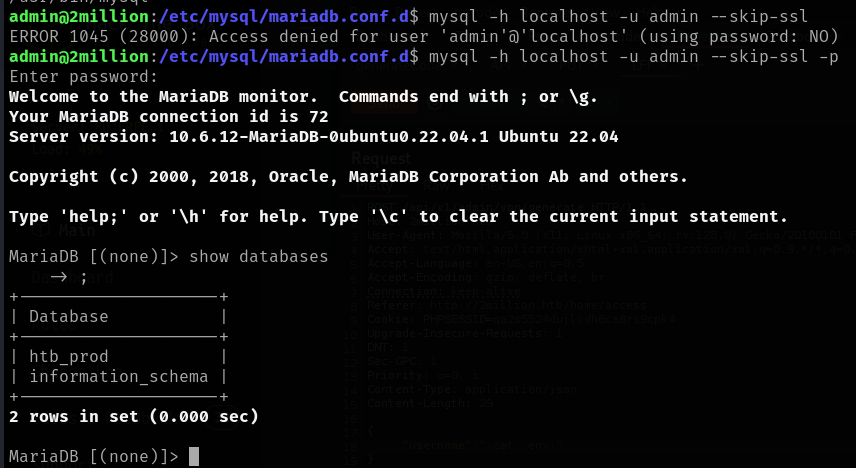

# TwoMillion

This is my write-up for the machine **TwoMillion** on Hack The Box located at: https://app.hackthebox.com/machines/547

## Enumeration

First I started with an nmap scan, which shows the following

Since only port 80 is open, apart from port 22, I navigated there to see what are we up against, and it shows the following

I also checked wappalyzer to see the tech stack

And I ran gobuster to enumerate subdirectories, and it found some interesting things, like the invite, login and register

I also ran nikto to scan for vulnerabilities, but nothing came through, a part that the cookie is created without httponly

After that I took a look to the website, and scrolling down I saw that on the faq section it says that we have to hack our way in from the invite page

So I went there, and I saw that there's a page to put a code to sign up

I checked the source code and at the end it was a script that redirects to /register when the code is correct

So I went there and I tried to register, but it failed cause there wasn't a valid code

With that in mind I tried to put a random code to see what happens, and when I saw this popup I thought of XSS

But after trying a payload I saw that it wasn't the case, cause the text came from the api response

That made me check the network tab, where I saw a call to an interesting js file, I pulled the code, and I saw that they were using the eval function which made me think that maybe I could inject some commands

After some googling I found a js payload to check if the code was being executed, but it wasn't the case

So I asked chatgpt to explain me the code to see if I could find another attack vector, and it told me that the code was obfuscated, and that I could unobfuscate it changing the eval for console.log and putting it into the js console which gave me the following code

With that I was able to do a request to that endpoint where I recieved the following information saying that it was encrypted with ROT13

Then I decrypted the information with an online decryptor

I followed the steps and I finally was able to generate the invite code which was **8DS7G-NQ458-6RJZQ-6VSDE**

And with that, after registering I got logged in

After navigating around a little bit, I saw two interesting pages, access and changelog, first I tried to download the vpn and trying to connect, as you'd normally do in HTB, but I got an error, and after googling it I saw that it was that the firewall wasn't properly configured or the port wasn't open, which made sense considering our first nmap scan

So I moved to the changelog, where I saw a bunch of interesting bugs resolved on previous releases, like the API information disclosure, the htb-cli feature, and the docker management app access

I also ran gobuster with the new credentials that we have now, to see if it finds something new with the authentication, but it wasn't the case

I kept enumerating the website, when I saw the following message at home page

Which made me think that could be some kind of sql injection, but I ran sqlmap againt the login page, and nothing came through, neither with manual attempts

So I got back to the vpn cause I saw that there an alternative tcp connection, so I modified the test.ovpn file to connect to tcp and port 80, but I got an error too, also with port 22

After playing some time with the API request, I saw that it is possible to extract API information by changing the POST for a GET and using the /api/v1 endpoint

Where I saw some interesting endpoints under admin, the two first ones didn't do much, cause I wasn't authenticated as admin

## Exploitation

But the third one seemed to allow requests, the problem was that I didn't know which format was required

After checking all the other requests and not finding anything, I came back to the /admin/settings/update, and after rereading the response error, I saw that I was missing the content type on the request, and with that I got a different error, which was 'missing email'

Then I kept fixing the errors tha came through, until I got a valid insertion

Then I went to /admin/auth, to verify that my user was an admin now

Now that I was an admin, I went straight to the admin VPN, to see if I was able to connect through there, which wasn't the case, but I saw that on the request it was asking for a username, so I thought that maybe there could be command injection, same as I've tested before with the normal VPN, but here it was way faster, and I saw that the commands where giving a 200 response, but any output, so I thought that it could be a case of blind injection, so I fired an http server, and after doing a curl from the request I actually got a response there

Then I tried putting a reverse shell there, but it didn't work, neither with encoding or executing a shell.sh

So I tried just connecting with netcat, and it actually worked. So I guess that the problem comes with the arguments

While I was trying to bypass the problem with the arguments, by trying ways to escape the dash, I came through a weird output, which made me think that maybe the injection wasn't blind after all

So I tried to pull the /etc/passwd, and it worked, so maybe we only have LFI after all

With that in mind, I pulled the env file, but nothing interesting came through

I also tried dropping a shell and trying to execute it, but it didn't work either

I continued exploring the files, and in index.php I found a call to the .env file, which could be really interesting

So I proceed to cat that file, and there I found some credentials for a DB, which where the following **admin:SuperDuperPass123**

Since we were not able to access any DB from the point we were, I tried those credentials on SSH right away, and they worked

## Post Exploitation

First I got the user flag

Then I started with the usual enumeration for the escalation, by checking the SUIDs and if there's something executable as root, which wasn't the case

I continued by pulling the system info

And the network information, which revealed some interesting things, first that there's a DB running (which we already know from the message on the website) and that the port 11211 is open locally

After that I ran linpeas, which didn't get anything interesting apart from the installed software, which has gcc, nc and so on

And the database files

So I connected to the DB with the previously retrieved credentials

And I pulled the users

Then after identifing that the hashes are bcrypt I put the hashes to crack to see if we get the root password

Meanwhile, I went to explore the 11211 port, which after a quick google search I saw that it was possible to use netcat to connect to it, but I wasn't able to extract any information or exploit it

Since I was a little bit stuck, I went to HTB guided mode for a hint, which was to check the email address from the sender of the email sent to admin, so I googled where does linux store the emails and I found the following

With that I was able to go to google and find an exploit for that vulnerability, the problem is that when I tried to compile it, it didn't work, cause I didn't find the fuse.h file

So I went to the write-up to check what I was missing, and the thing is that you have to compile the exploit on the target machine, so the cmake can find the files from the fuse that's installed

Once compiled I followed the steps from the readme and I finally got an elevated shell

Then I got the root flag

## Post Root Work

Since I didn't know how the exploit work, I read this [article](https://securitylabs.datadoghq.com/articles/overlayfs-cve-2023-0386/#how-the-cve-2023-0386-vulnerability-works) which explains it really well. I also checked a video walkthrough and read the write-up to double check the steps that I should have followed

After that I tried the alternative privilege escalation path suggested on the guided mode, which suggested to take a look at ldd version

With that information I googled an [exploit](https://haxx.in/files/gnu-acme.py) and after running it I got a shell back

Then I did the last part of the write-up, which was decrypting the thank_you.json

