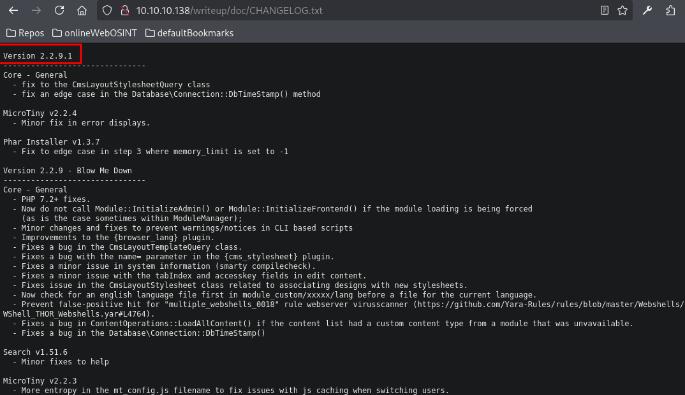
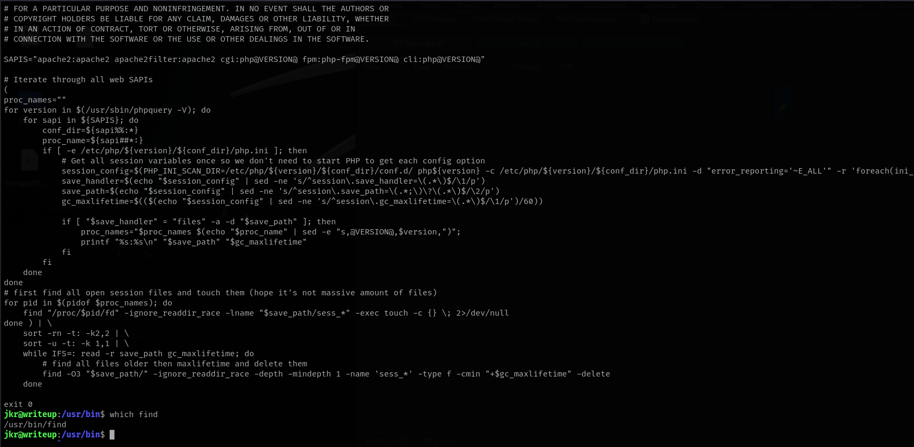
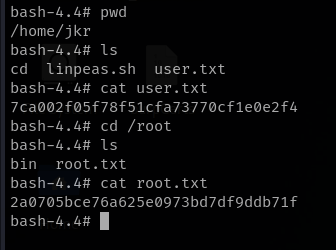

# Writeup

This is my write-up for the machine **Writeup** on Hack The Box located at: https://app.hackthebox.com/machines/192

## Enumeration

First I started with an nmap scan, which shows the following

Since only port 80 is open, a part from port 22, I navigated there to see what are we up against, and the default page was the following

I checked wappalyzer to see the tech stack used, but there was not much information given

Then I ran gobuster to check if there was any subdirectories, but I got a bunch of errors, so I got back to the page and after reading it, it seems that there's some kind of DoS protection script that could be blocking us

So I tried to enumerate manually, first by going to robots.txt where I found a directory listing, then I tried sitemap but it didn't exist

With that new discovery I went to those subdirectories, but it seems that there's only writeups

So I googled the protection script to see what was running on the background and ways to bypass it, where I tried adding a delay on feroxbuster requests

But it didn't work either, so I checked the writeup and apparently we don't have to brute force it, instead if we check at the source code of /writeup it is possible to see that it is using CMS made simple

Then we can search for a version that match the year on CMS official page

And also if we want to enumerate the version further to make sure which exploit we should use later on, we can find the cms repo on the official page under downloads

There we could see the file distribution that CMS has

And if we transfer this to our target, we are able to see the specific version on the changelog file

## Exploitation

With that I was able to search an [exploit](https://www.exploit-db.com/exploits/46635) which retrieved the username and the password hash with salt through blind SQL injection

So right after that I went straight to hashid to check which type of hash it was, and it seems to be an MD5

With that information I ran hashcat with the specific syntax and it cracked the hash real quick, which was **raykayjay9**

Then I tried the username and the retrieved password on ssh, and I got a shell back

## Post Exploitation

Once with the shell, proceed the enumeration as usual, first by pulling the system info

Then the /etc/passwd file, where we could see that there's only our current user and root with a shell

The sudo -l, which wasn't found this time and SUIDs, where could be some interesting things, like polkit and so on, which worked on previous machines

The networking info, which only displays the ports that we already know

And the cron jobs, where we could see that php is inside cron.d and it is ran every 9 minutes (or atleast that what I saw at the beginning cause I did not see the 0), which it is triggering the sessionclean script

That made me run linpeas to see if that was actually the case and there could be a path for escalation, or maybe there's something else, and it remarked that there's a bunch of files under /usr that we can modify cause we are in staff group

It also shows some misconfigurations on ld.so

And some cronjobs along with the PATH

So after that I went straight to the sessionclean script, and after analyzing it I saw that find was used there

So I created a malicious find and put it into /usr/local/bin, but after a while it didn't get executed, so I got back to the cron jobs and I noticed that the job that I was aiming for had a 0 on the hours, which means it only will get executed at 00:09 every day

But, after taking another look to the cronjobs reported by linpeas, I saw that there's a job on the hourly folder that is running at minute 17 of every hour, and that uses cd, so I went ahead and created a malicious cd file and put it there

Unfortunately, after the time passed I didn't get the shell back

So I decided to check the write-up to see what was going on, and it seems that we should have used pspy to check the processes that root was using, then login into another ssh to see that then root was using run-parts script, and then use path hijacking on that script to give SUID permissions to bash and get an elevated shell

And now we can retrive the flags

